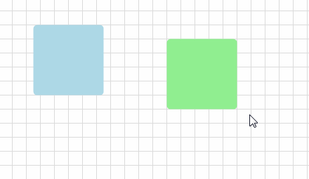
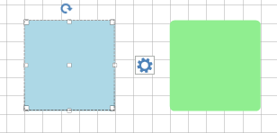
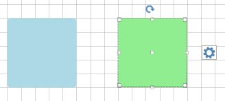

# Selection


__RadDiagram__ gives you the ability to select __RadDiagramItems__ in code behind,
        interactively or by invoking [RadDiagramCommand]().

The following tutorial will show you how to select items, work with different selection modes and set up selection commands and events.

## Selection modes

__RadDiagram__ has four different __Selection Modes__ which determine the way a user performs selection:

* __Single__ - the user can select only one item. This is the default __SelectionMode__'s value.
            

* __None__ - the user cannot select any items.
            

* __Extended__ - the user can select/deselect multiple items using the combinations (Ctrl Key+ Mouse Left Button) 
              or (Ctr + Key A). 
            

* __Multiple__ - the user can select/deselect multiple items using only left button or the combinations
              (Ctrl Key+ Mouse Left Button) and (Ctr + Key A).
            

In order to change the way the Selection Adorner Rectangle behaves, you can use the __RectSelectionMode__ property:

* __Full__ - the user selects item(s) only when the selection rectangle covers it(them) completely.
            

* __Partial__ - the user selects all items that are completely or partially covered by the selection rectangle.
            

## Selection in code behind

In order to select items programmatically, you only need to set their __IsSelected__ property to
        *true*:#_[C#] _

	


{{source=..\SamplesCS\Diagram\DiagramItemsManipulation.cs region=IsSelected}} 
{{source=..\SamplesVB\Diagram\DiagramItemsManipulation.vb region=IsSelected}} 

````C#

            RadDiagramShape shape1 = new RadDiagramShape()
            {
                ShapeText = "",
                IsSelected = true,
                ElementShape = new RoundRectShape(5),
                InternalElementColor = System.Drawing.Color.LightBlue
            };
            shape1.Position = new Telerik.Windows.Diagrams.Core.Point(10, 10);
            radDiagram1.AddShape(shape1);

            RadDiagramShape shape2 = new RadDiagramShape()
            {
                ShapeText = "",
                ElementShape = new RoundRectShape(5),
                InternalElementColor = System.Drawing.Color.LightGreen
            };
            shape2.Position = new Telerik.Windows.Diagrams.Core.Point(180, 10);
            radDiagram1.AddShape(shape2);
````
````VB.NET

        Dim shape1 As New RadDiagramShape() With { _
            .ShapeText = "", _
            .IsSelected = True, _
            .ElementShape = New RoundRectShape(5), _
            .InternalElementColor = System.Drawing.Color.LightBlue _
        }
        shape1.Position = New Telerik.Windows.Diagrams.Core.Point(10, 10)
        RadDiagram1.AddShape(shape1)

        Dim shape2 As New RadDiagramShape() With { _
            .ShapeText = "", _
            .ElementShape = New RoundRectShape(5), _
            .InternalElementColor = System.Drawing.Color.LightGreen _
        }
        shape2.Position = New Telerik.Windows.Diagrams.Core.Point(180, 10)
        RadDiagram1.AddShape(shape2)

        '
````

{{endregion}} 


When multiple items are selected, they are automatically added in one Selection Adorner: 
        #_[C#] _

	


{{source=..\SamplesCS\Diagram\DiagramItemsManipulation.cs region=MultipleSelection}} 
{{source=..\SamplesVB\Diagram\DiagramItemsManipulation.vb region=MultipleSelection}} 

````C#
                
            RadDiagramShape shape1 = new RadDiagramShape()
            {
                ShapeText = "",
                IsSelected = true,
                ElementShape = new RoundRectShape(5),
                InternalElementColor = System.Drawing.Color.LightBlue
            };
            shape1.Position = new Telerik.Windows.Diagrams.Core.Point(10, 10);
            radDiagram1.AddShape(shape1);
                
            RadDiagramShape shape2 = new RadDiagramShape()
            {
                ShapeText = "",
                IsSelected = true,
                ElementShape = new RoundRectShape(5),
                InternalElementColor = System.Drawing.Color.LightGreen
            };
            shape2.Position = new Telerik.Windows.Diagrams.Core.Point(180, 10);
            radDiagram1.AddShape(shape2);
````
````VB.NET

        Dim shape1 As New RadDiagramShape() With { _
            .ShapeText = "", _
            .IsSelected = True, _
            .ElementShape = New RoundRectShape(5), _
            .InternalElementColor = System.Drawing.Color.LightBlue _
        }
        shape1.Position = New Telerik.Windows.Diagrams.Core.Point(10, 10)
        RadDiagram1.AddShape(shape1)

        Dim shape2 As New RadDiagramShape() With { _
            .ShapeText = "", _
            .IsSelected = True, _
            .ElementShape = New RoundRectShape(5), _
            .InternalElementColor = System.Drawing.Color.LightGreen _
        }
        shape2.Position = New Telerik.Windows.Diagrams.Core.Point(180, 10)
        RadDiagram1.AddShape(shape2)

        '
````

{{endregion}} 


You may also want to use the __SelectedIndex__ or the __SelectedItem__ property
        of the __RadDiagram__:#_[C#] _

	


{{source=..\SamplesCS\Diagram\DiagramItemsManipulation.cs region=SelectedIndex}} 
{{source=..\SamplesVB\Diagram\DiagramItemsManipulation.vb region=SelectedIndex}} 

````C#
            
            this.radDiagram1.SelectedIndex = 1;
````
````VB.NET

        Me.RadDiagram1.SelectedIndex = 1
        '
````

{{endregion}} 


## Select All

You are able to select all __RadDiagramItems__ interactively (by Mouse or by pressing Ctrl + A),
          programmatically (via the __SelectAll__ method), set the __IsSelected__ property 
          to every Shape and Connection. Below is demonstrated how you can use the __SelectAll__ command:
        #_[C#] _

	


{{source=..\SamplesCS\Diagram\DiagramItemsManipulation.cs region=SelectAllCommand}} 
{{source=..\SamplesVB\Diagram\DiagramItemsManipulation.vb region=SelectAllCommand}} 

````C#
        
            this.radDiagram1.DiagramElement.TryExecuteCommand(DiagramCommands.SelectAll, "");
````
````VB.NET
        Me.RadDiagram1.DiagramElement.TryExecuteCommand(DiagramCommands.SelectAll, "")

        '
````

{{endregion}} 


## Selections events

__RadDiagram__ provides the following selection events:
        

* __SelectionChanged__ - fires when a selection operations has just been performed.
            

* __SelectionBoundsChanged__ - fires when the SelectionRectangle's bounds have just been changed.
            
