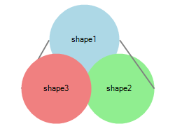
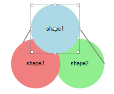
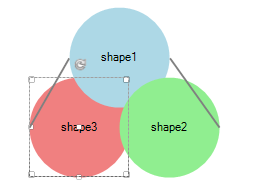

# ZOrder


__RadDiagram__ gives you the ability to control the Z-Order of shapes and connections 
        by using their __ZIndex__ property. You can also use __RadDiagramCommands__ 
        in order to increase/decrease __ZIndex__ of the selected __RadDiagramItems__ simultaneously.

## Using the ZIndex property

Consider the following code:#_[C#] _

	


{{source=..\SamplesCS\Diagram\DiagramItemsManipulation.cs region=ZOrder}} 
{{source=..\SamplesVB\Diagram\DiagramItemsManipulation.vb region=ZOrder}} 

````C#
                
            RadDiagramShape shape1 = new RadDiagramShape()
            {
                ShapeText = "shape1",
                ZIndex = 3,
                ElementShape = new EllipseShape(),
                InternalElementColor = System.Drawing.Color.LightBlue
            };
            shape1.Position = new Telerik.Windows.Diagrams.Core.Point(100, 10);
            radDiagram1.AddShape(shape1);
                
            RadDiagramShape shape2 = new RadDiagramShape()
            {
                ShapeText = "shape2",
                ZIndex = 2,
                ElementShape = new EllipseShape(),
                InternalElementColor = System.Drawing.Color.LightGreen
            };
            shape2.Position = new Telerik.Windows.Diagrams.Core.Point(150, 60);
            radDiagram1.AddShape(shape2);
                
            RadDiagramShape shape3 = new RadDiagramShape()
            {
                ShapeText = "shape3",
                ZIndex = 1,
                ElementShape = new EllipseShape(),
                InternalElementColor = System.Drawing.Color.LightCoral
            };
            shape3.Position = new Telerik.Windows.Diagrams.Core.Point(60, 60);
            radDiagram1.AddShape(shape3);
````
````VB.NET

        Dim shape1 As New RadDiagramShape() With { _
            .ShapeText = "shape1", _
            .ZIndex = 3, _
            .ElementShape = New EllipseShape(), _
            .InternalElementColor = System.Drawing.Color.LightBlue _
        }
        shape1.Position = New Telerik.Windows.Diagrams.Core.Point(100, 10)
        RadDiagram1.AddShape(shape1)

        Dim shape2 As New RadDiagramShape() With { _
            .ShapeText = "shape2", _
            .ZIndex = 2, _
            .ElementShape = New EllipseShape(), _
            .InternalElementColor = System.Drawing.Color.LightGreen _
        }
        shape2.Position = New Telerik.Windows.Diagrams.Core.Point(150, 60)
        RadDiagram1.AddShape(shape2)

        Dim shape3 As New RadDiagramShape() With { _
            .ShapeText = "shape3", _
            .ZIndex = 1, _
            .ElementShape = New EllipseShape(), _
            .InternalElementColor = System.Drawing.Color.LightCoral _
        }
        shape3.Position = New Telerik.Windows.Diagrams.Core.Point(60, 60)
        radDiagram1.AddShape(shape3)

        '
````

{{endregion}} 


We have reversed the natural ZOrder of the 3 Shapes. 

## Using the RadDiagram Commands

__RadDiagram__ provides a set of predefined commands for manipulating the selected items' ZIndices.
          "BringForward" and "SendBackward" allow you to increase/decrease the Z-Indices of the selected __RadDiagramItems__.
          If you need to bring the selected item(s) on top of all other items or below them, you can use "BringToFront" and "SentToback":#_[C#] _

	


{{source=..\SamplesCS\Diagram\DiagramItemsManipulation.cs region=CommandZIndex}} 
{{source=..\SamplesVB\Diagram\DiagramItemsManipulation.vb region=CommandZIndex}} 

````C#
            
            RadDiagramShape shape1 = new RadDiagramShape()
            {
                ShapeText = "shape1",
                ZIndex = 1,
                ElementShape = new EllipseShape(),
                InternalElementColor = System.Drawing.Color.LightBlue
            };
            shape1.Position = new Telerik.Windows.Diagrams.Core.Point(100, 10);
            radDiagram1.AddShape(shape1);
            
            RadDiagramShape shape2 = new RadDiagramShape()
            {
                ShapeText = "shape2",
                ZIndex = 2,
                ElementShape = new EllipseShape(),
                InternalElementColor = System.Drawing.Color.LightGreen
            };
            shape2.Position = new Telerik.Windows.Diagrams.Core.Point(150, 80);
            radDiagram1.AddShape(shape2);
            
            RadDiagramShape shape3 = new RadDiagramShape()
            {
                ShapeText = "shape3",
                ZIndex = 3,
                ElementShape = new EllipseShape(),
                InternalElementColor = System.Drawing.Color.LightCoral
            };
            shape3.Position = new Telerik.Windows.Diagrams.Core.Point(60, 80);
            radDiagram1.AddShape(shape3);
            
            RadDiagramConnection connection1 = new RadDiagramConnection() { Name = "connection1" };
            connection1.Source = shape1; 
            connection1.Target = shape2;
            connection1.ZIndex = 2;
            connection1.SourceConnectorPosition = "Right";
            connection1.TargetConnectorPosition = "Right";
            
            radDiagram1.Items.Add(connection1);
            
            RadDiagramConnection connection2 = new RadDiagramConnection()
            {
                Name = "connection2"
            };
            connection2.Source = shape1;
            connection2.Target = shape3;
            connection2.ZIndex = 1;
            connection2.SourceConnectorPosition = "Left";
            connection2.TargetConnectorPosition = "Left";
            radDiagram1.Items.Add(connection2);
````
````VB.NET

        Dim shape1 As New RadDiagramShape() With { _
            .ShapeText = "shape1", _
            .ZIndex = 1, _
            .ElementShape = New EllipseShape(), _
            .InternalElementColor = System.Drawing.Color.LightBlue _
        }
        shape1.Position = New Telerik.Windows.Diagrams.Core.Point(100, 10)
        radDiagram1.AddShape(shape1)

        Dim shape2 As New RadDiagramShape() With { _
            .ShapeText = "shape2", _
            .ZIndex = 2, _
            .ElementShape = New EllipseShape(), _
            .InternalElementColor = System.Drawing.Color.LightGreen _
        }
        shape2.Position = New Telerik.Windows.Diagrams.Core.Point(150, 80)
        RadDiagram1.AddShape(shape2)

        Dim shape3 As New RadDiagramShape() With { _
            .ShapeText = "shape3", _
            .ZIndex = 3, _
            .ElementShape = New EllipseShape(), _
            .InternalElementColor = System.Drawing.Color.LightCoral _
        }
        shape3.Position = New Telerik.Windows.Diagrams.Core.Point(60, 80)
        RadDiagram1.AddShape(shape3)

        Dim connection1 As New RadDiagramConnection() With { _
            .Name = "aaaa" _
        }
        connection1.Source = shape1
        connection1.Target = shape2
        connection1.ZIndex = 2
        connection1.SourceConnectorPosition = "Right"
        connection1.TargetConnectorPosition = "Right"

        RadDiagram1.Items.Add(connection1)

        Dim connection2 As New RadDiagramConnection() With { _
            .Name = "bbbb" _
        }
        connection2.Source = shape1
        connection2.Target = shape3
        connection2.ZIndex = 1
        connection2.SourceConnectorPosition = "Left"
        connection2.TargetConnectorPosition = "Left"
        radDiagram1.Items.Add(connection2)

        '
````

{{endregion}} 


This way configured, the items in __RadDiagram__ are ordered as illustrated below: 

Here is the result of selecting the first shape and executing the DiagramCommands.__BringToFront__:#_[C#] _

	


{{source=..\SamplesCS\Diagram\DiagramItemsManipulation.cs region=BringToFront}} 
{{source=..\SamplesVB\Diagram\DiagramItemsManipulation.vb region=BringToFront}} 

````C#
            
            this.radDiagram1.SelectedItem = shape1;
            this.radDiagram1.DiagramElement.TryExecuteCommand(DiagramCommands.BringToFront, "");
````
````VB.NET

        Me.RadDiagram1.SelectedItem = shape1
        Me.RadDiagram1.DiagramElement.TryExecuteCommand(DiagramCommands.BringToFront, "")

        '
````

{{endregion}} 


Here is the result of selecting the third shape and executing the DiagramCommands.__SendToBack__:
        #_[C#] _

	


{{source=..\SamplesCS\Diagram\DiagramItemsManipulation.cs region=SendToBack}} 
{{source=..\SamplesVB\Diagram\DiagramItemsManipulation.vb region=SendToBack}} 

````C#
        
            this.radDiagram1.SelectedItem = shape3;
            this.radDiagram1.DiagramElement.TryExecuteCommand(DiagramCommands.SendToBack, "");
````
````VB.NET

        Me.RadDiagram1.SelectedItem = shape3
        Me.RadDiagram1.DiagramElement.TryExecuteCommand(DiagramCommands.SendToBack, "")

        '
````

{{endregion}} 


