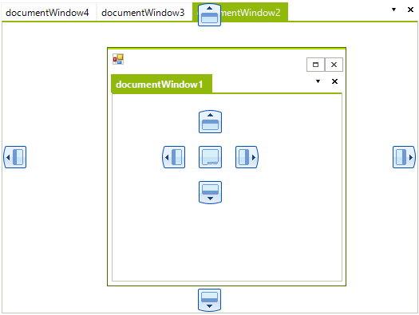
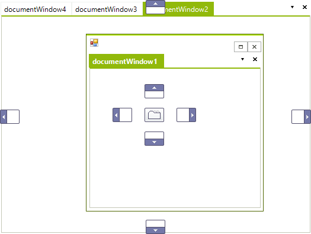

# DockingGuidesTemplate
 
__RadDock__ comes with four predefined docking guides templates:

* __Visual Studio 2008__ 


* __Visual Studio 2010__ 


* __Control Default__



* __Office2010__



By default, __RadDock__ uses the VS2010 template. In order to use the VS2008 template, you can set it as shown below: 

{{source=..\SamplesCS\Dock\dock-architecture-and-features-docking-guides-template.cs region=VS2008}} 
{{source=..\SamplesVB\Dock\dock-architecture-and-features-docking-guides-template.vb region=VS2008}} 

````C#
            
this.radDock1.DockingGuidesTemplate = PredefinedDockingGuidesTemplate.VS2008;

````
````VB.NET
Me.RadDock1.DockingGuidesTemplate = PredefinedDockingGuidesTemplate.VS2008

````

{{endregion}} 
 
## Creating a custom docking guides template

__RadDock__ gives you the ability to create and use your own __DockingGuidesTemplates__. The following example explains what is contained in a DockingGuidesTemplate and how it should be set up.
          
For our custom **DockingGuidesTemplate** we will use the following images (used in VS2008 template): 

||||||
|----|----|----|----|----|
| __Left__ | __Top__ | __Right__ | __Bottom__ | __Fill__ |
| __Left Hot__ | __Top Hot__ | __Right Hot__ | __Bottom Hot__ | __Fill Hot__ |
| __Center Background__ |||||

We should first create a **DockingGuidesTemplate** object and then set the images and their locations on the center background image. **RadDock** will define its hot mouse areas on the **CenterBackground** image depending on the images' locations that we set. The left, top, right and bottom images are reused for the outer guides (outside the center "compass"): 

{{source=..\SamplesCS\Dock\dock-architecture-and-features-docking-guides-template.cs region=Template}} 
{{source=..\SamplesVB\Dock\dock-architecture-and-features-docking-guides-template.vb region=Template}} 

````C#
DockingGuidesTemplate template;
       
void Form1_Load(object sender, EventArgs e)
{
    template = new DockingGuidesTemplate();
     
    template.DockingHintBackColor = Color.FromArgb(30, Color.Green);
    template.DockingHintBorderColor = Color.FromArgb(30, Color.DarkGreen);
    
    template.LeftImage.Image = Properties.Resources.Left;
    template.TopImage.Image = Properties.Resources.Top;
    template.RightImage.Image = Properties.Resources.Right;
    template.BottomImage.Image = Properties.Resources.Bottom;
    template.FillImage.Image = Properties.Resources.Fill;
    
    template.LeftImage.HotImage = Properties.Resources.LeftHot;
    template.TopImage.HotImage = Properties.Resources.TopHot;
    template.RightImage.HotImage = Properties.Resources.RightHot;
    template.BottomImage.HotImage = Properties.Resources.BottomHot;
    template.FillImage.HotImage = Properties.Resources.FillHot;
    
    template.CenterBackgroundImage.Image = Properties.Resources.Center;
    
    template.LeftImage.LocationOnCenterGuide = new Point(0, 28);
    template.TopImage.LocationOnCenterGuide = new Point(28, 0);
    template.RightImage.LocationOnCenterGuide = new Point(65, 28);
    template.BottomImage.LocationOnCenterGuide = new Point(28, 65);
    template.FillImage.LocationOnCenterGuide = new Point(28, 28);
        
    this.radDock1.DockingGuidesTemplate = template;
}

````
````VB.NET
Private template As DockingGuidesTemplate
Private Sub Form1_Load(sender As Object, e As EventArgs)
    template = New DockingGuidesTemplate()
    template.DockingHintBackColor = Color.FromArgb(30, Color.Green)
    template.DockingHintBorderColor = Color.FromArgb(30, Color.DarkGreen)
    template.LeftImage.Image = Resources.Left
    template.TopImage.Image = Resources.Top
    template.RightImage.Image = Resources.Right
    template.BottomImage.Image = Resources.Bottom
    template.FillImage.Image = Resources.Fill
    template.LeftImage.HotImage = Resources.LeftHot
    template.TopImage.HotImage = Resources.TopHot
    template.RightImage.HotImage = Resources.RightHot
    template.BottomImage.HotImage = Resources.BottomHot
    template.FillImage.HotImage = Resources.FillHot
    template.CenterBackgroundImage.Image = Resources.Center
    template.LeftImage.LocationOnCenterGuide = New Point(0, 28)
    template.TopImage.LocationOnCenterGuide = New Point(28, 0)
    template.RightImage.LocationOnCenterGuide = New Point(65, 28)
    template.BottomImage.LocationOnCenterGuide = New Point(28, 65)
    template.FillImage.LocationOnCenterGuide = New Point(28, 28)
    Me.RadDock1.DockingGuidesTemplate = template
End Sub

````

{{endregion}}  

As you can see in the code snippet, we are setting the __DockingHintBackColor__ and __DockingHintBorderColor__ properties which determine the colors of the docking hint area. The result is shown on the figure below:


# See Also

* [Using the CommandManager]()     
* [Using the ContextMenuService]()
* [Using the DragDropService]() 
* [Document Manager]()   
* [Understanding RadDock]()
