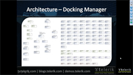
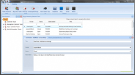
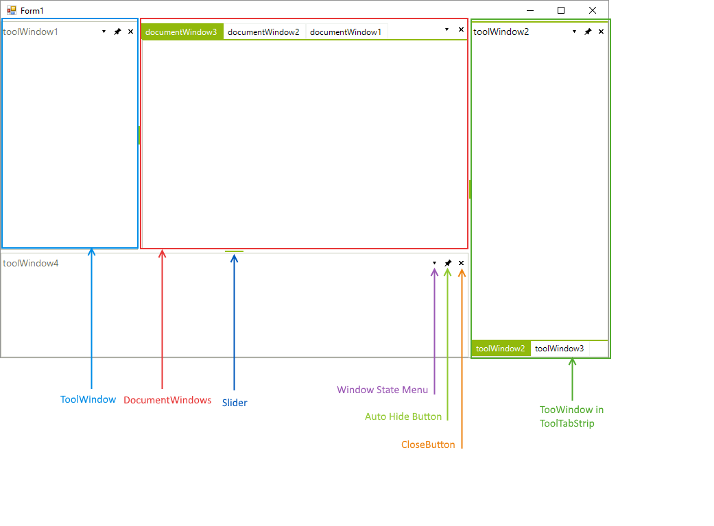
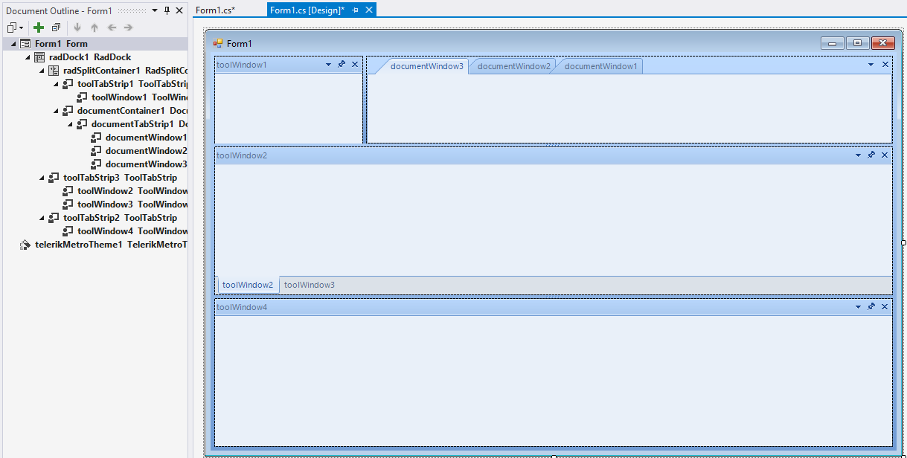
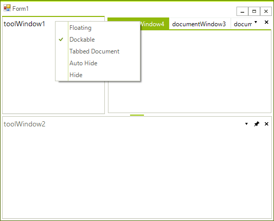

# Understanding RadDock

| RELATED VIDEOS |  |
| ------ | ------ |
|The new and improved RadDock for WinForms has landed and this is your opportunity to get a first look. Join Developer Evangelist John Kellar as he shows you how quickly you can get up and running with the new version of RadDock. John will cover the new features so you know what to expect and how you can use RadDock in your applications once it is officially released. (Runtime: 32:54) [ Introducing the new RadDock for WinForms ](http://www.telerik.com/videos/winforms/introducing-the-new-raddock-for-winforms)|In this video, you will learn how to get started with the run-time and design-time features in the new RadDock for WinForms. You will see the rich RadDock run-time features in action and you will see how easy it is to get started with RadDock in Visual Studio. You will also be introduced to the new Advanced Layout Designer for RadDock, a design-time tool that makes it easy to customize your RadDock layouts. (Runtime: 09:42) [ Getting Started with RadDock for WinForms ](http://www.telerik.com/videos/winforms/getting-started-with-raddock-for-winforms)|

## Anatomy of RadDock

__RadDock__ provides the end user a great deal of control over the placement of dockable objects in your application and provide that control with drag-and-drop ease. The control tree that __RadDock__ forms, consists of the following elements:

* __DocumentContainer__ contains DocumentTabStrips (containers of DocumentWindows). Each __RadDock__ has only one __DocumentContainer__ and this container cannot be deleted by design. By default, the DocumentContainer is visible even if you do not have any documents opened. This behavior is similar to the Visual Studio behavior. 

* __RadSplitContainer__ corresponds to Microsoft’s SplitContainer, but it offers not just two, but a list of Panels. Actually, __RadDock__ inherits __RadSplitContainer__ thus inheriting all the logic of displaying split windows. __RadSplitContainer__ uses __RadSplitter__ which allows you to resize your dock containers by drag and drop operations. [__RadSplitContainer__]() is also available as a separate control.   

* __ToolTabStrip__ is a control that displays the tabs to switch to different tool windows docked in the same container. ToolWindow, as you probably have guessed, is the actual container for all the controls you wish to add and drag around. 

* __DocumentTabStrip__ is a control that displays the tabs to switch to different document windows docked in the same container. DocumentTabStrip hosts DocumentWindows which from their side can host your controls. 

* __DocumentWindows__ are tabbed documents that cannot be dragged outside of their container. __DocumentWindows__ can be dragged and repositioned within their container. 

* __ToolWindows__ are tool window style panels that can be undocked and dragged off the form or to other docking containers. __ToolWindows__ can be pinned open or unpinned and auto-hidden (i.e. collapsed against the nearest side of the __RadDock__). __ToolWindow__ can be dragged onto __DocumentWindow__ containers as well, but it retains its identity as a ToolWindow so it can be docked back in __ToolWindow__ containers by its context menu (*Dockable* option)." 

* __HostWindows__ host your UserControls and when you dock a __HostWindow__ in RadDock, it is interpreted as a __ToolWindow__. 

* __Auto-HideTabStrips__ are shown at the edges of RadDock when you have a Auto-Hide windows. 

* __RadSplitters__ are shown between dock containers (ToolTabStrips, DocumentTabStrips) to allow you to resize these containers.

Both __ToolWindow__ and __DocumentWindow__ host other controls and provide two different approaches to managing layout.

>caption Figure 1: RadDock elements.

## Document Outline tool

You can inspect the hierarchy of the elements at design-time by using the Visual Studio `Document Outline` tool. In order to use it, simply go to View >> Other Windows >> Document Outline or press Ctrl+Alt+T. The screenshot below represents a RadDock instance at design-time and its corresponding hierarchy of elements in the `Document Outline` tool:

>caption Figure 2: The document outline window in Visual Studio.

## Context Menus

Differences in the behavior of __DocumentWindow__ vs. __ToolWindow__ are reflected in their context menus. __DocumentWindow__ has commands for closing windows, creating new horizontal and vertical tab groups and for moving windows between groups.

>caption Figure: 3 DocumentWindow context menu

The __ToolWindow__ context menu has commands that allow the panel to be __Floating__ away from the form, __Dockable__ (causes the panel to dock) or __Tabbed Document__.  If __Tabbed Document__ is selected the __ToolWindow__ becomes hosted in a __DocumentTabStrip__ container along with the tabbed documents. __Auto Hide__ causes the panel to be unpinned and collapsed against the nearest edge of the __RadDock__ (see the diagram in "Anatomy of RadDock" above). __Hide__ makes the panel invisible. By default, hidden __ToolWindows__ are still part of the [RadDock]() ToolWindows collection.

>caption Figure 4: ToowWindow context menu

