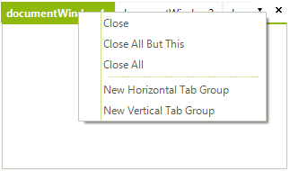

# Using the ContextMenuService
 
## Overview
 
All context menu related operations are handled by a stand alone service, registered with RadDock - `ContextMenuService`. Each context menu request is passed to the service, which on its hand creates the appropriate menu items and raises several events, which allows users to modify existing items, add their own or even cancel the request.
 
## Modifying the existing context menus
 

The following example demonstrates how you can hide the `Close` options from the DocumentWindow context menu. By default the menu looks like this:



 
Let's get the ContextMenuService and subscribe to its `ContextMenuDisplaying` event:

#### Getting the ContextMenuService 

{{source=..\SamplesCS\Dock\ArchitectureAndFeatures.cs region=gettingContextMenuService}} 
{{source=..\SamplesVB\Dock\ArchitectureAndFeatures.vb region=gettingContextMenuService}} 

````C#
ContextMenuService menuService = this.radDock1.GetService<ContextMenuService>();
menuService.ContextMenuDisplaying += menuService_ContextMenuDisplaying;

````
````VB.NET
Dim menuService As ContextMenuService = Me.RadDock1.GetService(Of ContextMenuService)()
AddHandler menuService.ContextMenuDisplaying, AddressOf menuService_ContextMenuDisplaying

````

{{endregion}}  

Then, hide the 'Close' options in the `ContextMenuDisplaying` event handler:

#### Hiding the 'close' menu items 

{{source=..\SamplesCS\Dock\ArchitectureAndFeatures.cs region=handlingContextMenuDisplaying}} 
{{source=..\SamplesVB\Dock\ArchitectureAndFeatures.vb region=handlingContextMenuDisplaying}} 

````C#
private void menuService_ContextMenuDisplaying(object sender, ContextMenuDisplayingEventArgs e)
{
    //the menu request is associated with a valid DockWindow instance, which resides within a DocumentTabStrip
    if (e.MenuType == ContextMenuType.DockWindow &&
        e.DockWindow.DockTabStrip is DocumentTabStrip)
    {
        //remove the "Close" menu items
        for (int i = 0; i < e.MenuItems.Count; i++)
        {
            RadMenuItemBase menuItem = e.MenuItems[i];
            if (menuItem.Name == "CloseWindow" ||
                menuItem.Name == "CloseAllButThis" ||
                menuItem.Name == "CloseAll" ||
                menuItem is RadMenuSeparatorItem)
            {
                // In case you just want to disable to option you can set Enabled false
                //menuItem.Enabled = false;
                menuItem.Visibility = Telerik.WinControls.ElementVisibility.Collapsed;
            }
        }
    }
}

````
````VB.NET
Private Sub menuService_ContextMenuDisplaying(ByVal sender As Object, ByVal e As ContextMenuDisplayingEventArgs)
    'the menu request is associated with a valid DockWindow instance, which resides within a DocumentTabStrip
    If e.MenuType = ContextMenuType.DockWindow AndAlso TypeOf e.DockWindow.DockTabStrip Is DocumentTabStrip Then
        'remove the "Close" menu items
        For i As Integer = 0 To e.MenuItems.Count - 1
            Dim menuItem As RadMenuItemBase = e.MenuItems(i)
            If menuItem.Name = "CloseWindow" OrElse menuItem.Name = "CloseAllButThis" OrElse menuItem.Name = "CloseAll" OrElse TypeOf menuItem Is RadMenuSeparatorItem Then
                ' In case you just want to disable to option you can set Enabled false
                'menuItem.Enabled = false;
                menuItem.Visibility = Telerik.WinControls.ElementVisibility.Collapsed
            End If
        Next i
    End If
End Sub

````

{{endregion}} 
 
The result is shown on the screenshot below:


 
## Menu items' names 

You can notice in the code snippet above that we are using the __Name__ property of the items instead of the __Text__ property. This allows you to handle the case even when a custom [RadDockLocalization]() provider is applied. The names for the menu items in RadDock are:
 
| __Text__ | __Name__ |
|----|----|
|Close|CloseWindow|
|Close All But This|CloseAllButThis|
|Close All|CloseAll|
|New Horizontal Tab Group|NewHTabGroup|
|New Vertical Tab Group|NewVTabGroup|
|Floating|Floating|
|Dockable|Docked|
|Tabbed Document|TabbedDocument|
|Auto Hide|AutoHide|
|Hide|Hidden|
| *Document Name* |ActivateWindow|
