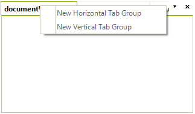

# Using the ContextMenuService

## Overview

All context menu related operations are handled by a stand alone service, registered with RadDock - ContextMenuService. Each context menu request is passed to the service, which on its hand creates the appropriate menu items and raises several events, which allows users to modify existing items, add their own or even cancel the request.

## Modifying the existing context menus

The following example demonstrates how you can hide the 'close' options from the DocumentWindow context menu. By default the menu looks like this:

Let's get the ContextMenuService and subscribe to its ContextMenuDisplaying event:

#### __[C#] Getting the ContextMenuService__

{{source=..\SamplesCS\Dock\ArchitectureAndFeatures.cs region=gettingContextMenuService}}
	            ContextMenuService menuService = this.radDock1.GetService<ContextMenuService>();
	            menuService.ContextMenuDisplaying += menuService_ContextMenuDisplaying;
	{{endregion}}

#### __[VB.NET] Getting the ContextMenuService__

{{source=..\SamplesVB\Dock\ArchitectureAndFeatures.vb region=gettingContextMenuService}}
	        Dim menuService As ContextMenuService = Me.RadDock1.GetService(Of ContextMenuService)()
	        AddHandler menuService.ContextMenuDisplaying, AddressOf menuService_ContextMenuDisplaying
	{{endregion}}

Then, hide the 'close' options in the ContextMenuDisplaying event handler:

#### __[C#] Hiding the 'close' menu items__

{{source=..\SamplesCS\Dock\ArchitectureAndFeatures.cs region=handlingContextMenuDisplaying}}
	        private void menuService_ContextMenuDisplaying(object sender, ContextMenuDisplayingEventArgs e)
	        {
	            //the menu request is associated with a valid DockWindow instance, which resides within a DocumentTabStrip
	            if (e.MenuType == ContextMenuType.DockWindow &&
	                e.DockWindow.DockTabStrip is DocumentTabStrip)
	            {
	                //remove the "Close" menu items
	                for (int i = 0; i < e.MenuItems.Count; i++)
	                {
	                    RadMenuItemBase menuItem = e.MenuItems[i];
	                    if (menuItem.Name == "CloseWindow" ||
	                        menuItem.Name == "CloseAllButThis" ||
	                        menuItem.Name == "CloseAll" ||
	                        menuItem is RadMenuSeparatorItem)
	                    {
	                        // In case you just want to disable to option you can set Enabled false
	                        //menuItem.Enabled = false;
	                        menuItem.Visibility = Telerik.WinControls.ElementVisibility.Collapsed;
	                    }
	                }
	            }
	        }
	{{endregion}}

#### __[VB.NET] Hiding the 'close' menu items__

{{source=..\SamplesVB\Dock\ArchitectureAndFeatures.vb region=handlingContextMenuDisplaying}}
	    Private Sub menuService_ContextMenuDisplaying(ByVal sender As Object, ByVal e As ContextMenuDisplayingEventArgs)
	        'the menu request is associated with a valid DockWindow instance, which resides within a DocumentTabStrip
	        If e.MenuType = ContextMenuType.DockWindow AndAlso TypeOf e.DockWindow.DockTabStrip Is DocumentTabStrip Then
	            'remove the "Close" menu items
	            For i As Integer = 0 To e.MenuItems.Count - 1
	                Dim menuItem As RadMenuItemBase = e.MenuItems(i)
	                If menuItem.Name = "CloseWindow" OrElse menuItem.Name = "CloseAllButThis" OrElse menuItem.Name = "CloseAll" OrElse TypeOf menuItem Is RadMenuSeparatorItem Then
	                    ' In case you just want to disable to option you can set Enabled false
	                    'menuItem.Enabled = false;
	                    menuItem.Visibility = Telerik.WinControls.ElementVisibility.Collapsed
	                End If
	            Next i
	        End If
	    End Sub
	{{endregion}}

The result is shown on the screenshot below:

## Menu items' names

You can notice in the code snippet above that we are using the Name property of the items instead of the Text property. This allows you to handle the case even when a custom [RadDockLocalization]() provider is applied. The names for the menu items in RadDock are:

<table><tr><td>

<b>Text</b></td><td>

<b>Name</b></td></tr><tr><td>

Close</td><td>

CloseWindow</td></tr><tr><td>

Close All But This</td><td>

CloseAllButThis</td></tr><tr><td>

Close All</td><td>

CloseAll</td></tr><tr><td>

New Horizontal Tab Group</td><td>

NewHTabGroup</td></tr><tr><td>

New Vertical Tab Group</td><td>

NewVTabGroup</td></tr><tr><td>

Floating</td><td>

Floating</td></tr><tr><td>

Dockable</td><td>

Docked</td></tr><tr><td>

Tabbed Document</td><td>

TabbedDocument</td></tr><tr><td>

Auto Hide</td><td>

AutoHide</td></tr><tr><td>

Hide</td><td>

Hidden</td></tr><tr><td>

<i>Document Name</i></td><td>

ActivateWindow</td></tr></table>
