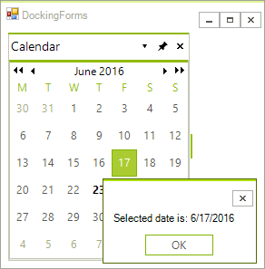

# Docking a UserControl with custom event
 

This tutorial walks you through a real-world scenario that you can have in your application. At a high level, this scenario involves:

1. Placing controls on different user controls.

1. Docking the user controls inside RadDock.

1. Implementing events, methods and properties in the user controls which allow you to have communication between the forms/user controls.

In our particular case we dock a user control instance in a RadDock instance. The user control itself contains a RadCalendar. When the user clicks the RadCalendar a custom __DateChanged__ event for the UserControl1 fires, showing a dialog with the selected date. Using this as a model you can create UserControls with custom properties, methods and events for more complex situations.


 
1\. In Visual Studio create a new Windows Application.

2\. Create a new UserControl - from the Solution Explorer, right-click the project node in the Solution Explorer and select "*Add >> UserControl...*". Name the new user control __CalendarPanel__.

3\. Drop a RadCalendar instance on the __CalendarPanel__ design surface.

4\. Set the RadCalendar __Dock__ property to *Fill*.

5\. In the Property Window locate the __SelectionChanged__ event and double-click it to create an event handler.

6\. Add a delegate and event to be surfaced by the CalendarPanel control when the date selection changes:
	
#### Setting up DateChanged Event 

{{source=..\SamplesCS\Dock\CalendarPanel.cs region=definingDelegates}} 
{{source=..\SamplesVB\Dock\CalendarPanel.vb region=definingDelegates}} 

````C#
public delegate void DateChangedHandler(DateTime date);
public event DateChangedHandler DateChanged;

````
````VB.NET
Public Delegate Sub DateChangedHandler(ByVal [date] As DateTime)
Public Event DateChanged As DateChangedHandler

````

{{endregion}} 


In the __SelectionChanged__ event handler add the following code:

#### Handling the RadCalendar SelectionChanged event 

{{source=..\SamplesCS\Dock\CalendarPanel.cs region=handlingSelectionChanged}} 
{{source=..\SamplesVB\Dock\CalendarPanel.vb region=handlingSelectionChanged}} 

````C#
private void radCalendar1_SelectionChanged(object sender, EventArgs e)
{
    if (DateChanged != null)
    {
        DateChanged((sender as Telerik.WinControls.UI.RadCalendar).SelectedDate);
    }
}

````
````VB.NET
Private Sub RadCalendar1_SelectionChanged(ByVal sender As System.Object, ByVal e As System.EventArgs) Handles RadCalendar1.SelectionChanged
    RaiseEvent DateChanged((TryCast(sender, RadCalendar)).SelectedDate)
End Sub

````

{{endregion}} 

 

7\. In the Solution Explorer, double-click the main form to open its design surface.  

8\. Drop a RadDock instance on the opened design surface. Set the RadDock __Dock__ property *Fill.*

9\. Dock the CalendarPanel user control to RadDock in the Form_Load event handler using the following code snippet:
	
#### Docking CalendarPanel user control in RadDock 

{{source=..\SamplesCS\Dock\DockingForms.cs region=creatingCalendarPanel}} 
{{source=..\SamplesVB\Dock\DockingForms.vb region=creatingCalendarPanel}} 
	
````C#
CalendarPanel calendarPanel = new CalendarPanel();
HostWindow host = this.radDock1.DockControl(calendarPanel, Telerik.WinControls.UI.Docking.DockPosition.Left);
host.Text = "Calendar";
calendarPanel.DateChanged += calendarPanel_DateChanged;

````
````VB.NET
Dim calendarPanel As New CalendarPanel()
Dim host As HostWindow = Me.RadDock1.DockControl(calendarPanel, Telerik.WinControls.UI.Docking.DockPosition.Left)
host.Text = "Calendar"
AddHandler calendarPanel.DateChanged, AddressOf calendarPanel_DateChanged

````

{{endregion}} 
 
10\. Add an event handler for the CalendarPanel DateChanged event:
	
#### Handling the Custom DateChanged event 

{{source=..\SamplesCS\Dock\DockingForms.cs region=handlingDateChanged}} 
{{source=..\SamplesVB\Dock\DockingForms.vb region=handlingDateChanged}} 

````C#
void calendarPanel_DateChanged(DateTime date)
{
    RadMessageBox.Show("Selected date is: " + date.ToShortDateString());
}

````
````VB.NET
Sub calendarPanel_DateChanged(ByVal [date] As DateTime)
    RadMessageBox.Show("Selected date is: " + [date].ToShortDateString())
End Sub

````

{{endregion}} 
 
11\. Press __F5__ to run the application. Click the cells in the calendar to display the date in a message dialog. 
