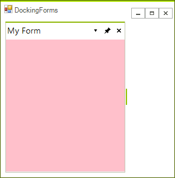

# Getting Started
 
In order to dock your UserControls and Forms in __RadDock__, you just need to use the DockControl method. This method will dock a Form, a UserControl, or simply any Control. A HostWindow with DockType ToolWindow will be created to host the Control.

For example, the following code snippet will result in the screenshot shown below:

#### Docking a Form 

{{source=..\SamplesCS\Dock\DockingForms.cs region=dockingForm}} 
{{source=..\SamplesVB\Dock\DockingForms.vb region=dockingForm}} 

````C#
Form form = new Form();
form.BackColor = Color.Pink;
form.Text = "My Form";
this.radDock1.DockControl(form, DockPosition.Left);
form.Show();

````
````VB.NET
Dim form As Form = New Form()
form.BackColor = Color.Pink
form.Text = "My Form"
Me.RadDock1.DockControl(form, DockPosition.Left)
form.Show()

````

{{endregion}} 





| RELATED VIDEOS |  |
| ------ | ------ |
|[Introducing the new RadDock for WinForms](http://www.telerik.com/videos/winforms/introducing-the-new-raddock-for-winforms)<br>The new and improved RadDock for WinForms has landed and this is your opportunity to get a first look. Join Developer Evangelist John Kellar as he shows you how quickly you can get up and running with the new version of RadDock. John will cover the new features so you know what to expect and how you can use RadDock in your applications once it is officially released. (Runtime: 32:54)|| 
|[Getting Started with RadDock for WinForms](http://www.telerik.com/videos/winforms/getting-started-with-raddock-for-winforms)<br>In this video, you will learn how to get started with the run-time and design-time features in the new RadDock for WinForms. You will see the rich RadDock run-time features in action and you will see how easy it is to get started with RadDock in Visual Studio. You will also be introduced to the new Advanced Layout Designer for RadDock, a design-time tool that makes it easy to customize yoru RadDock layouts. (Runtime: 09:42)| |

# See Also

* [Docking a UserControl with custom event]()     
* [Docking Singleton Forms]()
* [Get a HostWindow by its Content]() 
