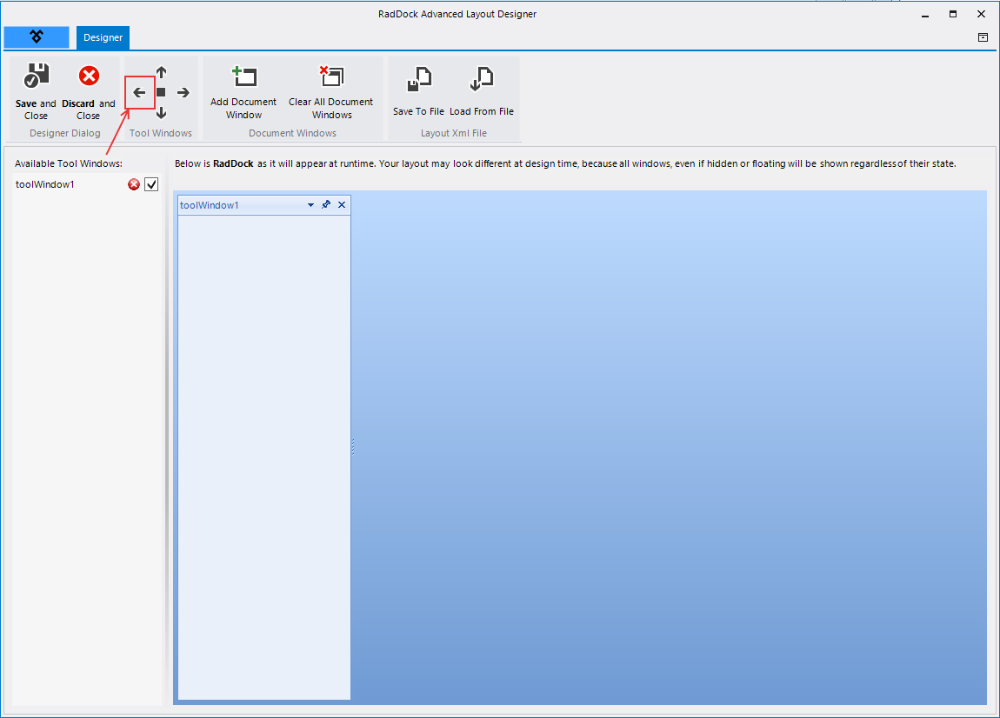
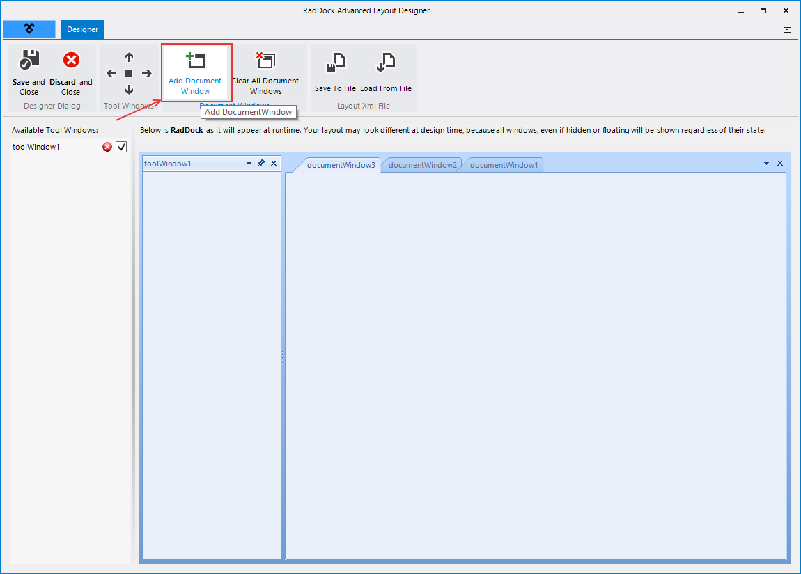

# Getting Started


This tutorial creates a shell for a report viewer/explorer. A __ToolWindow__ on the left represents a list of reports. The right side of the form in __RadDock__ contains three __DocumentWindows__, each representing a report. This tutorial demonstrates the layout of __ToolWindow__ and __DocumentWindows__. It also demonstrates adding a RadTreeView control to one of the created windows and synchronizing the active DockWindow with the selection in the RadTreeView instance. 


## Configure the RadDock

1. Drop a __RadDock__ control on the form.
            

1. Set the __RadDock Dock__ property to __Fill.__

1. Open the __RadDock__ Smart Tag and select __Show Advanced Layout Designer.__ This step will display the __RadDock Advanced Layout Designer__ dialog.
            

1. In the RadRibbonBar on top, click the left green arrow to dock a new __ToolWindow__ to the left.

	

>note The list on the left side of the preview displays all created windows. From this list you can set the visibility of the ToolWindows to false, if you do not need some of them visible at runtime initially.
>


1. Again from the RadRibbonBar, click on the __Add DocumentWindow__ button three times to add three __DocumentWindows__ instances.
            

1. Click __Save and Close__ button to close the dialog and save the layout to the __RadDock__. 
	
	For more complex scenarios RadDock advanced layout designer provides full drag and drop and user interaction support in the preview RadDock control. This allows you to the dock a ToolWindow to bottom-right, to set a ToolWindow in AutoHide mode or even to float a ToolWindow.
            

	>caution The real layout of RadDock which is displayed at runtime is available only through RadDock Advanced Layout Designer. I.e. if you have hidden, auto-hidden or floating ToolWindows, they will be shown as such only in the advanced designer. In Visual Studio IDE we display ToolWindows in their docked state, which allows you to place and layout your controls in them.
	

1. In the designer select the __ToolWindow__ on the left. You can verify this by checking that the currently selected component in the Properties Window of Visual Studio is __ToolWindow__.
            

1. Set the __ToolWindow Text__ property to "Reports".
            

1. Select one of the __DocumentWindows__. To do this in the designer, select the tab (i.e. on "Document1"), then click inside the client area. Check the Properties Window that you have selected a __DocumentWindow__.
            

1. Set the __DocumentWindow Name__ property to "dwProductListing" and __Text__ property to "Product Listing".
            

1. Select the next __DocumentWindow,__ set the __Name__ property to "dwProductByCategory" and the __Text__ property to "Product By Category".
            

1. Select the last __DocumentWindow,__ set the __Name__ property to "dwTop10Customers" and __Text__ property to "Top 10 Customers".
            

1. Drop a __RadTreeView__ control to the "Reports" __ToolWindow__, set the control's __Dock__ property to __Fill.__

1. Make sure that you have the __Telerik.Wincontrols.UI__ and __Telerik.Wincontrols.UI.Docking__ in the "using" (C#) or "Imports" (VB) section of the code.

	#### Include namespaces 
 
	{{source=..\SamplesCS\Dock\GettingStarted.cs region=namespace}} 
	{{source=..\SamplesVB\Dock\GettingStarted.vb region=namespace}} 

	````C#
	using Telerik.WinControls.UI;
	using Telerik.WinControls.UI.Docking;
	````
	````VB.NET
	Imports Telerik.WinControls.UI
	Imports Telerik.WinControls.UI.Docking
		'
	````

	{{endregion}} 
 
1. Create a __Form Load__ event handler and copy the code below to it. This code builds the __TreeView__ node structure and links the __Name__of each __DocumentWindow__ to the corresponding __Node Tag__ property. Each dockable object has a __Name__ property, a __String__ that uniquely identifies it. Later we use the __Name__ to locate the __DocumentWindow__ and activate it.

	#### Initializing RadTreeView 
 
	{{source=..\SamplesCS\Dock\GettingStarted.cs region=settingUpTree}} 
	{{source=..\SamplesVB\Dock\GettingStarted.vb region=settingUpTree}} 

	````C#
        void Form1_Load(object sender, EventArgs e)
        {
            RadTreeNode productNode = radTreeView1.Nodes.Add("Product Reports");
            RadTreeNode customerNode = radTreeView1.Nodes.Add("Customer Reports");
            RadTreeNode productListingNode = new RadTreeNode("Product Listing");
            productListingNode.Tag = dwProductListing.Name;
            RadTreeNode productCategoryNode = new RadTreeNode("Product By Category");
            productCategoryNode.Tag = dwProductByCategory.Name;
            RadTreeNode top10CustomerNode = new RadTreeNode("Top 10 Customers");
            top10CustomerNode.Tag = dwTop10Customers.Name;
            productNode.Nodes.Add(productListingNode);
            productNode.Nodes.Add(productCategoryNode);
            customerNode.Nodes.Add(top10CustomerNode);
            radTreeView1.ExpandAll();
        }
	````
	````VB.NET
    Private Sub Form1_Load(ByVal sender As System.Object, ByVal e As System.EventArgs) Handles MyBase.Load
        Dim productNode As RadTreeNode = RadTreeView1.Nodes.Add("Product Reports")
        Dim customerNode As RadTreeNode = RadTreeView1.Nodes.Add("Customer Reports")
        Dim productListingNode As New RadTreeNode("Product Listing")
        productListingNode.Tag = dwProductListing.Name
        Dim productCategoryNode As New RadTreeNode("Product By Category")
        productCategoryNode.Tag = dwProductByCategory.Name
        Dim top10CustomerNode As New RadTreeNode("Top 10 Customers")
        top10CustomerNode.Tag = dwTop10Customers.Name
        productNode.Nodes.Add(productListingNode)
        productNode.Nodes.Add(productCategoryNode)
        customerNode.Nodes.Add(top10CustomerNode)
        RadTreeView1.ExpandAll()
    End Sub
    '
	````

	{{endregion}} 
 

1. Create an __SelectedNodeChanged__ event handler and add the following code to it. The code for this event handler verifies that the Tag of the selected node has a value. Further, if this value corresponds to the name of an existing window in RadDock, the appropriate DocumentWindow gets activated.

	#### Handling the RadTreeView SelectedNodeChanged event 
 

	{{source=..\SamplesCS\Dock\GettingStarted.cs region=handlingSelectedNodeChanged}} 
	{{source=..\SamplesVB\Dock\GettingStarted.vb region=handlingSelectedNodeChanged}} 

	````C#
        void radTreeView1_SelectedNodeChanged(object sender, RadTreeViewEventArgs e)
        {            
            if (e.Node.Tag != null)
            {
                DockWindow dw = this.radDock1[e.Node.Tag.ToString()];
                if (dw != null)
                {
                    this.radDock1.ActiveWindow = dw;
                }
            }
        }
	````
	````VB.NET
    Private Sub RadTreeView1_SelectedNodeChanged(ByVal sender As Object, ByVal e As RadTreeViewEventArgs)
        If Not e.Node.Tag Is Nothing Then
            Dim dw As DockWindow = Me.RadDock1(e.Node.Tag.ToString())
            If Not dw Is Nothing Then
                Me.RadDock1.ActiveWindow = dw
            End If
        End If
    End Sub
    '
	````

	{{endregion}} 
 
Press __F5__ to run the application. Try experimenting with...
        

* Dragging the panel and document tabs
            

* Right-clicking document and panel tabs.
            

* Pressing __Ctrl-Tab__ to invoke the [Quick Navigator]().
            

* Pinning and un-pinning the __DockWindow__.
            

* Using the __ToolWindow__ and __DocumentWindow__ menus by clicking the downward arrows.
            


| RELATED VIDEOS |  |
| ------ | ------ |
|The new and improved RadDock for WinForms has landed and this is your opportunity to get a first look. Join Developer Evangelist John Kellar as he shows you how quickly you can get up and running with the new version of RadDock. John will cover the new features so you know what to expect and how you can use RadDock in your applications once it is officially released. (Runtime: 32:54)[ Introducing the new RadDock for WinForms ](http://tv.telerik.com/winforms/raddock/introducing-new-raddock-winforms)|In this video, you will learn how to get started with the run-time and design-time features in the new RadDock for WinForms. You will see the rich RadDock run-time features in action and you will see how easy it is to get started with RadDock in Visual Studio. You will also be introduced to the new Advanced Layout Designer for RadDock, a design-time tool that makes it easy to customize yoru RadDock layouts. (Runtime: 09:42)[ Getting Started with RadDock for WinForms ](http://tv.telerik.com/winforms/raddock/getting-started-with-raddock-winforms)|
