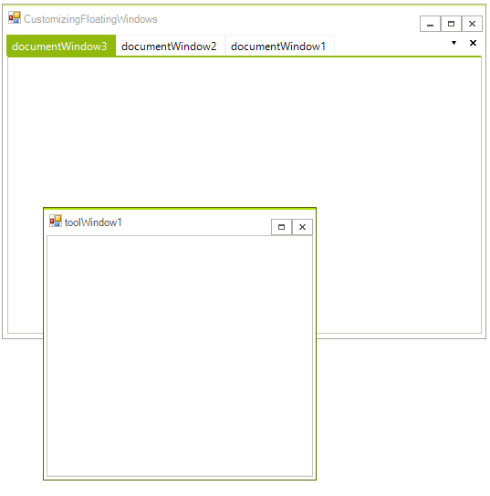
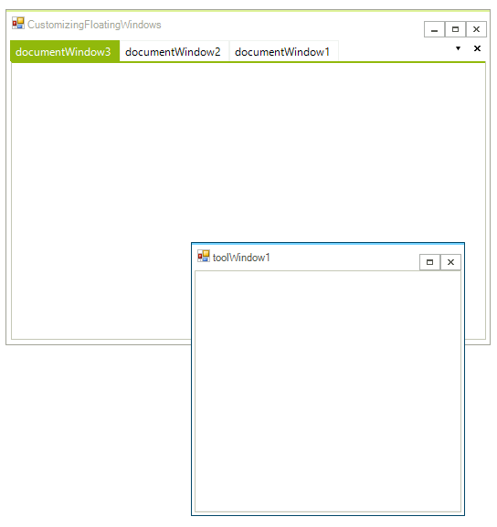

# Customizing Floating Windows
 
FloatingWindows provide a useful way of reordering pieces of content on your screen. By default, FloatingWindows only appear with their close button enabled, and on top of the RadDock that manages them. The following paragraphs demonstrate how this behavior can be changed. In all cases you need to handle the __FloatingWindowCreated__ event which is fired after the end-user starts dragging a ToolWindow to float it. At this point the FloatingWindow is created and it is just about to be shown. This is the moment when you can plug in and modify the window your way.
      

## Enabling Minimize and Maximize buttons
      

In order to enable the Maximize and Minimize buttons for a FloatingWindow, you have to handle the FloatingWindowCreated event and set the MinimizeBox, MaximizeBox and FormBorderStyle properties of the FloatingWindow the following way: 

{{source=..\SamplesCS\Dock\CustomizingFloatingWindows.cs region=buttons}} 
{{source=..\SamplesVB\Dock\CustomizingFloatingWindows.vb region=buttons}} 

````C#
        void radDock1_FloatingWindowCreated1(object sender, Telerik.WinControls.UI.Docking.FloatingWindowEventArgs e)
        {
            e.Window.MaximizeBox = true;
            e.Window.MinimizeBox = true;
            e.Window.FormBorderStyle = System.Windows.Forms.FormBorderStyle.Sizable;
        }
````
````VB.NET
    Private Sub radDock1_FloatingWindowCreated1(ByVal sender As Object, ByVal e As Telerik.WinControls.UI.Docking.FloatingWindowEventArgs)
        e.Window.MaximizeBox = True
        e.Window.MinimizeBox = True
        e.Window.FormBorderStyle = System.Windows.Forms.FormBorderStyle.Sizable
    End Sub
    '
````

{{endregion}} 
 
The result is:


## Allowing the FloatingWindow to be under the main form
      

Sometimes, you may want to prevent the FloatingWindow from being always on top of the form that contains the RadDock manager. In order to do that, you need to extend the FloatingWindow class and use an instance of the extended type. 
In the extended FloatingWindow type, we need to override the OnActivated method, and after the base implementation takes place, we should remove the window from the collection of owned forms that the main form has: 

{{source=..\SamplesCS\Dock\CustomFloatingWindow.cs region=customFloatingWindow}} 
{{source=..\SamplesVB\Dock\CustomFloatingWindow.vb region=customFloatingWindow}} 

````C#
    public class CustomFloatingWindow : FloatingWindow
    {
        public CustomFloatingWindow(RadDock dockManager)
            : base(dockManager)
        {
        }

        protected override void OnActivated(EventArgs e)
        {
            base.OnActivated(e);

            Form dockForm = this.DockManager.FindForm();
            if (dockForm != null)
            {
                dockForm.RemoveOwnedForm(this);
            }
        }
    }
````
````VB.NET
Public Class CustomFloatingWindow
    Inherits FloatingWindow
    Public Sub New(ByVal dockManager As RadDock)
        MyBase.New(dockManager)
    End Sub

    Protected Overrides Sub OnActivated(ByVal e As EventArgs)
        MyBase.OnActivated(e)

        Dim dockForm As Form = Me.DockManager.FindForm()
        If dockForm IsNot Nothing Then
            dockForm.RemoveOwnedForm(Me)
        End If
    End Sub
End Class
'
````

{{endregion}} 
 
Finally, we have to pass an instance of the custom FloatingWindow to the event arguments of the FloatingWindowCreated event: 

{{source=..\SamplesCS\Dock\CustomizingFloatingWindows.cs region=showBehind}} 
{{source=..\SamplesVB\Dock\CustomizingFloatingWindows.vb region=showBehind}} 

````C#
        void radDock1_FloatingWindowCreated2(object sender, Telerik.WinControls.UI.Docking.FloatingWindowEventArgs e)
        {
            CustomFloatingWindow customWindow = new CustomFloatingWindow(this.radDock1);
            e.Window = customWindow;
        }
````
````VB.NET
    Private Sub radDock1_FloatingWindowCreated2(ByVal sender As Object, ByVal e As Telerik.WinControls.UI.Docking.FloatingWindowEventArgs)
        Dim customWindow As New CustomFloatingWindow(Me.RadDock1)
        e.Window = customWindow
    End Sub
    '
````

{{endregion}} 
 

Here is the result. As you can see, the form that contains the RadDock manager can cover the FloatingWindow:


## Setting the theme of a FloatingWindow
      

FloatingWindow is a descendant class of RadForm. As such, FloatingWindow has the ThemeName property that you can set in the FloatingWindowCreated event in order to change its theme: 

{{source=..\SamplesCS\Dock\CustomizingFloatingWindows.cs region=themeName}} 
{{source=..\SamplesVB\Dock\CustomizingFloatingWindows.vb region=themeName}} 

````C#
        void radDock1_FloatingWindowCreated3(object sender, Telerik.WinControls.UI.Docking.FloatingWindowEventArgs e)
        {
            e.Window.ThemeName = "TelerikMetroBlue";
        }
````
````VB.NET
    Private Sub radDock1_FloatingWindowCreated3(ByVal sender As Object, ByVal e As Telerik.WinControls.UI.Docking.FloatingWindowEventArgs)
        e.Window.ThemeName = "TelerikMetroBlue"
    End Sub
    '
````

{{endregion}} 



