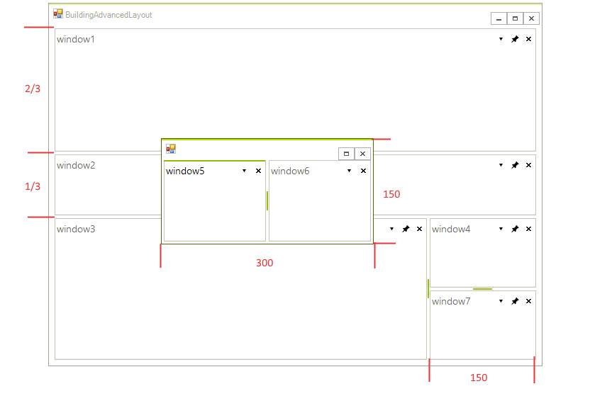
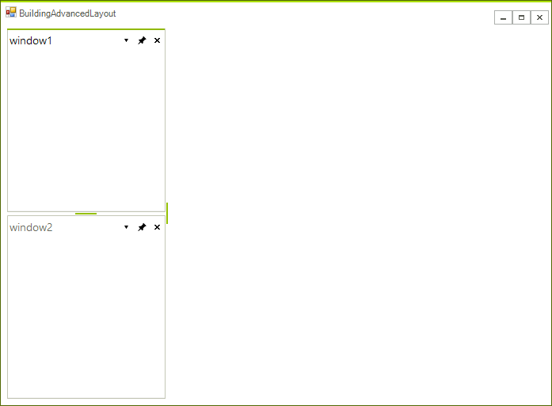
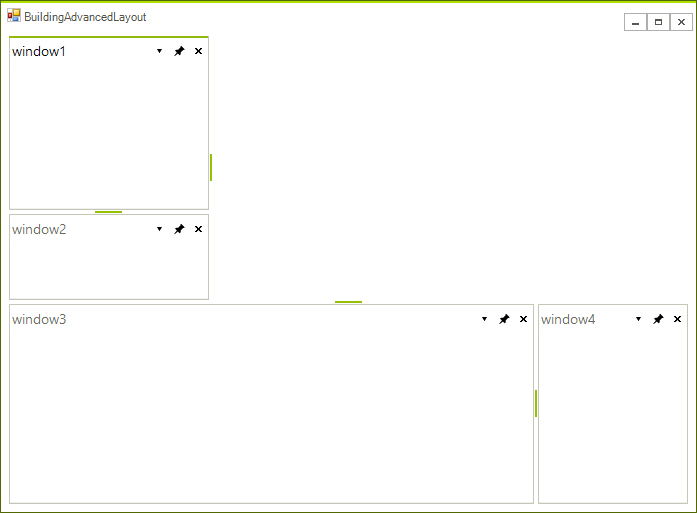
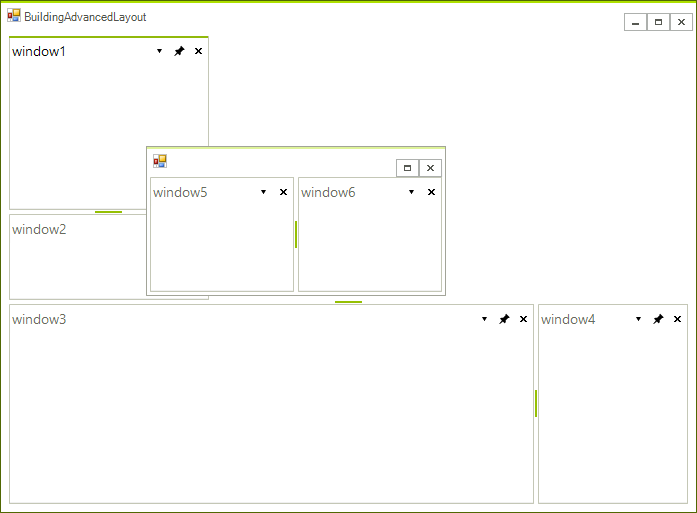
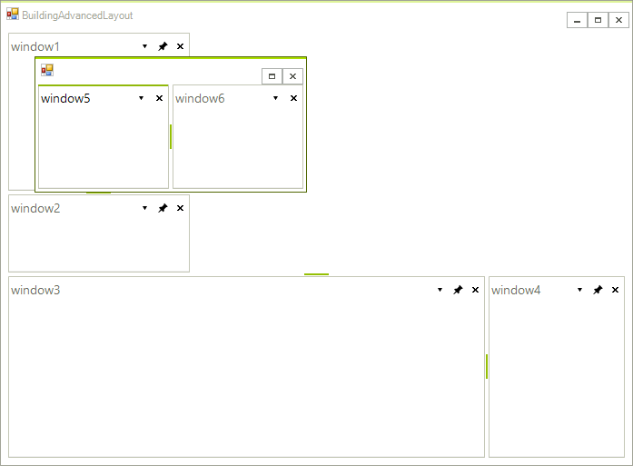
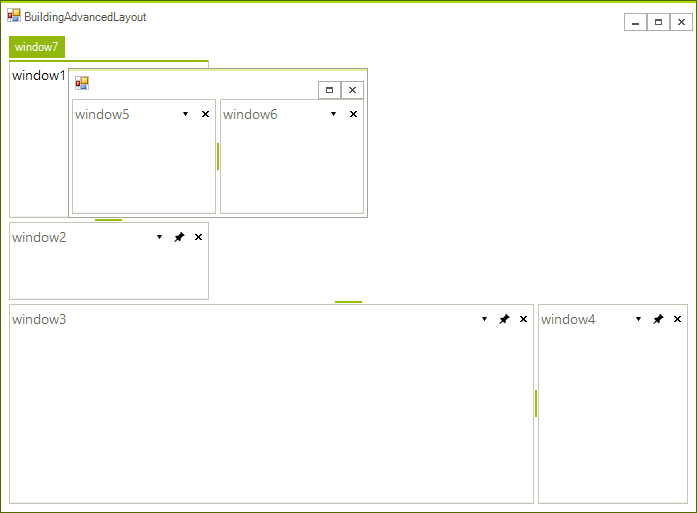
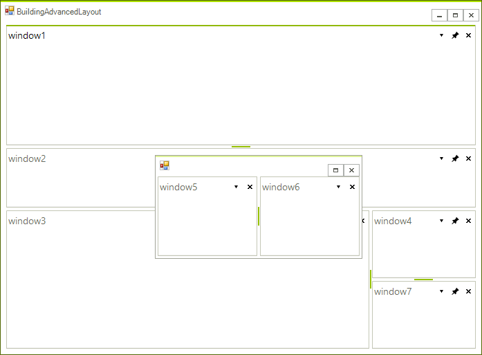

# Example: Building an advanced layout at runtime
 
In this tutorial we are going to create an advanced layout of ToolWindows and DocumentWindows programmatically. Our aim is to build the layout shown on the screenshot below:



We will have a floating window with two ToolWindows and dimensions of the floating window 150 height and 300 width. An interesting part of building the layout is using the __SizeInfo__ property of the TabStrip containers. This property gives you:

1. The ability to set a precise size of a TabStrip which will not be changed when a user resizes the whole RadDock control. For example, the TabStrip of window7 will not be resized when we resize the whole form. Its width will always be 150 unless we explicitly resize the TabStrip of the window7 by using the Splitter. 

1. The ability to set a relative size of a TabStrip so to keep two TabStrips in a specific size ratio. When we resize the form, the TabStrips of window1 and window2 will keep the ration of 1:2 between them - the TabStrip of window2 having 1/3 parts and the TabStrip of window1 having 2/3 parts. 

So, let's start building the layout:

1\. First, let's drag and drop a RadDock instance on our form. Set the Dock property of the RadDock to Fill. Subscribe to the Form_Load where we will implement our windows layout.

2\. Next, we are going to make to ToolWindows. The first one will be docked left, and the other will be docked left-bottom. For this case we need to give the first ToolWindow as a target in the DockWindow method responsible for docking the second ToolWindow:

#### Docking two ToolWindows 

{{source=..\SamplesCS\Dock\BuildingAdvancedLayout.cs region=dockingTwoToolWindows}} 
{{source=..\SamplesVB\Dock\BuildingAdvancedLayout.vb region=dockingTwoToolWindows}} 

````C#
ToolWindow window1 = new ToolWindow();
window1.Name = "window1";
this.radDock1.DockWindow(window1, DockPosition.Left);
ToolWindow window2 = new ToolWindow();
window2.Name = "window2";
this.radDock1.DockWindow(window2, window1, DockPosition.Bottom);

````
````VB.NET
Dim window1 As ToolWindow = New ToolWindow()
window1.Name = "window1"
Me.RadDock1.DockWindow(window1, DockPosition.Left)
Dim window2 As ToolWindow = New ToolWindow()
window2.Name = "window2"
Me.RadDock1.DockWindow(window2, window1, DockPosition.Bottom)

````

{{endregion}} 




3\. Next, let's make the height of window2's TabStrip relative to the height of the window1's TabStrip:

#### Setting relative size 

{{source=..\SamplesCS\Dock\BuildingAdvancedLayout.cs region=settingRelativeSize}} 
{{source=..\SamplesVB\Dock\BuildingAdvancedLayout.vb region=settingRelativeSize}} 

````C#
window2.TabStrip.SizeInfo.SizeMode = SplitPanelSizeMode.Relative;
window2.TabStrip.SizeInfo.RelativeRatio = new SizeF(0, 0.33f);

````
````VB.NET
window2.TabStrip.SizeInfo.SizeMode = SplitPanelSizeMode.Relative
window2.TabStrip.SizeInfo.RelativeRatio = New System.Drawing.SizeF(0, 0.33F)

````

{{endregion}} 
 
The result is shown on the picture below:


Now if we decide to resize the form, the ration of the TabStrips' Height will be kept:


 
4\. Let's add two more windows:

#### Setting absolute size 

{{source=..\SamplesCS\Dock\BuildingAdvancedLayout.cs region=settingAbsoliteSize}} 
{{source=..\SamplesVB\Dock\BuildingAdvancedLayout.vb region=settingAbsoliteSize}} 

````C#
ToolWindow window3 = new ToolWindow();
window3.Name = "window3";
this.radDock1.DockWindow(window3, DockPosition.Bottom);
ToolWindow window4 = new ToolWindow();
window4.Name = "window4";
this.radDock1.DockWindow(window4, window3, DockPosition.Right);
window4.TabStrip.SizeInfo.SizeMode = SplitPanelSizeMode.Absolute;
window4.TabStrip.SizeInfo.AbsoluteSize = new Size(150, 0);

````
````VB.NET
Dim window3 As ToolWindow = New ToolWindow()
window3.Name = "window3"
Me.RadDock1.DockWindow(window3, DockPosition.Bottom)
Dim window4 As ToolWindow = New ToolWindow()
window4.Name = "window4"
Me.RadDock1.DockWindow(window4, window3, DockPosition.Right)
window4.TabStrip.SizeInfo.SizeMode = SplitPanelSizeMode.Absolute
window4.TabStrip.SizeInfo.AbsoluteSize = New Size(150, 0)

````

{{endregion}} 
 
This time we set to Width of the window4's TabStrip to an absolute value of 150 pixels. Now when we resize the form, window4's TabStrip will not change its Width, but the window3's TabStrip will change its Width.




5\. Add two more ToolWindows. The interesting thing here is that these ToolWindows will be in a Floating DockState. Please note that you can give the size and location of the form that will host the ToolWindows:

#### Floating ToolWindows 

{{source=..\SamplesCS\Dock\BuildingAdvancedLayout.cs region=floatingWindows}} 
{{source=..\SamplesVB\Dock\BuildingAdvancedLayout.vb region=floatingWindows}} 
	
````C#
ToolWindow window5 = new ToolWindow();
window5.Name = "window5";
this.radDock1.FloatWindow(window5, new Rectangle(250, 250, 300, 150));
ToolWindow window6 = new ToolWindow();
window6.Name = "window6";
this.radDock1.DockWindow(window6, window5, DockPosition.Right);

````
````VB.NET
Dim window5 As ToolWindow = New ToolWindow()
window5.Name = "window5"
Me.RadDock1.FloatWindow(window5, New Rectangle(250, 250, 300, 150))
Dim window6 As ToolWindow = New ToolWindow()
window6.Name = "window6"
Me.RadDock1.DockWindow(window6, window5, DockPosition.Right)

````

{{endregion}} 


 

6\. We will add one more ToolWindow. The specific thing here is that although the ToolWindow should be auto-hidden to Bottom if the user decides to click the 'pin' button, this window will be auto-hidden to Top. This is done with the help of AutoHidePosition property of the TabStrip which hosts the ToolWindow. In addition, this auto-hidden window will have a specific size of (200, 200). Since the AutoHidePosition is set to Top, Height of the given size will be taken into consideration:

#### Setting the AutoHidePosition and AutoHideSize properties 

{{source=..\SamplesCS\Dock\BuildingAdvancedLayout.cs region=autoHide}} 
{{source=..\SamplesVB\Dock\BuildingAdvancedLayout.vb region=autoHide}} 

````C#
ToolWindow window7 = new ToolWindow();
window7.Name = "window7";
window7.AutoHideSize = new Size(100, 100);
this.radDock1.DockWindow(window7, window4, DockPosition.Bottom);
((ToolTabStrip)window7.TabStrip).AutoHidePosition = AutoHidePosition.Top;

````
````VB.NET
Dim window7 As ToolWindow = New ToolWindow()
window7.Name = "window7"
window7.AutoHideSize = New Drawing.Size(100, 100)
Me.RadDock1.DockWindow(window7, window4, DockPosition.Bottom)
CType(window7.TabStrip, ToolTabStrip).AutoHidePosition = AutoHidePosition.Top

````

{{endregion}}  

Initially, the layout will look like this:

 

If the user clicks the 'pin' button of window7, window7 will become auto-hidden to the Top. Next, when the user hovers the window7 tab, a window with 100 pixels in Height is shown:



7\. Finally, we should decide if we want to show several DocumentWindows. If 'yes', we can add them as shown below:

#### Adding DocumentWindows 

{{source=..\SamplesCS\Dock\BuildingAdvancedLayout.cs region=addingDocumentWindows}} 
{{source=..\SamplesVB\Dock\BuildingAdvancedLayout.vb region=addingDocumentWindows}} 

````C#
DocumentWindow document1 = new DocumentWindow();
document1.Name = "document1";
this.radDock1.AddDocument(document1);
DocumentWindow document2 = new DocumentWindow();
document2.Name = "document2";
this.radDock1.AddDocument(document2, document1, DockPosition.Bottom);

````
````VB.NET
Dim document1 As DocumentWindow = New DocumentWindow()
document1.Name = "document1"
Me.RadDock1.AddDocument(document1)
Dim document2 As DocumentWindow = New DocumentWindow()
document2.Name = "document2"
Me.RadDock1.AddDocument(document2, document1, DockPosition.Bottom)

````

{{endregion}} 


However, you may not want to have any documents. In this can set the __MainDocumentContainerVisible__ property to *false*:

#### Hiding the main DocumentContainer 

{{source=..\SamplesCS\Dock\BuildingAdvancedLayout.cs region=dockContainerVisible}} 
{{source=..\SamplesVB\Dock\BuildingAdvancedLayout.vb region=dockContainerVisible}} 

````C#
this.radDock1.MainDocumentContainerVisible = false;

````
````VB.NET
Me.RadDock1.MainDocumentContainerVisible = False

````

{{endregion}} 



