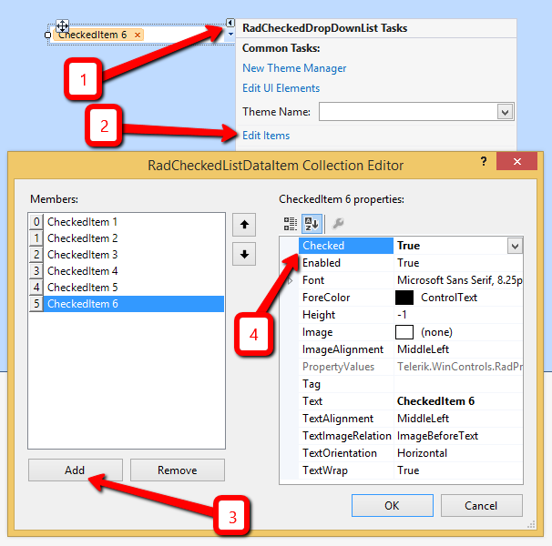
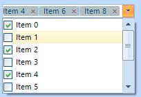

# Getting Started
 

## Design-Time Setup

Here is how to setup __RadCheckedDropDownList__ at design time:



1\. Drag __RadCheckedDropDownList__ to a form and click the smart tag
            

2\. Click the *Edit Items* button
            

3\. Add a few items
            

4\. Check some of them
            

## Run-Time Setup

Adding items at runtime is quite similar to the design-time prodcedure. Below you can see a sample code which shows how to add items and check them:

#### Add items 

{{source=..\SamplesCS\DropDownListControl\CheckedDropDownList\GettingStarted1.cs region=AddItems}} 
{{source=..\SamplesVB\DropDownListControl\CheckedDropDownList\GettingStarted1.vb region=AddItems}} 

````C#
            for (int i = 0; i < 10; i++)
            {
                this.radCheckedDropDownList1.Items.Add(new RadCheckedListDataItem("Item " + i, i % 2 == 0));
            }
````
````VB.NET
        For i As Integer = 0 To 9
            Me.RadCheckedDropDownList1.Items.Add(New RadCheckedListDataItem("Item " + i, i Mod 2 = 0))
        Next
        '
````

{{endregion}} 



