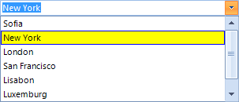

# Formatting Items
 
## Formatting drop down list items

Items appearance in __RadDropDownList__ can be customized by making use of the __VisualListItemFormatting__ event. The following example, demonstrates how you can change the color of an item which is being selected
        

>note By using this event to customize the items appearance, you should always provide an else clause, where you reset the appearance settings which you have introduced. This is necessary since RadDropDownList uses data virtualization, which might lead to unpredicted appearance results when items are being reused.




#### Customize selected item appearance 

{{source=..\SamplesCS\DropDownListControl\DropDownList\DropDownListCustomizeItems.cs region=CustomizeItems}} 
{{source=..\SamplesVB\DropDownListControl\DropDownList\DropDownListCustomizeItems.vb region=CustomizeItems}} 

````C#
private void radDropDownList1_VisualListItemFormatting(object sender, VisualItemFormattingEventArgs args)
{
    if (args.VisualItem.Selected)
    {
        args.VisualItem.NumberOfColors = 1;
        args.VisualItem.BackColor = Color.Yellow;
        args.VisualItem.BorderColor = Color.Blue;
    }
    else
    {
        args.VisualItem.ResetValue(LightVisualElement.NumberOfColorsProperty, Telerik.WinControls.ValueResetFlags.Local);
        args.VisualItem.ResetValue(LightVisualElement.BackColorProperty, Telerik.WinControls.ValueResetFlags.Local);
        args.VisualItem.ResetValue(LightVisualElement.BorderColorProperty, Telerik.WinControls.ValueResetFlags.Local);
    }
}

````
````VB.NET
Private Sub radDropDownList1_VisualListItemFormatting(sender As Object, args As VisualItemFormattingEventArgs)
    If args.VisualItem.Selected Then
        args.VisualItem.NumberOfColors = 1
        args.VisualItem.BackColor = Color.Yellow
        args.VisualItem.BorderColor = Color.Blue
    Else
        args.VisualItem.ResetValue(LightVisualElement.NumberOfColorsProperty, Telerik.WinControls.ValueResetFlags.Local)
        args.VisualItem.ResetValue(LightVisualElement.BackColorProperty, Telerik.WinControls.ValueResetFlags.Local)
        args.VisualItem.ResetValue(LightVisualElement.BorderColorProperty, Telerik.WinControls.ValueResetFlags.Local)
    End If
End Sub

````

{{endregion}} 
 

## Customizing auto-complete dropdown appearance

In order to customize the auto complete popup, you should subscribe to the __VisualItemFormatting__ event of the __AutoCompleteSuggestHelper__. The following code snippet demonstrates how to change the font of the auto complete drop down items:

#### Subscribe to the VisualItemFormatting event of the auto complete popup

{{source=..\SamplesCS\DropDownListControl\DropDownList\DropDownListCustomizeItems.cs region=Event}} 
{{source=..\SamplesVB\DropDownListControl\DropDownList\DropDownListCustomizeItems.vb region=Event}} 	


{{endregion}}  

The following code snippet, will demonstrate how to change the Font of all items in the auto complete drop down.

#### Customize auto complete items appearance 

{{source=..\SamplesCS\DropDownListControl\DropDownList\DropDownListCustomizeItems.cs region=CustomizeAutoCompleteDropDown}} 
{{source=..\SamplesVB\DropDownListControl\DropDownList\DropDownListCustomizeItems.vb region=CustomizeAutoCompleteDropDown}} 


{{endregion}} 
 

>note Here we do not reset the style because we do want the Font for all items to be changed not only on certain one.


