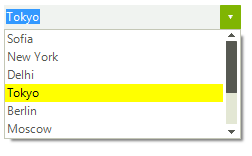
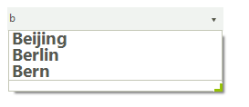

# Formatting Items
 
## Formatting drop down list items

Items appearance in __RadDropDownList__ can be customized by making use of the __VisualListItemFormatting__ event. The following example demonstrates how you can change the color of an item which is being selected.
        

>note By using this event to customize the items appearance, you should always provide an *else* clause, where you reset the appearance settings which you have introduced. This is necessary since __RadDropDownList__ uses data virtualization, which might lead to unpredicted appearance results when items are being reused.

>caption Figure 1: Formatting items in drop down



#### Customize selected item appearance 

{{source=..\SamplesCS\DropDownListControl\DropDownList\DropDownListCustomizeItems.cs region=CustomizeItems}} 
{{source=..\SamplesVB\DropDownListControl\DropDownList\DropDownListCustomizeItems.vb region=CustomizeItems}} 

````C#
private void radDropDownList1_VisualListItemFormatting(object sender, VisualItemFormattingEventArgs args)
{
    if (args.VisualItem.Selected)
    {
        args.VisualItem.NumberOfColors = 1;
        args.VisualItem.BackColor = Color.Yellow;
        args.VisualItem.BorderColor = Color.Blue;
    }
    else
    {
        args.VisualItem.ResetValue(LightVisualElement.NumberOfColorsProperty, Telerik.WinControls.ValueResetFlags.Local);
        args.VisualItem.ResetValue(LightVisualElement.BackColorProperty, Telerik.WinControls.ValueResetFlags.Local);
        args.VisualItem.ResetValue(LightVisualElement.BorderColorProperty, Telerik.WinControls.ValueResetFlags.Local);
    }
}

````
````VB.NET
Private Sub radDropDownList1_VisualListItemFormatting(sender As Object, args As VisualItemFormattingEventArgs)
    If args.VisualItem.Selected Then
        args.VisualItem.NumberOfColors = 1
        args.VisualItem.BackColor = Color.Yellow
        args.VisualItem.BorderColor = Color.Blue
    Else
        args.VisualItem.ResetValue(LightVisualElement.NumberOfColorsProperty, Telerik.WinControls.ValueResetFlags.Local)
        args.VisualItem.ResetValue(LightVisualElement.BackColorProperty, Telerik.WinControls.ValueResetFlags.Local)
        args.VisualItem.ResetValue(LightVisualElement.BorderColorProperty, Telerik.WinControls.ValueResetFlags.Local)
    End If
End Sub

````

{{endregion}} 
 

## Customizing auto-complete drop-down appearance

In order to customize the auto complete pop-up, you should subscribe to the __VisualItemFormatting__ event of the __AutoCompleteSuggestHelper__. 

#### Subscribe to the VisualItemFormatting event of the auto complete popup

{{source=..\SamplesCS\DropDownListControl\DropDownList\DropDownListCustomizeItems.cs region=Event}} 
{{source=..\SamplesVB\DropDownListControl\DropDownList\DropDownListCustomizeItems.vb region=Event}}
````C#
radDropDownList1.DropDownListElement.AutoCompleteSuggest.DropDownList.ListElement.VisualItemFormatting += new VisualListItemFormattingEventHandler(ListElement_VisualItemFormatting);

````
````VB.NET
AddHandler RadDropDownList1.DropDownListElement.AutoCompleteSuggest.DropDownList.ListElement.VisualItemFormatting, AddressOf ListElement_VisualItemFormatting

```` 	

{{endregion}}  

The following code snippet, will demonstrate how to change the Font of all items in the auto complete drop down.

#### Customize auto complete items appearance 

{{source=..\SamplesCS\DropDownListControl\DropDownList\DropDownListCustomizeItems.cs region=CustomizeAutoCompleteDropDown}} 
{{source=..\SamplesVB\DropDownListControl\DropDownList\DropDownListCustomizeItems.vb region=CustomizeAutoCompleteDropDown}}
````C#
Font myFont = new Font("Segoe UI", 14, FontStyle.Bold);
private void ListElement_VisualItemFormatting(object sender, VisualItemFormattingEventArgs args)
{
    args.VisualItem.Font = myFont;
}

````
````VB.NET
Private myFont As New Font("Segoe UI", 14, FontStyle.Bold)
Private Sub ListElement_VisualItemFormatting(sender As Object, args As VisualItemFormattingEventArgs)
    args.VisualItem.Font = myFont
End Sub

```` 

{{endregion}} 


>note Here we do not reset the style because we do want the Font for all items to be changed not only on certain one.

>caption Figure 2: Formatting auto-complete items


