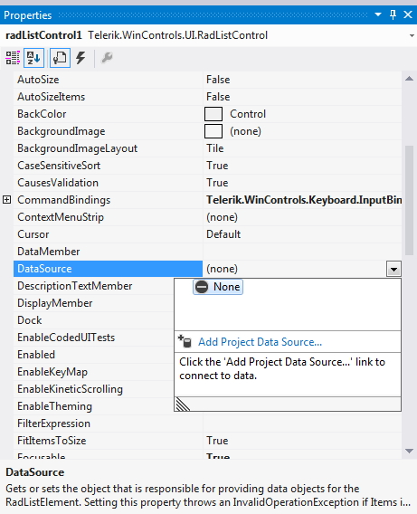

# DataBinding
 
Data binding provides a way to bind the display of data in a __RadListControl__ to a data source. Three properties control data binding:

* The __DataSource__ property specifies the source of the data to be bound.

* The __DisplayMember__ property specifies the particular data to be displayed in a __RadListControl__.

* The __ValueMember__ property specifies the particular data to be returned as the value of a __RadListControl__.

## The DataSource Property

To set the __DataSource__ property, select the __DataSource__ property in the Properties window, click the drop-down arrow to display all existing data sources on the form. Click the __Add Project Data Source__ link and follow the instructions in the __Data Source Configuration Wizard__ to add a data source to your project. You can use databases, web services, or objects as data sources.

__DisplayMember__: To set the __DisplayMember__ property, first set the __DataSource__ property. Then, select a value for the __DisplayMember__ property from the drop-down list in the Properties window.

__ValueMember__: To set the __ValueMember__ property, first set the __DataSource__ property. Then, select a value for the __ValueMember__ property from the drop-down list in the Properties window.
