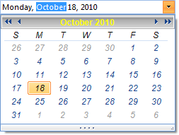

# Customize RadCalendar Programmatically


## 

In order to customize RadCalendar in RadDateTimePicker, you should first take the instance of the RadCalendar. You can do so by calling the __GetCurrentBehavior__() method. For example, if we want to change the font and colors of the RadCalendar navigation title, we need to use the following code snippet:#_[C#] Changing the font of RadCalendar navigation title_

	


{{source=..\SamplesCS\Editors\DateTimePicker1.cs region=customizeRadCalendarProgramatically}} 
{{source=..\SamplesVB\Editors\DateTimePicker1.vb region=customizeRadCalendarProgramatically}} 

````C#
            Font headerFont = new Font("Arial", 9.0f, FontStyle.Bold);
            Font datesFont = new Font("Arial", 9.0f, FontStyle.Italic);
            RadDateTimePickerCalendar calendarBehavior = this.radDateTimePicker1.DateTimePickerElement.GetCurrentBehavior() as RadDateTimePickerCalendar;
            RadCalendar calendar = calendarBehavior.Calendar as RadCalendar;
            RadCalendarElement calendarElement = calendar.CalendarElement as RadCalendarElement;
            calendarElement.CalendarNavigationElement.Font = headerFont;
            calendarElement.CalendarNavigationElement.ForeColor = Color.Yellow;
            calendarElement.CalendarNavigationElement.BackColor = Color.White;
            calendarElement.CalendarNavigationElement.BackColor2 = Color.Gray;
            calendarElement.CalendarNavigationElement.BackColor3 = Color.DarkGray;
            calendarElement.CalendarNavigationElement.BackColor4 = Color.Gainsboro;
            calendarElement.CalendarNavigationElement.BorderColor = Color.DarkGray;
            MonthViewElement monthView = calendarBehavior.Calendar.CalendarElement.CalendarVisualElement as MonthViewElement;
            foreach (RadItem item in monthView.TableElement.Children)
            {
                item.Font = datesFont;
            }
````
````VB.NET
        Dim headerFont As Font = New Font("Arial", 9.0F, FontStyle.Bold)
        Dim datesFont As Font = New Font("Arial", 9.0F, FontStyle.Italic)
        Dim calendarBehavior As RadDateTimePickerCalendar = TryCast(Me.RadDateTimePicker1.DateTimePickerElement.GetCurrentBehavior(), RadDateTimePickerCalendar)
        Dim calendar As RadCalendar = TryCast(calendarBehavior.Calendar, RadCalendar)
        Dim calendarElement As RadCalendarElement = TryCast(calendar.CalendarElement, RadCalendarElement)
        calendarElement.CalendarNavigationElement.Font = headerFont
        calendarElement.CalendarNavigationElement.ForeColor = Color.Yellow
        calendarElement.CalendarNavigationElement.BackColor = Color.White
        calendarElement.CalendarNavigationElement.BackColor2 = Color.Gray
        calendarElement.CalendarNavigationElement.BackColor3 = Color.DarkGray
        calendarElement.CalendarNavigationElement.BackColor4 = Color.Gainsboro
        calendarElement.CalendarNavigationElement.BorderColor = Color.DarkGray
        Dim monthView As MonthViewElement = TryCast(calendarBehavior.Calendar.CalendarElement.CalendarVisualElement, MonthViewElement)
        For Each item As RadItem In monthView.TableElement.Children
            item.Font = datesFont
        Next item
        '
````

{{endregion}} 


The result is shown on the screenshot below:




