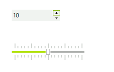

# Getting Started


## 

The following tutorial demonstrates changing the thumb position on a
__RadTrackBar__ to reflect changes in a
__RadSpinEditor__.




1. Drop a __RadSpinEditor__ and a
    __RadTrackbar__ on a form.

1. In the Property Window, set the __RadSpinEditor Maximum__
    property to "20".

1. Click the Events tab of the Property Window, locate the
    __ValueChanged__ event and double-click it to create an event
    handler. Replace the event handler with the following code.
      #_[C#]_

	


{{source=..\SamplesCS\Editors\SpinEditor1.cs region=spinEditorAndTrackBar}} 
{{source=..\SamplesVB\Editors\SpinEditor1.vb region=spinEditorAndTrackBar}} 

````C#
        void radSpinEditor1_ValueChanged(object sender, EventArgs e)
        {
            this.radTrackBar1.Value = Convert.ToInt32(radSpinEditor1.Value);
        }
````
````VB.NET
    Private Sub RadSpinEditor1_ValueChanged1(ByVal sender As Object, ByVal e As System.EventArgs) Handles RadSpinEditor1.ValueChanged
        Me.RadTrackBar1.Value = Convert.ToInt32(RadSpinEditor1.Value)
    End Sub
    '
````

{{endregion}} 


1. Press __F5__ to run the application. Experiment with the
    behavior of the RadSpinEdit by both typing values directly to the editor,
    by clicking the up and down arrows, and by pressing the up and down arrow
    keys.
