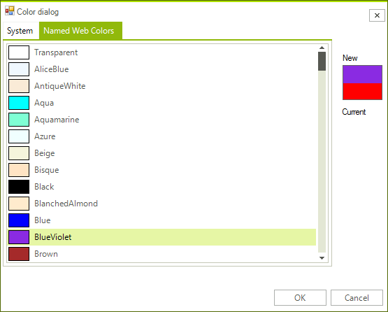

# Getting Started
 

## 

The following tutorial demonstrates configuring the __RadColorDialog__, localizing tab labeling and responding to the __OK__ button click.



Drop a __RadColorDialog__ on the form.

In the Properties Window set the __Dock__ property to __Fill__.

Set the __ShowBasicColors__ property to __false__.

Set the __ShowProfessionalColors__ property to __false__.

Set the __ShowHEXColorsValue__ property to __false__. 

Set the __AllowPickColorFromScreen__ property to __false__.

Set the __ShowCustomColors__ property to __false__.

Change the __WebTabHeading__ property to read "Named Web Colors".

Get the SelectedColor or SelectedHlsColor, check the returned DialogResult :

#### Check the selected values in RadColorDialog 

{{source=..\SamplesCS\Forms and Dialogs\ColorDialog1.cs region=getTheSelectedColors}} 
{{source=..\SamplesVB\Forms and Dialogs\ColorDialog1.vb region=getTheSelectedColors}} 

````C#
if (radColorDialog1.ShowDialog() == DialogResult.OK)
{
    Color color = radColorDialog1.SelectedColor;
    HslColor hslColor = radColorDialog1.SelectedHslColor;
}

````
````VB.NET
If RadColorDialog1.ShowDialog() = DialogResult.OK Then
    Dim color As Color = RadColorDialog1.SelectedColor
    Dim hslColor As Telerik.WinControls.HslColor = RadColorDialog1.SelectedHslColor
End If

````

{{endregion}} 


Press __F5__ to run the application.
