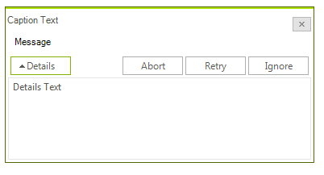

# Parameters
 
## SetThemeName method

You can easily set the __ThemeName__ of the __RadMessageBox__ by calling the __SetThemeName__ parameter, passing the theme name string:

#### Setting a theme in RadMessageBox 

{{source=..\SamplesCS\Forms and Dialogs\MessageBox1.cs region=SetThemeName}} 
{{source=..\SamplesVB\Forms and Dialogs\MessageBox1.vb region=SetThemeName}} 

````C#
RadMessageBox.SetThemeName("Desert");

````
````VB.NET
RadMessageBox.SetThemeName("Desert")

````

{{endregion}} 

## Show method

The __Show__ method displays a __RadMessageBox__. It returns a __DialogResult__ value and has a couple of overloads to suit to your needs. For a list of all methods see the API Reference section. __Show__ method could accept the following parameters:

* __Parent__ - An implementation of System.Windows.Forms.IWin32Window that will own the __RadMessageBox__.
            

* __Text__ - The text to display in the __RadMessageBox__.
            

* __Caption__ - The text to display in the title bar of the __RadMessageBox__.
            

* __Buttons__ - One of the __MessageBoxButtons__ enumeration values that specifies which buttons to display in the message box:
            

	* AbortRetryIgnore

	* OK

	* OKCancel

	* RetryCancel

	* YesNo

	* YesNoCancel

* __Icon__ - One of the __RadMessageIcon__ enumeration values that specifies which icon to display in the message box or a custom Bitmap icon that will be displayed:            

	* RadMessageIcon.*None*

	* RadMessageIcon.*Info*

	* RadMessageIcon.*Question*

	* RadMessageIcon.*Exclamation*

	* RadMessageIcon.*Error*

* __defaultBtn__ - One of the __MessageBoxDefaultButton__ enumeration values the specifies the default button for the message box:            

	* MessageBoxDefaultButton.*Button1*

	* MessageBoxDefaultButton.*Button2*

	* MessageBoxDefaultButton.*Button2*

* __Rtl__ - __RightToLeft__ settings:           

	* RightToLeft.*No*

	* RightToLeft.*Yes*

	* RightToLeft.*Inherit*

## Details Section

As of Q2 2014 __RadMessageBox__ supports details section. This section can be shown by just specifying the details text in the __Show__ method parameters:
  
{{source=..\SamplesCS\Forms and Dialogs\MessageBox1.cs region=details}} 
{{source=..\SamplesVB\Forms and Dialogs\MessageBox1.vb region=details}} 

````C#
RadMessageBox.Show("Message", "Caption Text", MessageBoxButtons.AbortRetryIgnore, "Details Text");

````
````VB.NET
RadMessageBox.Show("Message", "Caption Text", MessageBoxButtons.AbortRetryIgnore, "Details Text")
````

{{endregion}} 
 

The result looks like this:
        

