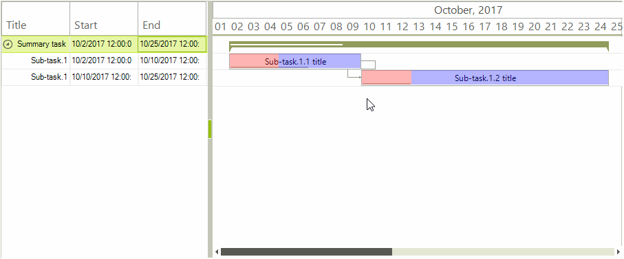

# Creating Custom Task Elements

**RadGanttView** provides a convenient API to customize the task elements displayed in the graphical view. In this article we will create a custom **GanttViewTaskElement** which will host two additional children. Our special scenario requires that a certain part of the whole task be painted with one color and the remaining part with another. The actual size of the newly created elements will be calculated so that the first element always occupies a fixed number of days of the task while the second element will be arranged in the remaining space.

>caption Figure 1: Custom Task Elements



The methods which need to be overridden in the derived custom class are:
 
 * **CreateChildElements**: This method is responsible for initializing the child elements.
 * **ArrangeOverride**: This method is called whenever the layout of the **GanttViewTaskElement** needs to be updated. Our special logic for arranging the two newly added **LightVisualElements** will also be executed here.

#### Custom Task Element Implementation

{{source=..\SamplesCS\GanttView\Formatting\GanttTaskElementForm.cs region=CustomTaskElementClass}} 
{{source=..\SamplesVB\GanttView\Formatting\GanttTaskElementForm.vb region=CustomTaskElementClass}}
````C#
public class MyGanttViewTaskItemElement : GanttViewTaskItemElement
{
    private int dayCount;
    public MyGanttViewTaskItemElement(GanttViewGraphicalViewElement ganttViewBaseViewElement, int dayCount)
        : base(ganttViewBaseViewElement)
    {
        this.dayCount = dayCount;
    }
    internal int DayCount
    {
        get
        {
            return this.dayCount;
        }
    }
    protected override Type ThemeEffectiveType
    {
        get
        {
            return typeof(GanttViewTaskItemElement);
        }
    }
    protected override GanttGraphicalViewBaseTaskElement CreateTaskElement()
    {
        return new MyGanttViewTaskElement();
    }
}
public class MyGanttViewTaskElement : GanttViewTaskElement
{
    private LightVisualElement start;
    private LightVisualElement end;
    protected override Type ThemeEffectiveType
    {
        get
        {
            return typeof(GanttViewTaskElement);
        }
    }
    protected override void CreateChildElements()
    {
        base.CreateChildElements();
        this.DrawFill = false;
        this.start = new LightVisualElement();
        this.start.ShouldHandleMouseInput = false;
        this.start.GradientStyle = Telerik.WinControls.GradientStyles.Solid;
        this.start.BackColor = Color.FromArgb(75, Color.Red);
        this.start.DrawFill = true;
        this.end = new LightVisualElement();
        this.end.ShouldHandleMouseInput = false;
        this.end.GradientStyle = Telerik.WinControls.GradientStyles.Solid;
        this.end.DrawFill = true;
        this.end.BackColor = Color.FromArgb(75, Color.Blue);
        this.Children.Add(start);
        this.Children.Add(end);
    }
    protected override SizeF ArrangeOverride(SizeF finalSize)
    {
        SizeF size = base.ArrangeOverride(finalSize);
        RectangleF rect = this.GetClientRectangle(finalSize);
        int dayCount = ((MyGanttViewTaskItemElement)this.Parent).DayCount;
        GanttViewDataItem data = ((GanttViewBaseItemElement)this.Parent).Data;
        if ((data.End - data.Start).TotalDays > dayCount)
        {
            double span = (data.End - data.Start).TotalSeconds;
            double pivot = (data.Start.AddDays(dayCount) - data.Start).TotalSeconds;
            double res = pivot / span;
            float desiredWidth = rect.Width * (float)res;
            RectangleF startRect = new RectangleF(rect.X, 0, desiredWidth, rect.Height);
            this.start.Arrange(startRect);
            RectangleF endRect = new RectangleF(rect.X + desiredWidth, 0, rect.Width - desiredWidth, rect.Height);
            this.end.Arrange(endRect);
        }
        else
        {
            this.start.Arrange(rect);
            this.end.Arrange(RectangleF.Empty);
        }
        return size;
    }
}

````
````VB.NET
Public Class MyGanttViewTaskItemElement
    Inherits GanttViewTaskItemElement
    Private m_dayCount As Integer
    Public Sub New(ganttViewBaseViewElement As GanttViewGraphicalViewElement, dayCount As Integer)
        MyBase.New(ganttViewBaseViewElement)
        Me.m_dayCount = dayCount
    End Sub
    Friend ReadOnly Property DayCount() As Integer
        Get
            Return Me.m_dayCount
        End Get
    End Property
    Protected Overrides ReadOnly Property ThemeEffectiveType() As Type
        Get
            Return GetType(GanttViewTaskItemElement)
        End Get
    End Property
    Protected Overrides Function CreateTaskElement() As GanttGraphicalViewBaseTaskElement
        Return New MyGanttViewTaskElement()
    End Function
End Class
Public Class MyGanttViewTaskElement
    Inherits GanttViewTaskElement
    Private start As LightVisualElement
    Private [end] As LightVisualElement
    Protected Overrides ReadOnly Property ThemeEffectiveType() As Type
        Get
            Return GetType(GanttViewTaskElement)
        End Get
    End Property
    Protected Overrides Sub CreateChildElements()
        MyBase.CreateChildElements()
        Me.DrawFill = False
        Me.start = New LightVisualElement()
        Me.start.ShouldHandleMouseInput = False
        Me.start.GradientStyle = Telerik.WinControls.GradientStyles.Solid
        Me.start.BackColor = Color.FromArgb(75, Color.Red)
        Me.start.DrawFill = True
        Me.[end] = New LightVisualElement()
        Me.[end].ShouldHandleMouseInput = False
        Me.[end].GradientStyle = Telerik.WinControls.GradientStyles.Solid
        Me.[end].DrawFill = True
        Me.[end].BackColor = Color.FromArgb(75, Color.Blue)
        Me.Children.Add(start)
        Me.Children.Add([end])
    End Sub
    Protected Overrides Function ArrangeOverride(finalSize As SizeF) As SizeF
        Dim size As SizeF = MyBase.ArrangeOverride(finalSize)
        Dim rect As RectangleF = Me.GetClientRectangle(finalSize)
        Dim dayCount As Integer = DirectCast(Me.Parent, MyGanttViewTaskItemElement).DayCount
        Dim data As GanttViewDataItem = DirectCast(Me.Parent, GanttViewBaseItemElement).Data
        If (data.[End] - data.Start).TotalDays > dayCount Then
            Dim span As Double = (data.[End] - data.Start).TotalSeconds
            Dim pivot As Double = (data.Start.AddDays(dayCount) - data.Start).TotalSeconds
            Dim res As Double = pivot / span
            Dim desiredWidth As Single = rect.Width * CSng(res)
            Dim startRect As New RectangleF(rect.X, 0, desiredWidth, rect.Height)
            Me.start.Arrange(startRect)
            Dim endRect As New RectangleF(rect.X + desiredWidth, 0, rect.Width - desiredWidth, rect.Height)
            Me.[end].Arrange(endRect)
        Else
            Me.start.Arrange(rect)
            Me.[end].Arrange(RectangleF.Empty)
        End If
        Return size
    End Function
End Class

````


{{endregion}} 

The custom elements can be initialized in the handler of the RadGanttView.**ItemElementCreating** event. This event is part of API allowing the default elements to be substituted with custom ones.

#### Handling Events

{{source=..\SamplesCS\GanttView\Formatting\GanttTaskElementForm.cs region=HandleEvents}} 
{{source=..\SamplesVB\GanttView\Formatting\GanttTaskElementForm.vb region=HandleEvents}}
````C#
private void RadGanttView1_ItemElementCreating(object sender, GanttViewItemElementCreatingEventArgs e)
{
    if (e.Item.Items.Count == 0 && e.ViewElement is GanttViewGraphicalViewElement)
    {
        e.ItemElement = new MyGanttViewTaskItemElement((GanttViewGraphicalViewElement)e.ViewElement, 3);
    }
}

````
````VB.NET
Private Sub RadGanttView1_ItemElementCreating(sender As Object, e As GanttViewItemElementCreatingEventArgs)
    If e.Item.Items.Count = 0 AndAlso TypeOf e.ViewElement Is GanttViewGraphicalViewElement Then
        e.ItemElement = New MyGanttViewTaskItemElement(DirectCast(e.ViewElement, GanttViewGraphicalViewElement), 3)
    End If
End Sub

````


{{endregion}}

# See Also

* [Creating Custom Cells]()
* [Customizing editor]()
* [Editing Graphical View]()
* [Editing Text View]()
