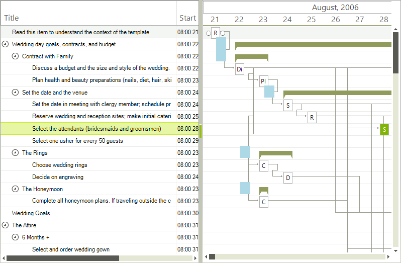

# Custom painting

## 

RadGanttView offers several method of customizing the looks of the elements it is displaying. One of these methods is allowing 
          developers to directly draw over the control through its Graphics object. To enable this functionality you have to set the 
          __EnableCustomPainting__ property of the control to __true__ and to subscribe to the 
          __ItemPaint__ event.
        

Since all the elements in the graphical view of the control are arranged along the timeline and their size depends on the current 
          zoom level you need a way to know where you should draw you graphics. For this purpose we have implemented two methods which by given 
          date and time return where this time or time range should appear in coordinates.
        

The following example demonstrates how to draw an image which appears exactly 12 hours after each task which has a duration longer than 12 hours.
        

#### __[C#] __

{{source=..\SamplesCS\GanttView\Formatting\CustomPainting.cs region=FormattingEventSubscribe1}}
	            this.radGanttView1.EnableCustomPainting = true;
	            this.radGanttView1.ItemPaint += radGanttView1_ItemPaint1;
	{{endregion}}

#### __[C#] __

{{source=..\SamplesCS\GanttView\Formatting\CustomPainting.cs region=FormattingPaintEvent1}}
	        private void radGanttView1_ItemPaint1(object sender, GanttViewItemPaintEventArgs e)
	        {
	            if (e.Element.Data.Items.Count == 0 && e.Element.Data.End - e.Element.Data.Start > new TimeSpan(12, 0, 0))
	            {
	                RectangleF rect = this.radGanttView1.GanttViewElement.GraphicalViewElement.GetDrawRectangle(e.Element.Data, e.Element.Data.End.AddHours(12));
	                rect.Width = rect.Height;
	                e.Graphics.DrawImage(prizeImage, rect);
	            }
	        }
	{{endregion}}

#### __[VB.NET] __

{{source=..\SamplesVB\GanttView\Formatting\CustomPainting.vb region=FormattingEventSubscribe1}}
	        Me.radGanttView1.EnableCustomPainting = True
	        AddHandler Me.radGanttView1.ItemPaint, AddressOf radGanttView1_ItemPaint1
	{{endregion}}

#### __[VB.NET] __

{{source=..\SamplesVB\GanttView\Formatting\CustomPainting.vb region=FormattingPaintEvent1}}
	    Private Sub radGanttView1_ItemPaint1(sender As Object, e As GanttViewItemPaintEventArgs)
	        If (e.Element.Data.Items.Count = 0 AndAlso e.Element.Data.End - e.Element.Data.Start > New TimeSpan(12, 0, 0)) Then
	
	            Dim rect As RectangleF = Me.radGanttView1.GanttViewElement.GraphicalViewElement.GetDrawRectangle(e.Element.Data, e.Element.Data.End.AddHours(12))
	            rect.Width = rect.Height
	            e.Graphics.DrawImage(prizeImage, rect)
	        End If
	    End Sub
	{{endregion}}

Another example demonstrating how to draw a colored rectangle which would be 10 hours in duration and will “start” 
          18 hours before each summary task.
        

#### __[C#] __

{{source=..\SamplesCS\GanttView\Formatting\CustomPainting.cs region=FormattingEventSubscribe2}}
	            this.radGanttView1.ItemPaint += radGanttView1_ItemPaint2;
	{{endregion}}

#### __[C#] __

{{source=..\SamplesCS\GanttView\Formatting\CustomPainting.cs region=FormattingPaintEvent2}}
	        private void radGanttView1_ItemPaint2(object sender, GanttViewItemPaintEventArgs e)
	        {
	            if (e.Element.Data.Items.Count > 0)
	            {
	                DateTime start = e.Element.Data.Start.AddHours(-18);
	                RectangleF rect = this.radGanttView1.GanttViewElement.GraphicalViewElement.GetDrawRectangle(e.Element.Data, start, start.AddHours(10));
	                e.Graphics.FillRectangle(Brushes.LightBlue, rect);
	            }
	        }
	{{endregion}}

#### __[VB.NET] __

{{source=..\SamplesVB\GanttView\Formatting\CustomPainting.vb region=FormattingEventSubscribe2}}
	        AddHandler Me.radGanttView1.ItemPaint, AddressOf radGanttView1_ItemPaint2
	{{endregion}}

#### __[VB.NET] __

{{source=..\SamplesVB\GanttView\Formatting\CustomPainting.vb region=FormattingPaintEvent2}}
	    Private Sub radGanttView1_ItemPaint2(sender As Object, e As GanttViewItemPaintEventArgs)
	        If (e.Element.Data.Items.Count > 0) Then
	            Dim start As DateTime = e.Element.Data.Start.AddHours(-18)
	            Dim rect As RectangleF = Me.radGanttView1.GanttViewElement.GraphicalViewElement.GetDrawRectangle(e.Element.Data, start, start.AddHours(10))
	            e.Graphics.FillRectangle(Brushes.LightBlue, rect)
	        End If
	    End Sub
	{{endregion}}

You will see that if the zoom level changes the rectangle size resizes accordingly
        
