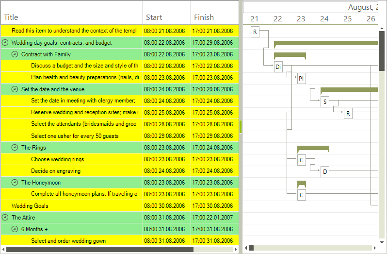
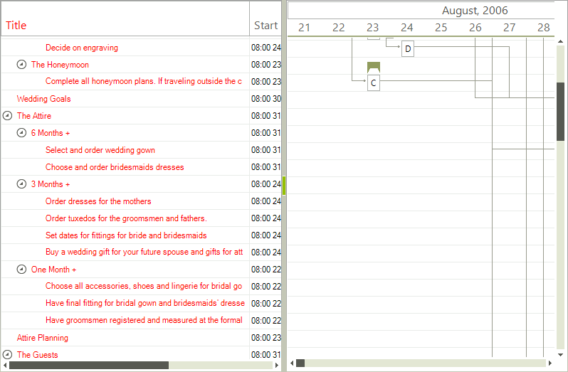

# TextView item formatting
 
## 

RadGanttView offers two level of granularity when it comes to formatting the text view part. There is the __TextViewItemFormatting__ event which is fired for each item (row) and there is the __TextViewCellFormatting__ which is fired for every cell.
        

Here is an example demonstrating how to use the event to make all summary items have a green back color and all tasks a yellow one.
         
{{source=..\SamplesCS\GanttView\Formatting\TextViewItemCellFormatting.cs region=TextViewItemFormatting}} 
{{source=..\SamplesVB\GanttView\Formatting\TextViewItemCellFormatting.vb region=TextViewItemFormatting}} 

````C#
private void radGanttView1_TextViewItemFormatting(object sender, GanttViewTextViewItemFormattingEventArgs e)
{
    if (e.Item.Items.Count > 0)
    {
        e.ItemElement.DrawFill = true;
        e.ItemElement.BackColor = Color.LightGreen;
        e.ItemElement.GradientStyle = GradientStyles.Solid;
    }
    else if (e.Item.Start != e.Item.End)
    {
        e.ItemElement.DrawFill = true;
        e.ItemElement.BackColor = Color.Yellow;
        e.ItemElement.GradientStyle = GradientStyles.Solid;
    }
    else
    {
        e.ItemElement.ResetValue(LightVisualElement.DrawBorderProperty, ValueResetFlags.Local);
        e.ItemElement.ResetValue(LightVisualElement.BackColorProperty, ValueResetFlags.Local);
        e.ItemElement.ResetValue(LightVisualElement.GradientStyleProperty, ValueResetFlags.Local);
    }
}

````
````VB.NET
Private Sub radGanttView1_TextViewItemFormatting(sender As Object, e As GanttViewTextViewItemFormattingEventArgs)
    If (e.Item.Items.Count > 0) Then
        e.ItemElement.DrawFill = True
        e.ItemElement.BackColor = Color.LightGreen
        e.ItemElement.GradientStyle = GradientStyles.Solid
    ElseIf (e.Item.Start <> e.Item.End) Then
        e.ItemElement.DrawFill = True
        e.ItemElement.BackColor = Color.Yellow
        e.ItemElement.GradientStyle = GradientStyles.Solid
    Else
        e.ItemElement.ResetValue(LightVisualElement.DrawBorderProperty, ValueResetFlags.Local)
        e.ItemElement.ResetValue(LightVisualElement.BackColorProperty, ValueResetFlags.Local)
        e.ItemElement.ResetValue(LightVisualElement.GradientStyleProperty, ValueResetFlags.Local)
    End If
End Sub

````

{{endregion}} 




Another example showing how to change the fore color of the cells in the Title column for all types of tasks that start on an even day of the month.
        
{{source=..\SamplesCS\GanttView\Formatting\TextViewItemCellFormatting.cs region=TextViewCellFormatting}} 
{{source=..\SamplesVB\GanttView\Formatting\TextViewItemCellFormatting.vb region=TextViewCellFormatting}} 

````C#
private void radGanttView1_TextViewCellFormatting(object sender, GanttViewTextViewCellFormattingEventArgs e)
{
    if (e.Item.Start.Day % 2 == 0 && e.Column.Name == "Title")
    {
        e.CellElement.ForeColor = Color.Red;
    }
    else
    {
        e.CellElement.ResetValue(LightVisualElement.ForeColorProperty, ValueResetFlags.Local);
    }
}

````
````VB.NET
Private Sub radGanttView1_TextViewCellFormatting(sender As Object, e As GanttViewTextViewCellFormattingEventArgs)
    If (e.Item.Start.Day Mod 2 = 0 AndAlso e.Column.Name = "Title") Then
        e.CellElement.ForeColor = Color.Red
    Else
        e.CellElement.ResetValue(LightVisualElement.ForeColorProperty, ValueResetFlags.Local)
    End If
End Sub

````

{{endregion}} 



