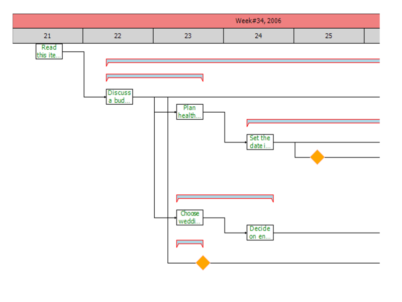

# Printing Events


You can customize the print output through the __PrintElementFormatting__ and __PrintElementPaint__ events. __PrintElementFormatting__ provides you with a print element which has style properties available so you can customize it as you see fit. The __PrintElementPaint__ gives you direct access to the graphical context and allows you to directly draw to the print output. 

## PrintElementFormatting

The following example demonstrates how you can use the __PrintContext__ property to determine what element is being printed and to change the styling accordingly.#_[C#]_

	


{{source=..\SamplesCS\GanttView\PrintingEvents\PrintingEvents.cs region=PrintFormatting}} 
{{source=..\SamplesVB\GanttView\PrintingEvents\PrintingEvents.vb region=PrintFormatting}} 

````C#

        private void radGanttView1_PrintElementFormatting(object sender, GanttViewPrintElementFormattingEventArgs e)
        {
            switch (e.PrintContext)
            {
                case GanttViewPrintElementContext.HeaderCell:
                    e.PrintElement.BackColor = Color.LightBlue;
                    break;
                case GanttViewPrintElementContext.DataCell:
                    e.PrintElement.BorderColor = Color.Cyan;
                    break;
                case GanttViewPrintElementContext.TaskElement:
                    e.PrintElement.ForeColor = Color.Green;
                    break;
                case GanttViewPrintElementContext.SummaryTaskElement:
                    e.PrintElement.BorderColor = Color.Red;
                    break;
                case GanttViewPrintElementContext.MilestoneElement:
                    e.PrintElement.BackColor = Color.Orange;
                    break;
                case GanttViewPrintElementContext.TimelineUpperElement:
                    e.PrintElement.BackColor = Color.LightCoral;
                    break;
                case GanttViewPrintElementContext.TimelineBottomElement:
                    e.PrintElement.BackColor = Color.LightGray;
                    break;
            }
        }
````
````VB.NET
    Private Sub GanttViewPrintElementFormattingEventArgs(sender As Object, e As GanttViewPrintElementFormattingEventArgs)
        Select Case e.PrintContext
            Case GanttViewPrintElementContext.HeaderCell
                e.PrintElement.BackColor = Color.LightBlue
                Exit Select
            Case GanttViewPrintElementContext.DataCell
                e.PrintElement.BorderColor = Color.Cyan
                Exit Select
            Case GanttViewPrintElementContext.TaskElement
                e.PrintElement.ForeColor = Color.Green
                Exit Select
            Case GanttViewPrintElementContext.SummaryTaskElement
                e.PrintElement.BorderColor = Color.Red
                Exit Select
            Case GanttViewPrintElementContext.MilestoneElement
                e.PrintElement.BackColor = Color.Orange
                Exit Select
            Case GanttViewPrintElementContext.TimelineUpperElement
                e.PrintElement.BackColor = Color.LightCoral
                Exit Select
            Case GanttViewPrintElementContext.TimelineBottomElement
                e.PrintElement.BackColor = Color.LightGray
                Exit Select
        End Select
    End Sub
    '
````

{{endregion}} 


## PrintElementPaint

This example demonstrates how you can paint the text of summary items next to the printed graphical representation.
        #_[C#]_

	


{{source=..\SamplesCS\GanttView\PrintingEvents\PrintingEvents.cs region=PrintPaint}} 
{{source=..\SamplesVB\GanttView\PrintingEvents\PrintingEvents.vb region=PrintPaint}} 

````C#

        private void radGanttView1_PrintElementPaint(object sender, GanttViewPrintElementPaintEventArgs e)
        {
            if (e.PrintContext == GanttViewPrintElementContext.SummaryTaskElement)
            {
                GanttViewDataItem dataItem = e.DataContext as GanttViewDataItem;

                SizeF textSize = e.Graphics.MeasureString(dataItem.Title, this.radGanttView1.Font);
                RectangleF rect = new RectangleF(e.Rectangle.Right + 10, e.Rectangle.Y, textSize.Width, e.Rectangle.Height);
                e.Graphics.TextRenderingHint = System.Drawing.Text.TextRenderingHint.SingleBitPerPixelGridFit;
                e.Graphics.DrawString(dataItem.Title, this.radGanttView1.Font, Brushes.Black, rect);
            }
        }
````
````VB.NET
    Private Sub radGanttView1_PrintElementPaint(sender As Object, e As GanttViewPrintElementPaintEventArgs)
        If e.PrintContext = GanttViewPrintElementContext.SummaryTaskElement Then
            Dim dataItem As GanttViewDataItem = TryCast(e.DataContext, GanttViewDataItem)

            Dim textSize As SizeF = e.Graphics.MeasureString(dataItem.Title, Me.radGanttView1.Font)
            Dim rect As New RectangleF(e.Rectangle.Right + 10, e.Rectangle.Y, textSize.Width, e.Rectangle.Height)
            e.Graphics.TextRenderingHint = System.Drawing.Text.TextRenderingHint.SingleBitPerPixelGridFit
            e.Graphics.DrawString(dataItem.Title, Me.radGanttView1.Font, Brushes.Black, rect)
        End If
    End Sub
    '
````

{{endregion}} 



