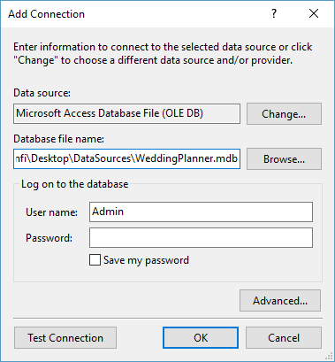
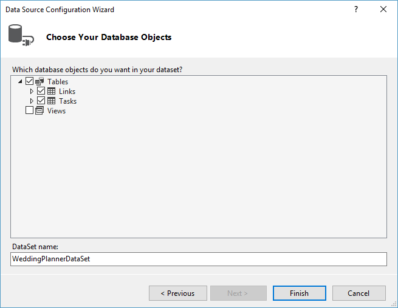

# Binding to database

## 

RadGanttView supports binding to Database data. Levels are created using the Parent and Child members’ values. You can read more
          on the data binding properties of RadGanttView in the [binding basics article.]()

1. In a new Windows project drop a RadGanttView control on the form.
            

1. In the __DataSource__ property drop down in the Properties Window of from the smart tag of the control
              select the __Add Project Data Source__ link.
            

1. In the __Choose a Data Source Type__page select the __Database__icon,
              then click the __Next__button.
            

1. In the __Choose Your Data Connection__page of the wizard click the __New Connection__button.
            

1. In the __Add Connection__dialog click the __Change__button, select 
              "Microsoft Access Database File" and click the __OK__button. In the __Database file name__
              entry click the __Browse__button and locate the WeddingPlanner.mdb file in the installation directory under 
              *\Examples\DataSources*. Click the __OK__button. When prompted if you would 
              like to copy the local data file to your project click the __Yes__button.
            

1. In the Choose Your Database Objects page of the wizard check the "Tasks" and "Links" tables checkboxes. Click the Finish button.
            

1. Set the DataSource property first to Tasks, then to Links datatable. This will create the necessary data-binding components
              in the component tray - a DataSet, BindingSources and TableAdapters. The DataSet is the container for the data, the TableAdapters 
              are used to fill the DataSet.
            

1. In the smart tag or in the properties window set the member properties in the following way.
            

1. Finally add this code to the form load event handler to specify the timeline range:
            

#### __[C#] __

{{region BindingToDatabase}}
	            this.radGanttView1.GanttViewElement.GraphicalViewElement.TimelineStart = new DateTime(2006, 8, 2);
	            this.radGanttView1.GanttViewElement.GraphicalViewElement.TimelineEnd = new DateTime(2007, 4, 2);
	{{endregion}}

#### __[VB.NET] __

{{region BindingToDatabase}}
	        Me.radGanttView1.GanttViewElement.GraphicalViewElement.TimelineStart = New DateTime(2006, 8, 2)
	        Me.radGanttView1.GanttViewElement.GraphicalViewElement.TimelineEnd = New DateTime(2007, 4, 2)
	{{endregion}}

