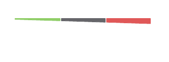
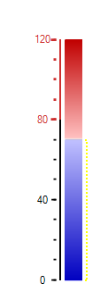

# Working with Bars

This element represents a bar that can be used for indicating a specific value or as a scale for other indicators.

## Design Time

The bar has start and end values and they can be tied to the gauge or can have static values. The bellow image shows two bars and the smart tag for the first one. As you can see the most important properties can be set directly in the smart tag.

## Properties

* __RangeStart:__ Indicates the start value of the bar.
            

* __RangeEnd:__ Indicates the end value of the bar.
            

* __Width__,  __Width2:__ These properties represent the top and bottom (left or right if the element is placed horizontally) width values. These properties allow you to create triangle or trapezoid bars.
            

* __Offset:__ – specifies how far to the left/bottom the control is shifted.
            

* __BackColor__,  __BackColor2:__ By default the bar has linear gradient background and these properties allow you to set its colors.
            

* __IsTopToBottom:__ Specifies the orientation of the bar.
            

* __BindStartRange__, __BindEndRange:__ These properties allow you to bind the start/end ranges of the bar to the ones of the gauge.
            
