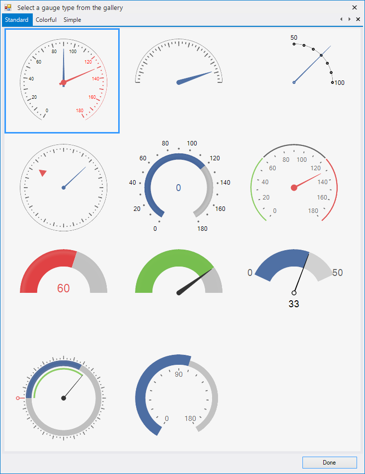
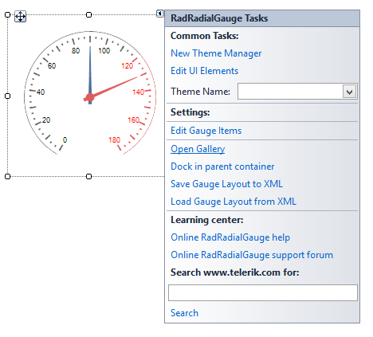
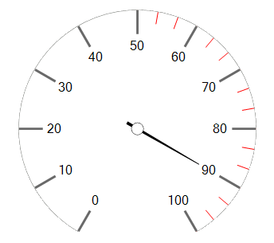
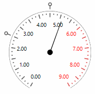

# Getting started


## Loading predefined gauges

When you drag a __RadRadialGauge__ from the Toolbox and drop it onto the form, the gauge gallery will offer you to pick up the desired type:

>note If you do not choose a gauge's style and just close the gallery, an empty __RadRadialGauge__ will be created.
>


You can change the gauge's style via the Smart tag's option * Open Gallery* as well.

## Adding items programmatically

You can create your own gauge's style programmatically from the scratch by adding the desired labels, ticks, needles, arcs to the 
          RadRadialGauge.__Items__ collection. Here is a sample code snippet:
        #_[C#]_

	


{{source=..\SamplesCS\Gauges\RadialGauge\RadialGaugeGettingStarted.cs region=AddItemsProgrammatically}} 
{{source=..\SamplesVB\Gauges\RadialGauge\RadialGaugeGettingStarted.vb region=AddItemsProgrammatically}} 

````C#
            
RadialGaugeLabels labels = new RadialGaugeLabels();
RadialGaugeTicks smallTicks = new RadialGaugeTicks();
RadialGaugeTicks bigTicks = new RadialGaugeTicks();
RadialGaugeNeedle needle = new RadialGaugeNeedle();
RadialGaugeArc arc = new RadialGaugeArc();
labels.LabelFontSize = 4;
smallTicks.TickColor = Color.Red;
smallTicks.TickThickness = 0.5f;
smallTicks.TicksCount = 30;
smallTicks.TickStartIndexVisibleRange = 15;
bigTicks.TickColor = Color.DimGray;
bigTicks.TickThickness = 1f;
bigTicks.TicksCount = 10;
bigTicks.TicksLenghtPercentage = 20;
bigTicks.TicksRadiusPercentage = 80;
needle.LenghtPercentage = 60;
arc.Width = 0.5f;
arc.BackColor = Color.Gray; 
radRadialGauge1.Items.Add(labels);
radRadialGauge1.Items.Add(smallTicks);
radRadialGauge1.Items.Add(bigTicks);
radRadialGauge1.Items.Add(needle);
radRadialGauge1.Items.Add(arc);

````
````VB.NET
Dim labels As New RadialGaugeLabels()
Dim smallTicks As New RadialGaugeTicks()
Dim bigTicks As New RadialGaugeTicks()
Dim needle As New RadialGaugeNeedle()
Dim arc As New RadialGaugeArc()
labels.LabelFontSize = 4
smallTicks.TickColor = Color.Red
smallTicks.TickThickness = 0.5F
smallTicks.TicksCount = 30
smallTicks.TickStartIndexVisibleRange = 15
bigTicks.TickColor = Color.DimGray
bigTicks.TickThickness = 1.0F
bigTicks.TicksCount = 10
bigTicks.TicksLenghtPercentage = 20
bigTicks.TicksRadiusPercentage = 80
needle.LenghtPercentage = 60
arc.Width = 0.5F
arc.BackColor = Color.Gray
radRadialGauge1.Items.Add(labels)
radRadialGauge1.Items.Add(smallTicks)
radRadialGauge1.Items.Add(bigTicks)
radRadialGauge1.Items.Add(needle)
radRadialGauge1.Items.Add(arc)

````

{{endregion}} 


## Adding additional elements

Drag a __RadRadialGauge__ from the Toolbox and drop it onto the form. The gauge gallery will offer you to pick up the desired type. Select the first gauge type.
          Now, we will customize the gauge in order to obtain the result illustrated on the screen-shot below:
        #_[C#]_

	


{{source=..\SamplesCS\Gauges\RadialGauge\RadialGaugeGettingStarted.cs region=AdvancedExample}} 
{{source=..\SamplesVB\Gauges\RadialGauge\RadialGaugeGettingStarted.vb region=AdvancedExample}} 

````C#
        
Timer timer = new Timer(); 
float step = 0f; 
        
private void AdvancedExample()
{
    this.AVGRadialGauge1.RangeStart = 0;
    this.AVGRadialGauge1.RangeEnd = 9;
    this.AVGRadialGauge1.ValueChanged += AVGRadialGauge1_ValueChanged;
    step = -(float)(AVGRadialGauge1.RangeEnd - AVGRadialGauge1.RangeStart) / 10f;
    
    this.radialGaugeLabels1.LabelFormat = "#,##0.00#";
    this.radialGaugeLabels1.LabelRadiusPercentage = 70;
    this.radialGaugeLabels1.LabelEndVisibleRange = 5;
    this.radialGaugeLabels2.LabelRadiusPercentage = 70;
    this.radialGaugeLabels2.LabelFormat = "#,##0.00#";
        this.radialGaugeLabels2.LabelStartVisibleRange=6;
    
    this.radialGaugeNeedle1.Visibility = ElementVisibility.Collapsed;
    this.radialGaugeNeedle2.Value = 4.25f;
    this.radialGaugeNeedle2.BackColor = Color.Black;
    this.radialGaugeNeedle2.BackColor2 = Color.Black;
    this.radialGaugeNeedle2.BackLenghtPercentage = 0;
    this.radialGaugeNeedle2.Thickness = 0.2f;
    this.radialGaugeNeedle2.BindValue = true;
    
    RadialGaugeTicks firstCircleTick = new RadialGaugeTicks();
    this.AVGRadialGauge1.Items.Add(firstCircleTick);
    
    firstCircleTick.TicksCount = 18;
    firstCircleTick.TickStartIndexVisibleRange = 5;
    firstCircleTick.TickEndIndexVisibleRange = 5;
    firstCircleTick.TicksLenghtPercentage = 3;
    firstCircleTick.TicksRadiusPercentage = 115;
    firstCircleTick.CircleTicks = true;
    firstCircleTick.TickThickness = 1;
    firstCircleTick.TickColor = Color.DimGray;
    
    RadialGaugeTicks firstTick = new RadialGaugeTicks();
    this.AVGRadialGauge1.Items.Add(firstTick);
    
    firstTick.TicksCount = 18;
    firstTick.TickStartIndexVisibleRange = 5;
    firstTick.TickEndIndexVisibleRange = 5;
    firstTick.TicksRadiusPercentage = 103;
    firstTick.CircleTicks = false;
    firstTick.TickThickness = 1;
    firstTick.TickColor = Color.DimGray;
    
    RadialGaugeTicks secondCircleTick = new RadialGaugeTicks();
    this.AVGRadialGauge1.Items.Add(secondCircleTick);
    
    secondCircleTick.TicksCount = 18;
    secondCircleTick.TickStartIndexVisibleRange = 9;
    secondCircleTick.TickEndIndexVisibleRange = 9;
    secondCircleTick.TicksLenghtPercentage = 3;
    secondCircleTick.TicksRadiusPercentage = 115;
    secondCircleTick.CircleTicks = true;
    secondCircleTick.TickThickness = 1;
    secondCircleTick.TickColor = Color.DimGray;
    
    RadialGaugeTicks secondTick = new RadialGaugeTicks();
    this.AVGRadialGauge1.Items.Add(secondTick);
    
    secondTick.TicksCount = 18;
    secondTick.TickStartIndexVisibleRange = 9;
    secondTick.TickEndIndexVisibleRange = 9;
    secondTick.TicksRadiusPercentage = 103;
    secondTick.CircleTicks = false;
    secondTick.TickThickness = 1;
    secondTick.TickColor = Color.DimGray;
    
    timer.Interval = 1000;
    timer.Tick += timer_Tick;
    timer.Start();
}
private void AVGRadialGauge1_ValueChanged(object sender, EventArgs e)
{
    if (this.AVGRadialGauge1.Value >= 6f) 
    { 
        this.radialGaugeNeedle2.BackColor = Color.FromArgb(224, 90, 90); 
        this.radialGaugeNeedle2.BackColor2 = Color.FromArgb(224, 90, 90); 
    }
    else
    { 
        this.radialGaugeNeedle2.BackColor = Color.Black; 
        this.radialGaugeNeedle2.BackColor2 = Color.Black; 
    }
}
        
private void timer_Tick(object sender, EventArgs e)
{
    if (AVGRadialGauge1.Value + step > AVGRadialGauge1.RangeEnd || AVGRadialGauge1.Value + step < AVGRadialGauge1.RangeStart)
    {
        step = -step;
    }
    AnimatedPropertySetting setting = new AnimatedPropertySetting(RadRadialGaugeElement.ValueProperty,
        AVGRadialGauge1.Value, AVGRadialGauge1.Value + step, 12, 40);
    setting.ApplyEasingType = RadEasingType.OutBounce;
    setting.ApplyValue(AVGRadialGauge1.GaugeElement);
}

````
````VB.NET
Private timer As New Timer()
Private [step] As Single = 0.0F
Private Sub AdvancedExample()
    Me.AVGRadialGauge1.RangeStart = 0
    Me.AVGRadialGauge1.RangeEnd = 9
    AddHandler Me.AVGRadialGauge1.ValueChanged, AddressOf AVGRadialGauge1_ValueChanged
    [step] = -CSng(AVGRadialGauge1.RangeEnd - AVGRadialGauge1.RangeStart) / 10.0F
    Me.RadialGaugeLabels1.LabelFormat = "#,##0.00#"
    Me.RadialGaugeLabels1.LabelRadiusPercentage = 70
    Me.RadialGaugeLabels1.LabelEndVisibleRange = 5
    Me.RadialGaugeLabels2.LabelRadiusPercentage = 70
    Me.RadialGaugeLabels2.LabelFormat = "#,##0.00#"
    Me.RadialGaugeLabels2.LabelStartVisibleRange = 6
    Me.RadialGaugeNeedle1.Visibility = ElementVisibility.Collapsed
    Me.RadialGaugeNeedle2.Value = 4.25F
    Me.RadialGaugeNeedle2.BackColor = Color.Black
    Me.RadialGaugeNeedle2.BackColor2 = Color.Black
    Me.RadialGaugeNeedle2.BackLenghtPercentage = 0
    Me.RadialGaugeNeedle2.Thickness = 0.2F
    Me.RadialGaugeNeedle2.BindValue = True
    Dim firstCircleTick As New RadialGaugeTicks()
    Me.AVGRadialGauge1.Items.Add(firstCircleTick)
    firstCircleTick.TicksCount = 18
    firstCircleTick.TickStartIndexVisibleRange = 5
    firstCircleTick.TickEndIndexVisibleRange = 5
    firstCircleTick.TicksLenghtPercentage = 3
    firstCircleTick.TicksRadiusPercentage = 115
    firstCircleTick.CircleTicks = True
    firstCircleTick.TickThickness = 1
    firstCircleTick.TickColor = Color.DimGray
    Dim firstTick As New RadialGaugeTicks()
    Me.AVGRadialGauge1.Items.Add(firstTick)
    firstTick.TicksCount = 18
    firstTick.TickStartIndexVisibleRange = 5
    firstTick.TickEndIndexVisibleRange = 5
    firstTick.TicksRadiusPercentage = 103
    firstTick.CircleTicks = False
    firstTick.TickThickness = 1
    firstTick.TickColor = Color.DimGray
    Dim secondCircleTick As New RadialGaugeTicks()
    Me.AVGRadialGauge1.Items.Add(secondCircleTick)
    secondCircleTick.TicksCount = 18
    secondCircleTick.TickStartIndexVisibleRange = 9
    secondCircleTick.TickEndIndexVisibleRange = 9
    secondCircleTick.TicksLenghtPercentage = 3
    secondCircleTick.TicksRadiusPercentage = 115
    secondCircleTick.CircleTicks = True
    secondCircleTick.TickThickness = 1
    secondCircleTick.TickColor = Color.DimGray
    Dim secondTick As New RadialGaugeTicks()
    Me.AVGRadialGauge1.Items.Add(secondTick)
    secondTick.TicksCount = 18
    secondTick.TickStartIndexVisibleRange = 9
    secondTick.TickEndIndexVisibleRange = 9
    secondTick.TicksRadiusPercentage = 103
    secondTick.CircleTicks = False
    secondTick.TickThickness = 1
    secondTick.TickColor = Color.DimGray
    timer.Interval = 1000
    AddHandler timer.Tick, AddressOf timer_Tick
    timer.Start()
End Sub
Private Sub AVGRadialGauge1_ValueChanged(sender As Object, e As EventArgs)
    If Me.AVGRadialGauge1.Value >= 6.0F Then
        Me.RadialGaugeNeedle2.BackColor = Color.FromArgb(224, 90, 90)
        Me.RadialGaugeNeedle2.BackColor2 = Color.FromArgb(224, 90, 90)
    Else
        Me.RadialGaugeNeedle2.BackColor = Color.Black
        Me.RadialGaugeNeedle2.BackColor2 = Color.Black
    End If
End Sub
Private Sub timer_Tick(sender As Object, e As EventArgs)
    If AVGRadialGauge1.Value + [step] > AVGRadialGauge1.RangeEnd OrElse AVGRadialGauge1.Value + [step] < AVGRadialGauge1.RangeStart Then
        [step] = -[step]
    End If
    Dim setting As New AnimatedPropertySetting(RadRadialGaugeElement.ValueProperty, AVGRadialGauge1.Value, AVGRadialGauge1.Value + [step], 12, 40)
    setting.ApplyEasingType = RadEasingType.OutBounce
    setting.ApplyValue(AVGRadialGauge1.GaugeElement)
End Sub

````

{{endregion}} 


## Clock example

The following code snippet is purposed to demonstrate how to create a simple clock. For this purpose we will add the necessary clock's elements to the 
          RadRadialGauge.__Items__ collection. Afterwards, we need to drag a timer from the Toolbox and drop it onto the form.
          Set the timer's __Interval__ property to *1000*. Subscribe to its __Tick__
          event where we should  update the time.
        #_[C#]_

	


{{source=..\SamplesCS\Gauges\RadialGauge\RadialGaugeGettingStarted.cs region=Clock}} 
{{source=..\SamplesVB\Gauges\RadialGauge\RadialGaugeGettingStarted.vb region=Clock}} 

````C#
        
RadialGaugeNeedle hoursNeedle ;
RadialGaugeNeedle minutesNeedle;
RadialGaugeNeedle secondsNeedle;
        
private void RadialGaugeGettingStarted_Load(object sender, EventArgs e)
{
    RadialGaugeLabels hoursLabels = new RadialGaugeLabels();
    RadialGaugeTicks minutesTicks = new RadialGaugeTicks();
    RadialGaugeTicks bigTicks = new RadialGaugeTicks();
    
    hoursNeedle = new RadialGaugeNeedle();
    minutesNeedle = new RadialGaugeNeedle();
    secondsNeedle = new RadialGaugeNeedle();
    
    RadialGaugeArc arc = new RadialGaugeArc();
    
    hoursLabels.LabelFontSize = 4;
    bigTicks.TickColor = Color.DimGray;
    bigTicks.TickThickness = 1f;
    bigTicks.TicksCount = 12;
    bigTicks.TicksLenghtPercentage = 20;
    bigTicks.TicksRadiusPercentage = 80;
    
    minutesTicks.TicksCount = 60;
    minutesTicks.TickColor = Color.Black;
    minutesTicks.TickThickness = 0.5f;
    
    hoursNeedle.LenghtPercentage = 40;
    hoursNeedle.BackColor = Color.Gray;
    hoursNeedle.BackColor2 = Color.Gray;
    minutesNeedle.LenghtPercentage = 60;
    minutesNeedle.BackColor = Color.Gray;
    minutesNeedle.BackColor2 = Color.Gray;
    secondsNeedle.LenghtPercentage = 80;
    secondsNeedle.BackColor = Color.CadetBlue;
    secondsNeedle.BackColor2 = Color.CadetBlue;
    
    arc.Width = 0.5f;
    arc.BackColor = Color.Gray;
    
    radRadialGauge1.StartAngle = 270;
    radRadialGauge1.SweepAngle = 360;
    radRadialGauge1.RangeStart = 0;
    radRadialGauge1.RangeEnd = 12;
    hoursLabels.LabelStartVisibleRange = 1;
    hoursLabels.LabelFormat = "N0";
    hoursLabels.LabelsCount = 12;
    
    radRadialGauge1.Items.Add(hoursLabels);
    radRadialGauge1.Items.Add(minutesTicks);
    radRadialGauge1.Items.Add(bigTicks);
    
    radRadialGauge1.Items.Add(hoursNeedle);  
    radRadialGauge1.Items.Add(minutesNeedle);
    radRadialGauge1.Items.Add(secondsNeedle);
    
    radRadialGauge1.Items.Add(arc);
    
    this.timer1.Start();
}
        
private void timer1_Tick(object sender, EventArgs e)
{
    float angleHour = (float)(DateTime.Now.Hour * 30 + DateTime.Now.Minute * 0.5);
    hoursNeedle.Value = angleHour % 360 / 360 * 12 ;
    minutesNeedle.Value = 12 * ((float)DateTime.Now.Minute / 60);
    secondsNeedle.Value = 12 * ((float)DateTime.Now.Second / 60);
}

````
````VB.NET
Private hoursNeedle As RadialGaugeNeedle
Private minutesNeedle As RadialGaugeNeedle
Private secondsNeedle As RadialGaugeNeedle
Private Sub RadialGaugeGettingStarted_Load(sender As Object, e As EventArgs) Handles MyBase.Load
    Dim hoursLabels As New RadialGaugeLabels()
    Dim minutesTicks As New RadialGaugeTicks()
    Dim bigTicks As New RadialGaugeTicks()
    
    hoursNeedle = New RadialGaugeNeedle()
    minutesNeedle = New RadialGaugeNeedle()
    secondsNeedle = New RadialGaugeNeedle()
    Dim arc As New RadialGaugeArc()
    hoursLabels.LabelFontSize = 4
    bigTicks.TickColor = Color.DimGray
    bigTicks.TickThickness = 1.0F
    bigTicks.TicksCount = 12
    bigTicks.TicksLenghtPercentage = 20
    bigTicks.TicksRadiusPercentage = 80
    minutesTicks.TicksCount = 60
    minutesTicks.TickColor = Color.Black
    minutesTicks.TickThickness = 0.5F
    hoursNeedle.LenghtPercentage = 40
    hoursNeedle.BackColor = Color.Gray
    hoursNeedle.BackColor2 = Color.Gray
    minutesNeedle.LenghtPercentage = 60
    minutesNeedle.BackColor = Color.Gray
    minutesNeedle.BackColor2 = Color.Gray
    secondsNeedle.LenghtPercentage = 80
    secondsNeedle.BackColor = Color.CadetBlue
    secondsNeedle.BackColor2 = Color.CadetBlue
    arc.Width = 0.5F
    arc.BackColor = Color.Gray
    radRadialGauge1.StartAngle = 270
    radRadialGauge1.SweepAngle = 360
    radRadialGauge1.RangeStart = 0
    radRadialGauge1.RangeEnd = 12
    hoursLabels.LabelStartVisibleRange = 1
    hoursLabels.LabelFormat = "N0"
    hoursLabels.LabelsCount = 12
    radRadialGauge1.Items.Add(hoursLabels)
    radRadialGauge1.Items.Add(minutesTicks)
    radRadialGauge1.Items.Add(bigTicks)
    radRadialGauge1.Items.Add(hoursNeedle)
    radRadialGauge1.Items.Add(minutesNeedle)
    radRadialGauge1.Items.Add(secondsNeedle)
    radRadialGauge1.Items.Add(arc)
    Me.Timer1.Start()
End Sub
Private Sub Timer1_Tick(sender As Object, e As EventArgs) Handles Timer1.Tick
    Dim angleHour As Single = CSng(DateTime.Now.Hour * 30 + DateTime.Now.Minute * 0.5)
    hoursNeedle.Value = (angleHour Mod 360) / 360 * 12
    minutesNeedle.Value = 12 * (CSng(DateTime.Now.Minute) / 60)
    secondsNeedle.Value = 12 * (CSng(DateTime.Now.Second) / 60)
End Sub

````

{{endregion}} 


