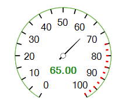
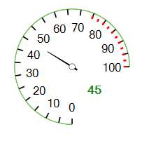
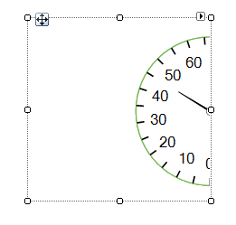
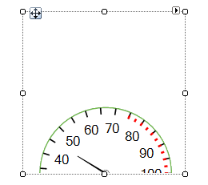
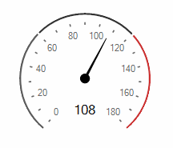

# Properties and events

## Properties

* __Value__ - specifies the gauge's value.
            

* __RangeStart__ - specifies the gauge's start. On the picture below, the __RangeStart__
              is *0*.
            

* __RangeEnd__ - specifies the gauge's end. On the picture above, the __RangeEnd__
              is *100*.
            

* __StartAngle__ - determines the starting angle of the arc. On the following screen shot the
              __StartAngle__ is *90*.
            

* __SweepAngle__ - determines the angle value starting from the __StartAngle__ to
              draw an arc in clockwise direction. On the picture above the  __SweepAngle__ is *270*.
            

* __CenterOffsetX__ - controls the __RadRadialGauge__'s offset in horizontal direction.
            

* __CenterOffsetY__ - controls the __RadRadialGauge__'s offset in vertical direction.
            

## Events

The __ValueChanged__ event fires when the value is modified. You can perform changes to the gauge's elements
         in order to indicate low/high values. The following code snippet demonstrates how to color the needle and the single label in red color,
         when the RadRadialGauge.__Value__ gets greater than *120*.
        

#### __[C#]__

{{source=..\SamplesCS\Gauges\RadialGauge\RadialGaugePropertiesAndEvents.cs region=ValueChanged}}
	        
	        Timer timer1 = new Timer();
	        float step = 0f; 
	        
	        public RadialGaugePropertiesAndEvents()
	        {
	            InitializeComponent();
	            
	            step = -(float)(radRadialGauge1.RangeEnd - radRadialGauge1.RangeStart) / 10f;
	            this.radRadialGauge1.ValueChanged += radRadialGauge1_ValueChanged;
	            timer1.Interval = 1000;
	            timer1.Tick += timer1_Tick;
	            timer1.Start();
	        }
	        
	        private void radRadialGauge1_ValueChanged(object sender, EventArgs e)
	        {
	            if (this.radRadialGauge1.Value >= 120)
	            {
	                this.radialGaugeNeedle1.BackColor = Color.FromArgb(224, 90, 90);
	                this.radialGaugeNeedle1.BackColor2 = Color.FromArgb(224, 90, 90);
	                this.radialGaugeSingleLabel1.ForeColor = Color.FromArgb(224, 90, 90);
	            }
	            else
	            {
	                this.radialGaugeNeedle1.BackColor = Color.Black;
	                this.radialGaugeNeedle1.BackColor2 = Color.Black;
	                this.radialGaugeSingleLabel1.ForeColor = Color.Black;
	            }
	        }
	        
	        private void timer1_Tick(object sender, EventArgs e)
	        {
	            if (radRadialGauge1.Value + step > radRadialGauge1.RangeEnd || radRadialGauge1.Value + step < radRadialGauge1.RangeStart)
	            {
	                step = -step;
	            }
	            AnimatedPropertySetting setting = new AnimatedPropertySetting(RadRadialGaugeElement.ValueProperty,
	                this.radRadialGauge1.Value, radRadialGauge1.Value + step, 12, 40);
	            setting.ApplyEasingType = RadEasingType.OutBounce;
	            setting.ApplyValue(radRadialGauge1.GaugeElement);
	        }
	    
	{{endregion}}

#### __[VB.NET]__

{{source=..\SamplesVB\Gauges\RadialGauge\RadialGaugePropertiesAndEvents.vb region=ValueChanged}}
	
	    Private timer1 As New Timer()
	    Private [step] As Single = 0.0F
	
	    Public Sub New()
	        InitializeComponent()
	
	        [step] = -CSng(RadRadialGauge1.RangeEnd - RadRadialGauge1.RangeStart) / 10.0F
	        AddHandler Me.RadRadialGauge1.ValueChanged, AddressOf radRadialGauge1_ValueChanged
	        timer1.Interval = 1000
	        AddHandler timer1.Tick, AddressOf timer1_Tick
	        timer1.Start()
	    End Sub
	
	    Private Sub radRadialGauge1_ValueChanged(sender As Object, e As EventArgs)
	        If Me.RadRadialGauge1.Value >= 120 Then
	            Me.RadialGaugeNeedle1.BackColor = Color.FromArgb(224, 90, 90)
	            Me.RadialGaugeNeedle1.BackColor2 = Color.FromArgb(224, 90, 90)
	            Me.RadialGaugeSingleLabel1.ForeColor = Color.FromArgb(224, 90, 90)
	        Else
	            Me.RadialGaugeNeedle1.BackColor = Color.Black
	            Me.RadialGaugeNeedle1.BackColor2 = Color.Black
	            Me.RadialGaugeSingleLabel1.ForeColor = Color.Black
	        End If
	    End Sub
	
	    Private Sub timer1_Tick(sender As Object, e As EventArgs)
	        If RadRadialGauge1.Value + [step] > RadRadialGauge1.RangeEnd OrElse RadRadialGauge1.Value + [step] < RadRadialGauge1.RangeStart Then
	            [step] = -[step]
	        End If
	        Dim setting As New AnimatedPropertySetting(RadRadialGaugeElement.ValueProperty, Me.RadRadialGauge1.Value, RadRadialGauge1.Value + [step], 12, 40)
	        setting.ApplyEasingType = RadEasingType.OutBounce
	        setting.ApplyValue(RadRadialGauge1.GaugeElement)
	    End Sub
	
	{{endregion}}

