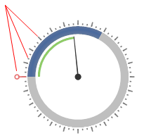
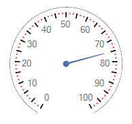
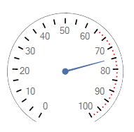
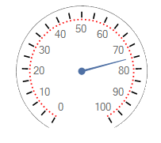
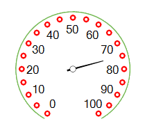
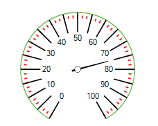
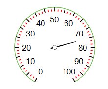

# Working with ticks

__RadialGaugeTicks__ are displayed next to the arc spanning the entire sweep angle.   
   

## 

The following properties allow you to modify the ticks' look:

* __TicksCount__ - specifies how many ticks will be displayed. On the following picture the black ticks are 24, but the red ticks are 72.
            

>note  __RadRadialGauge__ always displays one additional tick to the __TicksCount__ in order to distribute the ticks correctly on the arc.

* __TickStartIndexVisibleRange__ - specifies at which index the visible ticks range will start. On the following picture the red ticks start from index 45:
            

* __TickEndIndexVisibleRange__ - specifies at which index the visible ticks range will end. On the following picture the red ticks ends with index 50:
            

* __TicksRadiusPercentage__ - controls how far according to the gauge's arc the ticks will be rendered. On the following picture, the red ticks have __TicksRadiusPercentage__ 80.
            

* __CircleTicks__ - controls whether the specific ticks are circle or not.
            

* __TickThickness__ - specifies how thick the ticks will be rendered.
            

* __TickColor__ - specifies the back color for the ticks
            

* __TicksOffset__ - specifies the ticks back length towards the center point.
            

* __TicksLenghtPercentage__ - controls the ticks length. On the picture below, the black ticks are with __TicksLenghtPercentage__ 10, but the red ones with 5.
            

