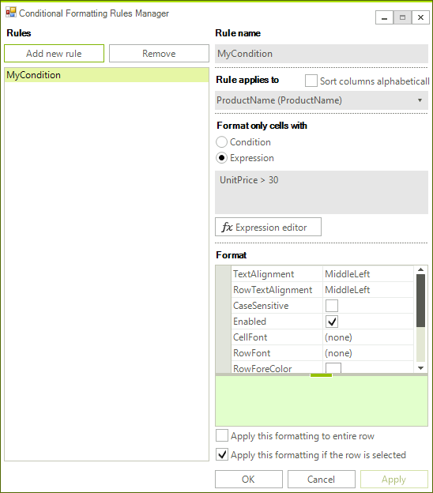

# Conditional Formatting Cells

Cells and rows can be styled based on data conditions using ConditionalFormattingObjects.The formatting objects could contain the following formatting properties for cell, row, and text alignment:

* __CellBackColor__  – sets the background color of the cell
          

* __CellForeColor__  – sets the cell text color
          

* __CellFont__ – sets the font of the cell.
          

* __TextAlignment__ – sets the alignment of the cell text
          

* __RowBackColor__ – sets the background color for the entire row that the cell appears in
          

* __RowForeColor__ – sets the cell text  color for the entire row that the cell appears in
          

* __RowFont__ – sets the font of the row’s cells text.
          

* __RowTextAlignment__ – sets the alignment of the row’s cells text.
          

The formatting properties of the rows apply if the __ApplyToRow__ property of the formatting object is set to ‘*true*’. The __ApplyOnSelectedRows__ property defines if the formatting properties of the object will apply also to the selected rows.
      

The formatting objects are two different types depending on the mechanism for defining conditions - rule based and expression based.
      

## Rule based formatting objects

The rule based formatting objects apply to the cells / rows according to the defined rules:

* __ConditionType__– sets conditions like *Equal*, *Contains*, etc.
            

* __TValue1__ – a string representing the first value used to test the condition
            

* __TValue2__ – a string representing the second value used to test the condition.
            

The example below detects when a value in the second column "*UnitPrice*" has a value __greater than 30__. When the condition is met the cell background color is set to __SkyBlue__, the text color is set to __Red__ and the text alignment is set to __MiddleRight__.

{{source=..\SamplesCS\GridView\Cells\ConditionalFormattingCells.cs region=conditionalFormattingCells}} 
{{source=..\SamplesVB\GridView\Cells\ConditionalFormattingCells.vb region=conditionalFormattingCells}} 

````C#
ConditionalFormattingObject obj = new ConditionalFormattingObject("MyCondition", ConditionTypes.Greater, "30", "", false);
obj.CellBackColor = Color.SkyBlue;
obj.CellForeColor = Color.Red;
obj.TextAlignment = ContentAlignment.MiddleRight;
this.radGridView1.Columns["UnitPrice"].ConditionalFormattingObjectList.Add(obj);

````
````VB.NET
Dim obj As New ConditionalFormattingObject("MyCondition", ConditionTypes.Greater, "30", "", False)
obj.CellBackColor = Color.SkyBlue
obj.CellForeColor = Color.Red
obj.TextAlignment = ContentAlignment.MiddleRight
Me.RadGridView1.Columns("UnitPrice").ConditionalFormattingObjectList.Add(obj)

````

{{endregion}} 


## Expression based formatting objects

The expression based formatting objects apply to the cells / rows according to the defined __Expression__. It provides high flexibility to the formatting mechanism. The __Expression__ could refer to data from more than one column. Its result should be boolean.
        

The example below detects when a value in the second column "*UnitPrice*" has a value __greater than 30__ and sets styles to the “*ProductName*” column.

{{source=..\SamplesCS\GridView\Cells\ConditionalFormattingCells.cs region=expression}} 
{{source=..\SamplesVB\GridView\Cells\ConditionalFormattingCells.vb region=expression}} 

````C#
ExpressionFormattingObject obj = new ExpressionFormattingObject("MyCondition", "UnitPrice > 30", false);
obj.CellBackColor = Color.SkyBlue;
obj.CellForeColor = Color.Red;
this.radGridView1.Columns["ProductName"].ConditionalFormattingObjectList.Add(obj);

````
````VB.NET
Dim obj As New ExpressionFormattingObject("MyCondition", "UnitPrice > 30", False)
obj.CellBackColor = Color.SkyBlue
obj.CellForeColor = Color.Red
Me.RadGridView1.Columns("ProductName").ConditionalFormattingObjectList.Add(obj)

````

{{endregion}} 


## Customize ConditionalFormattingForm

RadGridView provides convenient form which the end user could use to create formatting objects:

To access and customize the dialog, you can use the  __ConditionalFormattingFormShown__ event of RadGridView. For example, here is how to disallow displaying of non-visible columns in the drop down and also, specify the format of displaying the columns as  __name and header text__:

{{source=..\SamplesCS\GridView\Cells\ConditionalFormattingCells.cs region=expression}} 
{{source=..\SamplesVB\GridView\Cells\ConditionalFormattingCells.vb region=expression}} 

````C#
ExpressionFormattingObject obj = new ExpressionFormattingObject("MyCondition", "UnitPrice > 30", false);
obj.CellBackColor = Color.SkyBlue;
obj.CellForeColor = Color.Red;
this.radGridView1.Columns["ProductName"].ConditionalFormattingObjectList.Add(obj);

````
````VB.NET
Dim obj As New ExpressionFormattingObject("MyCondition", "UnitPrice > 30", False)
obj.CellBackColor = Color.SkyBlue
obj.CellForeColor = Color.Red
Me.RadGridView1.Columns("ProductName").ConditionalFormattingObjectList.Add(obj)

````

{{endregion}} 


