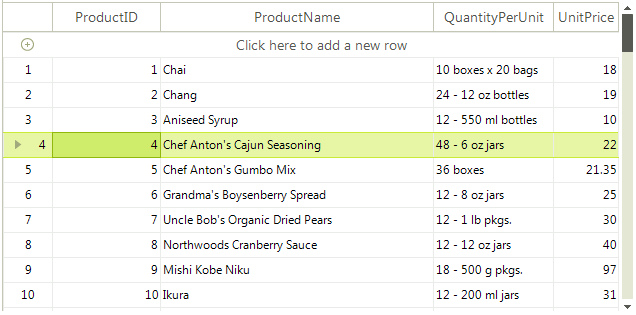

# Row Numbers

By default, **RadGridView** displays a current row indicator in the row header represented by an arrow image. A common requirement is to display the row number in the row header as well. This can be easily achieved by handling the **ViewCellFormatting** event. You can find below a sample code snippet.

>caption Figure 1: Row numbers



#### Handling the ViewCellFormatting event

{{source=..\SamplesCS\GridView\Cells\GridViewRowNumbers.cs region=RowNumbers}} 
{{source=..\SamplesVB\GridView\Cells\GridViewRowNumbers.vb region=RowNumbers}} 

````C#
 private void radGridView1_ViewCellFormatting(object sender, CellFormattingEventArgs e)
{
    if (e.CellElement is GridRowHeaderCellElement && e.Row is GridViewDataRowInfo)
    {
        e.CellElement.Text = (e.CellElement.RowIndex + 1).ToString();
        e.CellElement.TextImageRelation = TextImageRelation.ImageBeforeText;
    }
    else
    { 
        e.CellElement.ResetValue(LightVisualElement.TextImageRelationProperty, ValueResetFlags.Local);
    }
}     

````
````VB.NET
Private Sub radGridView1_ViewCellFormatting(sender As Object, e As CellFormattingEventArgs)
    If TypeOf e.CellElement Is GridRowHeaderCellElement AndAlso TypeOf e.Row Is GridViewDataRowInfo Then
        e.CellElement.Text = (e.CellElement.RowIndex + 1).ToString()
        e.CellElement.TextImageRelation = TextImageRelation.ImageBeforeText
    Else
        e.CellElement.ResetValue(LightVisualElement.TextImageRelationProperty, ValueResetFlags.Local)
    End If
End Sub

````

{{endregion}} 

It is necessary to increase the header row's width in order to have enough space to display the row number and the current row indicator. This can be accomplished by setting the TableElement.**RowHeaderColumnWidth** property.

#### Adjust the RowHeaderColumnWidth

{{source=..\SamplesCS\GridView\Cells\GridViewRowNumbers.cs region=RowHeaderWidth}} 
{{source=..\SamplesVB\GridView\Cells\GridViewRowNumbers.vb region=RowHeaderWidth}} 

````C#
 this.radGridView1.TableElement.RowHeaderColumnWidth = 50;          

````
````VB.NET
Me.RadGridView1.TableElement.RowHeaderColumnWidth = 50

````

{{endregion}} 

# See Also
* [Formatting GridViewCommandColumn]()

* [Formating Group Rows]()

* [Style Property]()

