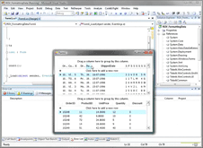

# Formatting Cells

Due to the UI virtualization in RadGridView, cell elements are created only for currently visible cells and are being reused during operations like scrolling, filtering, grouping and so on.

In order to prevent applying the formatting to other columns' cell elements (because of the cell reuse) all customization should be reset for the rest of the cell elements. Please refer to the Fundamentals [topic]() for more information.

| RELATED VIDEOS |  |
| ------ | ------ |
|[Formatting Data In RadGridView for WinForms](http://tv.telerik.com/watch/radtips/radgrid/formatting-data-in-radgridview)<br>In this RadTip, John Kellar demonstrates how you can apply custom formatting to data within a RadGridView for Windows Forms. (Runtime: 09:14)||

## Formatting data cells.

The __CellFormatting__ event is used to access and change the styles of the *data* cells including the *new row cells*. For example, the code sample below changes the ForeColor in a particular column:

#### Changing the data cells font color

{{source=..\SamplesCS\GridView\Cells\FormattingCells.cs region=cellFormattingExample1}} 
{{source=..\SamplesVB\GridView\Cells\FormattingCells.vb region=cellFormattingExample1}} 

````C#
void radGridView1_CellFormatting1(object sender, Telerik.WinControls.UI.CellFormattingEventArgs e)
{
    if (e.CellElement.ColumnInfo.Name == "KBytes")
    {
        e.CellElement.ForeColor = Color.Red;
    }
    else
    {
        e.CellElement.ResetValue(LightVisualElement.ForeColorProperty, ValueResetFlags.Local);
    }
}

````
````VB.NET
Private Sub RadGridView1_CellFormatting1(ByVal sender As Object, ByVal e As Telerik.WinControls.UI.CellFormattingEventArgs) Handles RadGridView1.CellFormatting
    If e.CellElement.ColumnInfo.Name = "KBytes" Then
        e.CellElement.ForeColor = Color.Red
    Else
        e.CellElement.ResetValue(LightVisualElement.ForeColorProperty, ValueResetFlags.Local)
    End If
End Sub

````

{{endregion}} 

>caption Figure 1 Changing the cells fore color. 


## Cells background formatting

This is an advanced example of using CellFormatting event to highlight certain cells in red color based on the values of cells in the same row but *different* column. In the example, the values in the first column are  highlighted if the value in the check box column returns true:

>caption Figure 2 Formating cell upon a condition. 


#### Formatting cells 

{{source=..\SamplesCS\GridView\Cells\FormattingCells.cs region=cellFormattingExample2}} 
{{source=..\SamplesVB\GridView\Cells\FormattingCells.vb region=cellFormattingExample2}} 

````C#
void radGridView1_CellFormatting2(object sender, Telerik.WinControls.UI.CellFormattingEventArgs e)
{
    if (e.CellElement.ColumnInfo.HeaderText == "Id")
    {
        if (e.CellElement.RowInfo.Cells["BMP"].Value != null)
        {
            if ((bool)e.CellElement.RowInfo.Cells["BMP"].Value == true)
            {
                e.CellElement.DrawFill = true;
                e.CellElement.ForeColor = Color.Blue;
                e.CellElement.NumberOfColors = 1;
                e.CellElement.BackColor = Color.Aqua;
            }
            else
            {
                e.CellElement.DrawFill = true;
                e.CellElement.ForeColor = Color.Yellow;
                e.CellElement.NumberOfColors = 1;
                e.CellElement.BackColor = Color.Green;
            }
        }
    }
    else
    {
        e.CellElement.ResetValue(LightVisualElement.DrawFillProperty, ValueResetFlags.Local);
        e.CellElement.ResetValue(LightVisualElement.ForeColorProperty, ValueResetFlags.Local);
        e.CellElement.ResetValue(LightVisualElement.NumberOfColorsProperty, ValueResetFlags.Local);
        e.CellElement.ResetValue(LightVisualElement.BackColorProperty, ValueResetFlags.Local);
    }
}

````
````VB.NET
Private Sub RadGridView1_CellFormatting2(ByVal sender As Object, ByVal e As Telerik.WinControls.UI.CellFormattingEventArgs) Handles RadGridView1.CellFormatting
    If e.CellElement.ColumnInfo.HeaderText = "Id" Then
        If e.CellElement.RowInfo.Cells("BMP").Value IsNot Nothing Then
            If CBool(e.CellElement.RowInfo.Cells("BMP").Value) = True Then
                e.CellElement.DrawFill = True
                e.CellElement.ForeColor = Color.Blue
                e.CellElement.NumberOfColors = 1
                e.CellElement.BackColor = Color.Aqua
            Else
                e.CellElement.DrawFill = True
                e.CellElement.ForeColor = Color.Yellow
                e.CellElement.NumberOfColors = 1
                e.CellElement.BackColor = Color.Green
            End If
        End If
    Else
        e.CellElement.ResetValue(LightVisualElement.DrawFillProperty, ValueResetFlags.Local)
        e.CellElement.ResetValue(LightVisualElement.ForeColorProperty, ValueResetFlags.Local)
        e.CellElement.ResetValue(LightVisualElement.NumberOfColorsProperty, ValueResetFlags.Local)
        e.CellElement.ResetValue(LightVisualElement.BackColorProperty, ValueResetFlags.Local)
    End If
End Sub

````

{{endregion}} 

## Formatting non-data cells

The __ViewCellFormatting__ is fired for all cells. So if you want to format the grouping row or the header cells, you should use this event.

##  Change group and header cells font and removing the default filter operator text.

For example, to change the font of the header cells and the group cells use the following code:

####  Formatting non-data rows

{{source=..\SamplesCS\GridView\Cells\FormattingCells.cs region=viewCellFormatting1}} 
{{source=..\SamplesVB\GridView\Cells\FormattingCells.vb region=viewCellFormatting1}} 

````C#
Font newFont = new Font("Arial", 12f, FontStyle.Bold);
void radGridView1_ViewCellFormatting1(object sender, CellFormattingEventArgs e)
{
    if (e.CellElement is GridHeaderCellElement || e.CellElement is GridGroupContentCellElement)
    {
        e.CellElement.Font = newFont;
        e.CellElement.ForeColor = Color.Blue;
    }
    else
    {
        e.CellElement.ResetValue(LightVisualElement.FontProperty, ValueResetFlags.Local);
        e.CellElement.ResetValue(LightVisualElement.ForeColorProperty, ValueResetFlags.Local);
    }
    //hiding the text from the filter cells
    GridFilterCellElement filterCell = e.CellElement as GridFilterCellElement;
    if (filterCell != null)
    {
        filterCell.FilterOperatorText.Visibility = Telerik.WinControls.ElementVisibility.Collapsed;
    }
}

````
````VB.NET
Dim newFont = New Font("Arial", 12.0F, FontStyle.Bold)
Private Sub RadGridView1_ViewCellFormatting1(ByVal sender As Object, ByVal e As Telerik.WinControls.UI.CellFormattingEventArgs) Handles RadGridView1.ViewCellFormatting
    If TypeOf e.CellElement Is GridHeaderCellElement OrElse TypeOf e.CellElement Is GridGroupContentCellElement Then
        e.CellElement.Font = newFont
        e.CellElement.ForeColor = Color.Blue
    Else
        e.CellElement.ResetValue(LightVisualElement.FontProperty, ValueResetFlags.Local)
        e.CellElement.ResetValue(LightVisualElement.ForeColorProperty, ValueResetFlags.Local)
    End If
    'hiding the text from the filter cells
    Dim filterCell As GridFilterCellElement = TryCast(e.CellElement, GridFilterCellElement)
    If filterCell IsNot Nothing Then
        filterCell.FilterOperatorText.Visibility = Telerik.WinControls.ElementVisibility.Collapsed
    End If
End Sub

````

{{endregion}} 

>caption Figure 3: Formatting non-data rows.


## Formatting cells on demand   

Sometimes you may need to format the cells on a specific user action, for example, on a button click. Let's take the following scenario: you have a search box (RadTextBox) above RadGridView and a RadButton. When you click the button, RadGridView should highlight the cells that match the text typed in the RadTextBox. Here is how you can implement this:

* First, you should handle the `CellFormatting` event and set the back color of the cells whose text matches the text in the RadTextBox.

{{source=..\SamplesCS\GridView\Cells\FormattingCellsOnDemand.cs region=cellFormatting}} 
{{source=..\SamplesVB\GridView\Cells\FormattingCellsOnDemand.vb region=cellFormatting}} 

````C#
void radGridView1_CellFormatting(object sender, Telerik.WinControls.UI.CellFormattingEventArgs e)
{
    if (e.CellElement.Text == this.radTextBox1.Text)
    {
        e.CellElement.DrawFill = true;
        e.CellElement.BackColor = Color.Yellow;
        e.CellElement.GradientStyle = Telerik.WinControls.GradientStyles.Solid;
    }
    else
    {
        e.CellElement.ResetValue(LightVisualElement.DrawFillProperty, Telerik.WinControls.ValueResetFlags.Local);
        e.CellElement.ResetValue(VisualElement.BackColorProperty, ValueResetFlags.Local);
        e.CellElement.ResetValue(LightVisualElement.GradientStyleProperty, ValueResetFlags.Local);
    }
}

````
````VB.NET
Private Sub RadGridView1_CellFormatting(ByVal sender As Object, ByVal e As Telerik.WinControls.UI.CellFormattingEventArgs) Handles RadGridView1.CellFormatting
    If e.CellElement.Text = Me.RadTextBox1.Text Then
        e.CellElement.DrawFill = True
        e.CellElement.BackColor = Color.Yellow
        e.CellElement.GradientStyle = Telerik.WinControls.GradientStyles.Solid
    Else
        e.CellElement.ResetValue(LightVisualElement.DrawFillProperty, Telerik.WinControls.ValueResetFlags.Local)
        e.CellElement.ResetValue(VisualElement.BackColorProperty, ValueResetFlags.Local)
        e.CellElement.ResetValue(LightVisualElement.GradientStyleProperty, ValueResetFlags.Local)
    End If
End Sub

````

{{endregion}} 

* The user types some text, but then you should somehow notify RadGridView that it needs to refresh itself. This is done by calling the __Update__ method of the `TableElement`, passing the *StateChanged* argument as a parameter.

{{source=..\SamplesCS\GridView\Cells\FormattingCellsOnDemand.cs region=buttonClick}} 
{{source=..\SamplesVB\GridView\Cells\FormattingCellsOnDemand.vb region=buttonClick}} 

````C#
void searchButton_Click(object sender, EventArgs e)
{
    this.radGridView1.TableElement.Update(GridUINotifyAction.StateChanged);
}

````
````VB.NET
Private Sub searchButton_Click(ByVal sender As Object, ByVal e As System.EventArgs) Handles searchButton.Click
    Me.RadGridView1.TableElement.Update(GridUINotifyAction.StateChanged)
End Sub

````

{{endregion}} 

As a result of the update call, the CellFormatting (and the other formatting events as well) will be triggered and you will get the following results:

>caption Figure 4: Manually trigger the grid update. 


# See Also

* [Formating Group Rows]()
* [Formating Child Tabs]()
* [Formating Command Cells]()
* [The Style Property]()