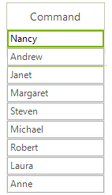

# GridViewCommandColumn

__GridViewCommandColumn__ displays a button element that responds to user input mouse clicks and keyboard key presses. Either mouse click or keyboard input fires the __RadGridView.CommandCommandCellClick__ event. The button text can be supplied through the column __FieldName__ property values or by the column __DefaultText__ property. To display the same button text for every cell, set the __UseDefaultText__ property to true and the __DefaultText__ property to the value you want displayed in the button. __UseDefaultText__ is false by default.

__GridViewCommandColumn__ inherits from __GridViewDataColumn.__

The example below creates two __GridViewCommandColumns__. The first has __UseDefaultText__ set to __False__ and so displays the __FieldName__ value for "ProductName" in the button text. The second has the __UseDefaultText__ property set to __True__ and the __DefaultText__ property set to "Order". In both cases the RadGridView __CommandCellClick__ reacts to a mouse click, casts "sender" to be __GridCommandCellElement__ and makes use of the __Value__ property. 

#### __[C#] Adding GridViewCommandColumn__

{{source=..\SamplesCS\GridView\Columns\GridViewCommandColumn1.cs region=addCommandColumn}}
	        public GridViewCommandColumn1()
	        {
	            InitializeComponent();
	
	            GridViewCommandColumn commandColumn = new GridViewCommandColumn();
	            commandColumn.Name = "CommandColumn";
	            commandColumn.UseDefaultText = false;
	            commandColumn.FieldName = "ProductName";
	            commandColumn.HeaderText = "Order";
	            radGridView1.MasterTemplate.Columns.Add(commandColumn);
	
	            GridViewCommandColumn commandColumn2 = new GridViewCommandColumn();
	            commandColumn2.Name = "CommandColumn2";
	            commandColumn2.UseDefaultText = true;
	            commandColumn2.DefaultText = "Order";
	            commandColumn2.FieldName = "ProductName";
	            commandColumn2.HeaderText = "Order";
	            radGridView1.MasterTemplate.Columns.Add(commandColumn2);
	
	            radGridView1.CommandCellClick += new CommandCellClickEventHandler(radGridView1_CommandCellClick);
	        }
	
	        void radGridView1_CommandCellClick(object sender, EventArgs e)
	        {
	            MessageBox.Show("You ordered " + ((sender as GridCommandCellElement)).Value);
	        }
	{{endregion}}

#### __[VB.NET] Adding GridViewCommandColumn__

{{source=..\SamplesVB\GridView\Columns\GridViewCommandColumn1.vb region=addCommandColumn}}
	    Public Sub New()
	        InitializeComponent()
	
	        Dim commandColumn As New GridViewCommandColumn()
	        commandColumn.Name = "CommandColumn"
	        commandColumn.UseDefaultText = False
	        commandColumn.FieldName = "ProductName"
	        commandColumn.HeaderText = "Order"
	        RadGridView1.MasterTemplate.Columns.Add(commandColumn)
	        Dim commandColumn2 As New GridViewCommandColumn()
	        commandColumn2.Name = "CommandColumn2"
	        commandColumn2.UseDefaultText = True
	        commandColumn2.DefaultText = "Order"
	        commandColumn2.FieldName = "ProductName"
	        commandColumn2.HeaderText = "Order"
	        RadGridView1.MasterTemplate.Columns.Add(commandColumn2)
	        AddHandler RadGridView1.CommandCellClick, AddressOf radGridView1_CommandCellClick
	    End Sub
	
	    Sub radGridView1_CommandCellClick(ByVal sender As Object, ByVal e As EventArgs)
	        MessageBox.Show("You ordered " + ((TryCast(sender, GridCommandCellElement))).Value)
	    End Sub
	{{endregion}}

