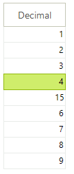

# GridViewDecimalColumn


__GridViewDecimalColumn__ allows decimal data to be displayed and edited. __GridViewDecimalColumn__ can be bound to fields of any numeric type.
      #_[C#] Adding GridViewDecimalColumn_

	


{{source=..\SamplesCS\GridView\Columns\GridViewDecimalColumn1.cs region=addingDecimalColumn}} 
{{source=..\SamplesVB\GridView\Columns\GridViewDecimalColumn1.vb region=addingDecimalColumn}} 

````C#
            GridViewDecimalColumn decimalColumn = new GridViewDecimalColumn();
            decimalColumn.Name = "DecimalColumn";
            decimalColumn.HeaderText = "Unit Price";
            decimalColumn.FieldName = "UnitPrice";
            decimalColumn.DecimalPlaces = 3;
            radGridView1.MasterTemplate.Columns.Add(decimalColumn);
````
````VB.NET
        Dim decimalColumn As New GridViewDecimalColumn()
        decimalColumn.Name = "DecimalColumn"
        decimalColumn.HeaderText = "Unit Price"
        decimalColumn.FieldName = "UnitPrice"
        decimalColumn.DecimalPlaces = 3
        RadGridView1.MasterTemplate.Columns.Add(decimalColumn)
        '
````

{{endregion}} 


## Setting a default value for empty cells

You may provide a default value using the following code:#_[C#] Setting the default value for empty cells_

	


{{source=..\SamplesCS\GridView\Columns\GridViewDecimalColumn1.cs region=settingTheDefaultValue}} 
{{source=..\SamplesVB\GridView\Columns\GridViewDecimalColumn1.vb region=settingTheDefaultValue}} 

````C#
        void radGridView1_CellEditorInitialized(object sender, GridViewCellEventArgs e)
        {
            GridSpinEditor spinEditor = this.radGridView1.ActiveEditor as GridSpinEditor;
            if (spinEditor != null)
            {
                if (spinEditor.Value == null)
                {
                    spinEditor.Value = 0.0;
                }
            }
        }
````
````VB.NET
    Private Sub RadGridView1_CellEditorInitialized(ByVal sender As Object, ByVal e As Telerik.WinControls.UI.GridViewCellEventArgs)
        Dim spinEditor As GridSpinEditor = TryCast(Me.RadGridView1.ActiveEditor, GridSpinEditor)

        If spinEditor IsNot Nothing Then
            spinEditor.Value = 0
        End If
    End Sub
    '
````

{{endregion}} 


##  Disable the up and down buttons of the spin editor

The code below demonstrates how you can disable the up and down arrow buttons. Using the commented code you can completely hide them.#_[C#] Disable up and down arrow buttons_

	


{{source=..\SamplesCS\GridView\Columns\GridViewDecimalColumn1.cs region=ShowUpDownButtons}} 
{{source=..\SamplesVB\GridView\Columns\GridViewDecimalColumn1.vb region=ShowUpDownButtons}} 

````C#
        void radGridView1_CellEditorInitialized1(object sender, GridViewCellEventArgs e)
        {
            GridSpinEditor spinEditor = this.radGridView1.ActiveEditor as GridSpinEditor;

            ((GridSpinEditorElement)spinEditor.EditorElement).ShowUpDownButtons = false;
        }
````
````VB.NET
    Private Sub RadGridView1_CellEditorInitialized1(ByVal sender As Object, ByVal e As Telerik.WinControls.UI.GridViewCellEventArgs)
        Dim spinEditor As GridSpinEditor = TryCast(Me.RadGridView1.ActiveEditor, GridSpinEditor)
        If spinEditor IsNot Nothing Then
            Dim element As GridSpinEditorElement = spinEditor.EditorElement
            element.ShowUpDownButtons = False
        End If
    End Sub
    '
````

{{endregion}} 


## Setting decimal places

The rich API of RadGridView allows you to define one value for the decimal places
          that should be shown in the spin editor of the column and another value for the cells of the column.
          

__Setting decimal places to the spin editor__

You can define how many places after the decimal point the value in the spin editor should have
            by setting the DecimalPlaces property of GridViewDecimalColumn:
             #_[C#]_

	


{{source=..\SamplesCS\GridView\Columns\GridViewDecimalColumn1.cs region=decimalPlacesEditor}} 
{{source=..\SamplesVB\GridView\Columns\GridViewDecimalColumn1.vb region=decimalPlacesEditor}} 

````C#
            decimalColumn.DecimalPlaces = 3;
````
````VB.NET
        decimalColumn.DecimalPlaces = 3
        '
````

{{endregion}} 


__Setting decimal places to the column cells__

In order to define how the values should be displayed by the cells
            of the GridViewDecimalColumn in the sense of their decimal places,
            we should set the FormatString property of the column:
          #_[C#]_

	


{{source=..\SamplesCS\GridView\Columns\GridViewDecimalColumn1.cs region=decimalPlacesCell}} 
{{source=..\SamplesVB\GridView\Columns\GridViewDecimalColumn1.vb region=decimalPlacesCell}} 

````C#
            decimalColumn.FormatString = "{0:N2}";
````
````VB.NET
        decimalColumn.FormatString = "{0:N2}"
        '
````

{{endregion}} 


Here is the result of setting the DecimalPlaces property to 3 and the FormatString property to {0:N2}:
            

>note For a list of the standard numeric format strings, see[Standard Numeric Format Strings](http://msdn.microsoft.com/en-us/library/dwhawy9k.aspx)
>

