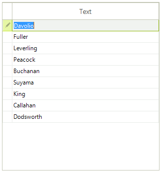

# GridViewTextBoxColumn

__GridViewTextBoxColumn__ displays and allows editing of text data. Each cell in __GridViewTextBoxColumn__ column displays the text of cell __Value__ property according to the settings of the __TextAlignment__ (default is __ContentAlignment.MiddleLeft__) and __WrapText__(default is *false*) properties. The displayed text is formatted according to the value of the __FormatString__ property.

When a user begins editing a cell, a textbox editor is provided to handle the user’s input. The length of the text the user can enter is restricted to the value of __MaxLength__ property.



{{source=..\SamplesCS\GridView\Columns\GridViewTextBoxColumn1.cs region=addTextBoxColumn}} 
{{source=..\SamplesVB\GridView\Columns\GridViewTextBoxColumn1.vb region=addTextBoxColumn}} 

````C#
GridViewTextBoxColumn textBoxColumn = new GridViewTextBoxColumn();
textBoxColumn.Name = "TextBoxColumn";
textBoxColumn.HeaderText = "Product Name";
textBoxColumn.FieldName = "ProductName";
textBoxColumn.MaxLength = 50;
textBoxColumn.TextAlignment = ContentAlignment.BottomRight;
radGridView1.MasterTemplate.Columns.Add(textBoxColumn);

````
````VB.NET
Dim textBoxColumn As New GridViewTextBoxColumn()
textBoxColumn.Name = "TextBoxColumn"
textBoxColumn.HeaderText = "Product Name"
textBoxColumn.FieldName = "ProductName"
textBoxColumn.MaxLength = 50
textBoxColumn.TextAlignment = ContentAlignment.BottomRight
RadGridView1.MasterTemplate.Columns.Add(textBoxColumn)

````

{{endregion}} 

## Character casing

GridViewTextBoxColumn editor - *RadTextBoxEditor* - supports character casing. To enable this functionality you need to set __ColumnCharecterCasing__ property of the desired GridViewTextBoxColumn column:

{{source=..\SamplesCS\GridView\Columns\GridViewTextBoxColumn1.cs region=characterCasting}} 
{{source=..\SamplesVB\GridView\Columns\GridViewTextBoxColumn1.vb region=characterCasting}} 

````C#
((GridViewTextBoxColumn)this.radGridView1.Columns[0]).ColumnCharacterCasing = CharacterCasing.Upper;

````
````VB.NET
DirectCast(Me.RadGridView1.Columns(0), GridViewTextBoxColumn).ColumnCharacterCasing = CharacterCasing.Upper

````

{{endregion}} 


>note ColumnCarecterCasing property affects only the editor and does not change the values in your data base. For instance, if your data base contains text which is lower case or partially lower case and you set the ColumnCharecterCasing to upper case the data will not be change, but if the user starts editing a cell, the editor will only allow upper case symbols and all lower case symbols will be converted to upper case ones.
>

