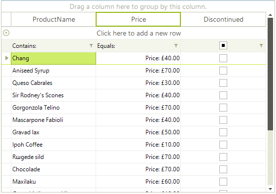

# Data Formatting

|   |
|---|
|RELATED VIDEOS|
|[Formatting Data In RadGridView for WinForms. ](https://www.youtube.com/watch?v=LmIHjRHudIw)<br>In this RadTip, John Kellar demonstrates how you can apply custom formatting to data within a RadGridView for Windows Forms. (Runtime: 09:14)|

[GridViewDataColumn]() allows you to format the data displayed in it. You can control that by setting the __FormatString__, __FormatInfo__ and __NullValue__ properties of the column.

The __FormatString__ property determines how the cell values are formatted as strings. The property is applicable with Microsoft Formatting Syntax. For more information, see the [Formatting Overview chapter in MSDN.](http://msdn.microsoft.com/en-us/library/26etazsy.aspx)

The __FormatInfo__ property provides the culture in which the string formatting is applied.

By setting the __NullValue__ property, you determine the value that appears if the cell value is null.

Here is a sample covering these properties:

#### Formatting data

{{source=..\SamplesCS\GridView\Columns\DataFormatting1.cs region=dataFormatting}} 
{{source=..\SamplesVB\GridView\Columns\DataFormatting1.vb region=dataFormatting}} 

````C#
GridViewDecimalColumn unitPriceColumn = this.radGridView1.Columns["UnitPrice"] as GridViewDecimalColumn;
unitPriceColumn.FormatString = "Price: {0:C}";
unitPriceColumn.FormatInfo = CultureInfo.CreateSpecificCulture("en-GB");
unitPriceColumn.NullValue = 0;

````
````VB.NET
Dim unitPriceColumn As GridViewDecimalColumn = TryCast(Me.RadGridView1.Columns("UnitPrice"), GridViewDecimalColumn)
        unitPriceColumn.FormatString = "Price: {0:C}"
        unitPriceColumn.FormatInfo = CultureInfo.CreateSpecificCulture("en-GB")
        unitPriceColumn.NullValue = 0

````

{{endregion}}

>caption Figure 1: The data in the middle is formated.



>note Note that the value of the NullValue property should be the same as its column data type.
>

The __WrapText__ property wraps text if the text is wider than the column width.

The __TextAlignment__ property defines the text alignment for the column.

#### Using the column text properties

{{source=..\SamplesCS\GridView\Columns\DataFormatting1.cs region=textProperties}} 
{{source=..\SamplesVB\GridView\Columns\DataFormatting1.vb region=textProperties}} 

````C#
GridViewDataColumn productNameColumn = this.radGridView1.Columns["ProductName"];
productNameColumn.WrapText = true;
productNameColumn.TextAlignment = ContentAlignment.BottomRight;

````
````VB.NET
Dim productNameColumn = Me.RadGridView1.Columns("ProductName")
productNameColumn.WrapText = True
productNameColumn.TextAlignment = ContentAlignment.BottomRight

````

{{endregion}}
# See Also
* [Accessing and Iterating through Columns]()

* [Calculated Columns (Column Expressions)]()

* [Overview]()

* [Converting Data Types]()

* [Generating Columns]()

* [GridViewColumn]()

* [GridViewDataColumn]()

* [Pinning and Unpinning Columns]()

