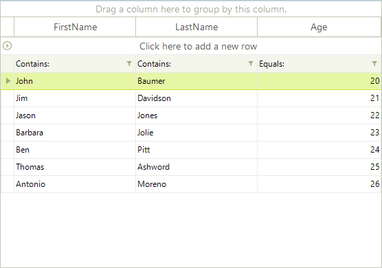

# Generating Columns

You can generate columns for RadGridView in two ways:

* Automatically, according to the columns in the data source

* Manually, with columns added by the user

The two modes can be switched using the template __AutoGenerateColumns__ property. The default value of the property is *true*, indicating the columns will be generated from the data source. If additional control is required at compile time over the columns to be shown in the grid, columns can be added manually.

## Automatic Column Generation

Auto-generation of columns means that when you set the __DataSource__ property of the RadGridView control to a collection of employees for example, a separate column will be created for each one of the public properties of your Employee object. This is the default behavior and it does not require any additional efforts from your side. Just set the __DataSource__ of your __RadGridView__ and you are ready.

However, if you wish to prevent the creation of a column for it, use the __System.ComponentModel.BrowsableAttribute__, as it is shown in the sample below:

#### Automatic column generation

{{source=..\SamplesCS\GridView\Columns\GeneratingColumns.cs region=autoGenerateColumns}} 
{{source=..\SamplesVB\GridView\Columns\GeneratingColumns.vb region=autoGenerateColumns}} 

````C#
public GeneratingColumns()
{
    InitializeComponent();
    
    BindingSource source = new BindingSource();
    List<string> firstName = new List<string> { "John", "Jim", "Jason", "Barbara", "Ben", "Thomas", "Antonio"};
    List<string> lastName = new List<string> { "Baumer", "Davidson", "Jones", "Jolie", "Pitt", "Ashword", "Moreno" };
    for (int i = 0; i < 7; i++)
    {
        source.Add(new Employee(i, firstName[i], lastName[i], i + 20));
    }
    radGridView1.DataSource = source;
}
public class Employee
{
    public Employee(int id, string fn, string ln, int age)
    {
        this.EmployeeId = id;
        this.FirstName = fn;
        this.LastName = ln;
        this.Age = age;
    }
    //the next attribute prevents the EmployeeId column from showing
    [Browsable(false)]
    public int EmployeeId { get; set; }
    public string FirstName { get; set; }
    public string LastName { get; set; }
    public int Age { get; set; }
}

````
````VB.NET
Public Sub New()
    InitializeComponent()
    Dim source As New BindingSource()

        Dim firstName As String() = {"John", "Jim", "Jason", "Barbara", "Ben", "Thomas", "Antonio"}
        Dim lastName As String() = {"Baumer", "Davidson", "Jones", "Jolie", "Pitt", "Ashword", "Moreno"}

        For i As Integer = 0 To 6
            source.Add(New Employee(i, firstName(i), lastName(i), i + 20))
        Next
        RadGridView1.DataSource = source

End Sub
Public Class Employee
        Public Sub New(ByVal id As Integer, ByVal fn As String, ByVal ln As String, ByVal age As Integer)
            Me.EmployeeId = id
            Me.FirstName = fn
            Me.LastName = ln
            Me.Age = age
        End Sub

        'the next attribute prevents the EmployeeId column from showing
        <Browsable(False)> _
        Public Property EmployeeId() As Integer
            Get
                Return m_EmployeeId
            End Get
            Set(ByVal value As Integer)
                m_EmployeeId = value
            End Set
        End Property
        Private m_EmployeeId As Integer
        Public Property FirstName() As String
            Get
                Return m_FirstName
            End Get
            Set(ByVal value As String)
                m_FirstName = value
            End Set
        End Property
        Private m_FirstName As String
        Public Property LastName() As String
            Get
                Return m_LastName
            End Get
            Set(ByVal value As String)
                m_LastName = value
            End Set
        End Property
        Private m_LastName As String
        Public Property Age() As Integer
            Get
                Return m_Age
            End Get
            Set(ByVal value As Integer)
                m_Age = value
            End Set
        End Property
        Private m_Age As Integer
    End Class

````

{{endregion}}

And here is the result:



## Manual Column Generation 

Setting the __AutoGenerateColumns__ property to *false* allows the developer to add unbound or bound columns from the data source. Columns are added to using the __Columns__ collection of a template. While the type of auto-generated columns is strictly defined by the data layer, manually added columns are defined by the developer. When defining a column you are able to choose between [several column types]()

#### Adding Columns in Code at Run Time

{{source=..\SamplesCS\GridView\Columns\GeneratingColumns2.cs region=manualColumnGeneration}} 
{{source=..\SamplesVB\GridView\Columns\GeneratingColumns2.vb region=manualColumnGeneration}} 

````C#
radGridView1.AutoGenerateColumns = false;
radGridView1.DataSource = categoriesBindingSource;
            
GridViewTextBoxColumn textBoxColumn = new GridViewTextBoxColumn();
textBoxColumn.Name = "TextBoxColumn";
textBoxColumn.HeaderText = "Product Description";
textBoxColumn.FieldName = "Description";
textBoxColumn.MaxLength = 50;
textBoxColumn.TextAlignment = ContentAlignment.BottomRight;
textBoxColumn.Width = 250;
radGridView1.MasterTemplate.Columns.Add(textBoxColumn);
GridViewComboBoxColumn categoryColumn = new GridViewComboBoxColumn();
categoryColumn.DataType = typeof(string);
categoryColumn.Name = "CategoryColumn";
categoryColumn.FieldName = "CategoryName";
categoryColumn.HeaderText = "Category";
categoryColumn.ValueMember = "CategoryID";
categoryColumn.DisplayMember = "CategoryName";
categoryColumn.Width = 150;
radGridView1.MasterTemplate.Columns.Add(categoryColumn);

````
````VB.NET
RadGridView1.AutoGenerateColumns = False
        RadGridView1.DataSource = CategoriesBindingSource

        Dim textBoxColumn As New GridViewTextBoxColumn()
        textBoxColumn.Name = "TextBoxColumn"
        textBoxColumn.HeaderText = "Product Description"
        textBoxColumn.FieldName = "Description"
        textBoxColumn.MaxLength = 50
        textBoxColumn.TextAlignment = ContentAlignment.BottomRight
        textBoxColumn.Width = 250
        RadGridView1.MasterTemplate.Columns.Add(textBoxColumn)
        Dim categoryColumn As New GridViewComboBoxColumn()
        categoryColumn.DataType = GetType(String)
        categoryColumn.Name = "CategoryColumn"
        categoryColumn.FieldName = "CategoryName"
        categoryColumn.HeaderText = "Category"
        categoryColumn.ValueMember = "CategoryID"
        categoryColumn.DisplayMember = "CategoryName"
        categoryColumn.Width = 150
        RadGridView1.MasterTemplate.Columns.Add(categoryColumn)

````

{{endregion}} 

# See Also

 * [Data Formatting]()
