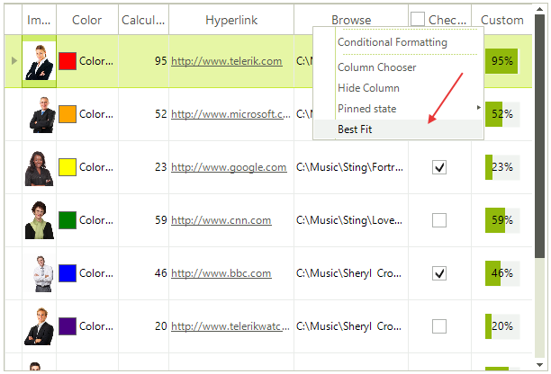

# Resizing columns programatically


## Resizing columns

The columns inside the RadGridView are resizable by default. The user is able to easily change the column width by positioning the
          mouse over the columns vertical grid line and dragging it until the desired size is achieved.
        

## Disabling resizing

There are two ways to disable the resizing of columns in the user interface:

* To restrict the resizing of all columns by the user set the __AllowColumnResize__ property of RadGridView
              to *false*#_[C#] Disable resizing_

	


{{source=..\SamplesCS\GridView\Columns\ResizingColumns.cs region=AllowColumnResize}} 
{{source=..\SamplesVB\GridView\Columns\ResizingColumns.vb region=AllowColumnResize}} 

````C#
this.radGridView1.AllowColumnResize = false;

````
````VB.NET
Me.RadGridView1.AllowColumnResize = False

````

{{endregion}} 


* To restrict the resizing of a particular column set the __AllowResize__ property of the column
              to *false*.
            #_[C#] Disable resizing for a specified column_

	


{{source=..\SamplesCS\GridView\Columns\ResizingColumns.cs region=AllowResize}} 
{{source=..\SamplesVB\GridView\Columns\ResizingColumns.vb region=AllowResize}} 

````C#
this.radGridView1.Columns["Photo"].AllowResize = false;

````
````VB.NET
Me.RadGridView1.Columns("Photo").AllowResize = False

````

{{endregion}} 


## Programatically resizing columns

The width of columns can be set individually, per column. Note that the visible width will always include some amount of data even when set
          to very small amounts. To resize the columns programmatically you can use the __Width__ property. For example:
        #_[C#] Rezise a column programatically_

	


{{source=..\SamplesCS\GridView\Columns\ResizingColumns.cs region=resizingColumn}} 
{{source=..\SamplesVB\GridView\Columns\ResizingColumns.vb region=resizingColumn}} 

````C#
this.radGridView1.Columns["Photo"].Width = 100;

````
````VB.NET
Me.RadGridView1.Columns("Photo").Width = 100

````

{{endregion}} 


You can restrict the possible values of the __Width__ property by setting the __MinWidth__ and
          __MaxWidth__ properties. The __MinWidth__ property sets a limit on how narrow the column can be
          resized. The __MaxWidth__ property determines the limit on how the column width can grow.
        

## Column Auto-Sizing

There are two ways to auto size the columns:

__AutoSizeColumnsMode__

Here, columns can automatically fill the entire width of the grid. Just set the __AutoSizeColumnsMode__ property
          of the desired template to __GridViewAutoSizeColumnsMode.Fill__.
        

__Best fit__

The column widths can be set to fit its content by using the __GridViewTemplate.BestFitColumns__ or
          __GridViewDataColumn.BestFit__ methods. This mode distributes algorithm that attempts to fit in the header text and
          column data for all visible rows.
        

The user can perform the best fit:

* By using the context menu of the header cell
            

* By double clicking of the left or right header edge
            

You can customize the execution of the algorithm of a concrete column by setting the 
          __AutoSizeMode__ property on the desired column. Here are the available options:
        

* __BestFitColumnMode.None__ - The column width does not automatically adjust.
            

* __BestFitColumnMode.AllCells__ - The column width adjusts to fit the contents all cells in the control.
            

* __BestFitColumnMode.DisplayedDataCells__ - The column width adjusts to fit the contents of the displayed data cells.
            

* __BestFitColumnMode.HeaderCells__ - The column width adjusts to fit the contents of the header cell.
            

* __BestFitColumnMode.FilterCells__ - The column width adjusts to fit the contents of the filter cell.
            

* __BestFitColumnMode.SummaryRowCells__ - The column width adjusts to fit the contents of the summary row cell.
            

* __BestFitColumnMode.SystemCells__ - The column width adjusts to fit the contents of the system cells.
            

* __BestFitColumnMode.DisplayedCells__ - The column width adjusts to fit the contents of the displayed cells.
            

## Resizing events

When the user resizes the column the __ColumnWidthChanging__ event is fired and if it is not canceled
          the __ColumnWidthChanged__ event fires after the resize is completed.
        
