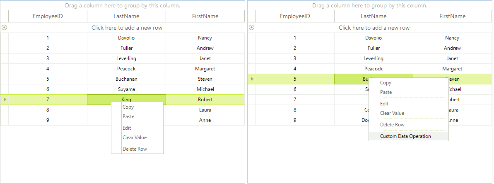

# Conditional Custom Context Menus


Applications may need to provide specific individual context menus depending on the element that was clicked. Context menus make a great amount of functionality available without burdening the user with additional screen transitions or extra controls on the screen. The example below demonstrates how to dynamically add different custom context menus, depending on the part of the grid that was clicked.

>note To set a custom context menu to appear every time the user right-clicks the __RadGridView__, regardless of the element of the control they click, see [Custom Context Menus]().
>


## Example

In this example, two different context menus are created and attached to cells in the second and third grid columns. If the user right-clicks in a cell the second column, they will get the first custom context menu. If they click in the third column, they will get the second context menu. If they right-click any other element of the __RadGridView__, the default context menu will be shown.

Start by creating the context menus, initializing its items, and subscribing to the context menu events that you want to handle.


{{source=..\SamplesCS\GridView\ContextMenus\ConditionalCustomContextMenus.cs region=creatingAndChangingContextMenus}} 
{{source=..\SamplesVB\GridView\ContextMenus\ConditionalCustomContextMenus.vb region=creatingAndChangingContextMenus}} 

````C#
private RadContextMenu firstContextMenu = new RadContextMenu();
private RadContextMenu secondContextMenu = new RadContextMenu();    
void Form1_Load(object sender, EventArgs e)
{
    radGridView1.MasterTemplate.BestFitColumns();
    RadMenuItem firstContextMenuItem1 = new RadMenuItem("First menu - Item 1");
    firstContextMenuItem1.ForeColor = Color.Red;
    firstContextMenuItem1.Click += new EventHandler(firstContextMenuItem1_Click);
    RadMenuItem firstContextMenuItem2 = new RadMenuItem("First menu - Item 2");
    firstContextMenuItem2.Click += new EventHandler(firstContextMenuItem2_Click);
    firstContextMenu.Items.Add(firstContextMenuItem1);
    firstContextMenu.Items.Add(firstContextMenuItem2);
    RadMenuItem secondContextMenuItem1 = new RadMenuItem("Second menu - Item 1");
    secondContextMenuItem1.ForeColor = Color.LightBlue;
    secondContextMenuItem1.Click += new EventHandler(secondContextMenuItem1_Click);
    RadMenuItem secondContextMenuItem2 = new RadMenuItem("Second menu - Item 2");
    secondContextMenuItem2.Click += new EventHandler(secondContextMenuItem2_Click);
    secondContextMenu.Items.Add(secondContextMenuItem1);
    secondContextMenu.Items.Add(secondContextMenuItem2);
}
void radGridView1_ContextMenuOpening(object sender, ContextMenuOpeningEventArgs e)
{
    GridDataCellElement cell = e.ContextMenuProvider as GridDataCellElement;
    if (cell == null)
    {
        return;
    }
    //set the first context menu to be displayed for cells in the second column   
    if (cell.ColumnIndex == 1)
    {
        e.ContextMenu = firstContextMenu.DropDown;
    }
    //set the second context menu to be displayed for cells in the third column   
    else if (cell.ColumnIndex == 2)
    {
        e.ContextMenu = secondContextMenu.DropDown;
    }
}

````
````VB.NET
Private firstContextMenu As New RadContextMenu()
Private secondContextMenu As New RadContextMenu()
Private Sub Form1_Load(ByVal sender As Object, ByVal e As EventArgs) Handles MyBase.Load
    RadGridView1.MasterTemplate.BestFitColumns()
    Dim firstContextMenuItem1 As New RadMenuItem("First menu - Item 1")
    firstContextMenuItem1.ForeColor = Color.Red
    AddHandler firstContextMenuItem1.Click, AddressOf firstContextMenuItem1_Click
    Dim firstContextMenuItem2 As New RadMenuItem("First menu - Item 2")
    AddHandler firstContextMenuItem2.Click, AddressOf firstContextMenuItem2_Click
    firstContextMenu.Items.Add(firstContextMenuItem1)
    firstContextMenu.Items.Add(firstContextMenuItem2)
    Dim secondContextMenuItem1 As New RadMenuItem("Second menu - Item 1")
    secondContextMenuItem1.ForeColor = Color.LightBlue
    AddHandler secondContextMenuItem1.Click, AddressOf secondContextMenuItem1_Click
    Dim secondContextMenuItem2 As New RadMenuItem("Second menu - Item 2")
    AddHandler secondContextMenuItem2.Click, AddressOf secondContextMenuItem2_Click
    secondContextMenu.Items.Add(secondContextMenuItem1)
    secondContextMenu.Items.Add(secondContextMenuItem2)
End Sub
Private Sub RadGridView1_ContextMenuOpening(ByVal sender As Object, ByVal e As Telerik.WinControls.UI.ContextMenuOpeningEventArgs) Handles RadGridView1.ContextMenuOpening
    Dim cell As GridDataCellElement = TryCast(e.ContextMenuProvider, GridDataCellElement)
    If cell Is Nothing Then
        Return
    End If
    'set the first context menu to be displayed for cells in the second column
    If cell.ColumnIndex = 1 Then
        e.ContextMenu = firstContextMenu.DropDown
    ElseIf cell.ColumnIndex = 2 Then
        'set the second context menu to be displayed for cells in the third column
        e.ContextMenu = secondContextMenu.DropDown
    End If
End Sub

````

{{endregion}} 


