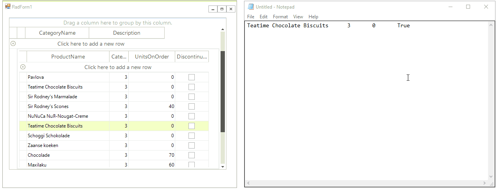

# Copy/Paste/Cut


__RadGridView__ supports built-in Copy/Paste functionality, which allows you to store text  in the Clipboard and then paste it in a different location. Using "Copy" and "Paste" gets quite useful when you want to enter the same content repeatedly.
      

## Copying

The copying functionality in __RadGridView__ is controlled via the __ClipboardCopyMode__ property. It has three possible values:
        

* *Disable* – copying will not be permitted

* *EnableWithoutHeaderText* – will copy the cells content, skipping any header cells data

* *EnableAlwaysIncludeHeaderText* – will copy the cells content including the header cells data

Copying is a pretty simple operation. After cell/row is selected, right click over the data cell/row opens a context menu where the copy option exists. After selecting it, you can paste the content anywhere you need to (in Notepad or Excel for example).<br>

__RadGridView__ introduces __Copying__ event which occurs when the grid has prepared appropriate data formats that represent the copy selection. This event is fired once for each supported format: DataFormats.*Text*, DataFormats.*HTML*, DataFormats.*CommaSeparatedValue*. You can cancel this event if the data is not allowed to be stored to Clipboard in a specific format, e.g. HTML format:

{{source=..\SamplesCS\GridView\CopyPasteBehavior\CopyPasteForm.cs region=Copying}} 
{{source=..\SamplesVB\GridView\CopyPasteBehavior\CopyPasteForm.vb region=Copying}} 

````C#
        
private void radGridView1_Copying(object sender, GridViewClipboardEventArgs e)
{
    if (e.Format == DataFormats.Html)
    {
        e.Cancel = true;
    }
}

````
````VB.NET
Private Sub radGridView1_Copying(sender As Object, e As GridViewClipboardEventArgs)
    If e.Format = DataFormats.Html Then
        e.Cancel = True
    End If
End Sub

````

{{endregion}} 


>note Additionally, you can use the __RadGridView__.__Copy__ method in order to perform programmatically copy functionality.
>


## Pasting

The pasting functionality in __RadGridView__ is controlled via the __ClipboardPasteMode__ property. It has three possible modes:

* *Disable* – pasting is disabled

* *Enable* – pasting is enabled

* *EnableWithNotifications* – pasting is enabled, and the respective cell events will be triggered upon paste operation

The default context menu for data cells offers paste possibility, except when the __RadGridView__ is read-only, disabled or the __ClipboardPasteMode__ property is set to GridViewClipboardPasteMode.*Disable*.<br>

RadGridView.__Pasting__ event is appropriate for modifying the Clipboard data before pasting it in the grid.<br>

The following example demonstrates how to capitalize the copied string before inserting it in the grid:

{{source=..\SamplesCS\GridView\CopyPasteBehavior\CopyPasteForm.cs region=Pasting}} 
{{source=..\SamplesVB\GridView\CopyPasteBehavior\CopyPasteForm.vb region=Pasting}} 

````C#
        
private void radGridView1_Pasting(object sender, GridViewClipboardEventArgs e)
{
    if (Clipboard.ContainsData(DataFormats.Text))
    {
        string data = Clipboard.GetData(DataFormats.Text).ToString();
        if (data != string.Empty)
        {
            Clipboard.SetData(DataFormats.Text, data.ToUpper());
        }
    }
}

````
````VB.NET
Private Sub radGridView1_Pasting(sender As Object, e As GridViewClipboardEventArgs)
    If Clipboard.ContainsData(DataFormats.Text) Then
        Dim data As String = Clipboard.GetData(DataFormats.Text).ToString()
        If data <> String.Empty Then
            Clipboard.SetData(DataFormats.Text, data.ToUpper())
        End If
    End If
End Sub

````

{{endregion}} 


You can cancel this event as well in order to prevent pasting data in some cases.

*Ctrl+C* and *Ctrl+V* are the keys combinations, replacing Copy and Paste behavior. If the RadGridView.__MultiSelect__ property is set to *true*, it is possible to select all the cells by pressing *Ctrl+A*. Afterwards, pressing *Ctrl+C* will copy all the cells’ content and it is ready to be pasted.<br>

>note Additionally, you can use the __RadGridView__.__Paste__ method in order to perform programmatically paste functionality.
>


## Cutting

The cutting functionality in __RadGridView__ is controlled via the __ClipboardCutMode__ property. It has three possible values:

* *Disable* – cutting will not be permitted

* *EnableWithoutHeaderText* – will cut the cells content, skipping any header cells data

* *EnableAlwaysIncludeHeaderText* – will cut the cells content including the header cells data

*Ctrl+X* is the key combination, replacing Cut behavior.

>note Additionally, you can use the __RadGridView__.__Cut__ method in order to perform programmatically cut functionality.
>

