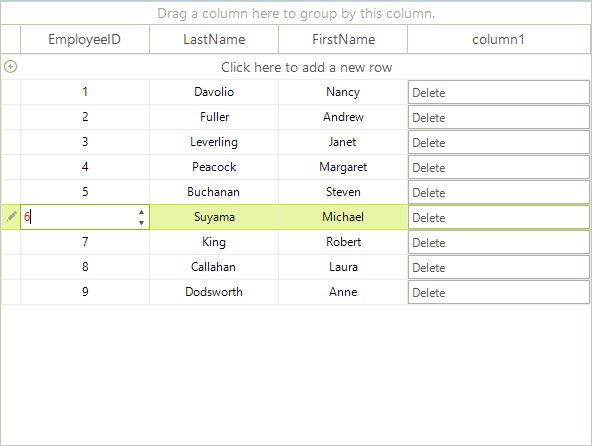

# Customizing editor behavior


## 

The look and behavior of grid editors can be changed programmatically. This can be done either in CellBeginEdit or in CellEditorInitialized event. 

* CellBeginEdit event is fired when the editor is created

* CellEditorInitialized is fired when the editor is created and initialized with a predefined set of properties


The following sample demonstrates how to change the default border of __GridSpinEditor__:#_[C#] Customizing spin editor_

	


{{source=..\SamplesCS\GridView\Editors\CustomizingEditorBehavior.cs region=customizingEditors}} 
{{source=..\SamplesVB\GridView\Editors\CustomizingEditorBehavior.vb region=customizingEditors}} 

````C#
        void radGridView1_CellBeginEdit(object sender, Telerik.WinControls.UI.GridViewCellCancelEventArgs e)
        {
            GridSpinEditor editor = this.radGridView1.ActiveEditor as GridSpinEditor;
            if (editor != null)
            {
                ((BorderPrimitive)editor.EditorElement.Children[1]).ForeColor = Color.Black;
                
            }
        }
````
````VB.NET
    Private Sub RadGridView1_CellBeginEdit(ByVal sender As Object, ByVal e As Telerik.WinControls.UI.GridViewCellCancelEventArgs) Handles RadGridView1.CellBeginEdit
        Dim editor As GridSpinEditor = TryCast(Me.RadGridView1.ActiveEditor, GridSpinEditor)
        If editor IsNot Nothing Then
            DirectCast(editor.EditorElement.Children(1), BorderPrimitive).ForeColor = Color.Black
        End If
    End Sub
    '
````

{{endregion}} 



