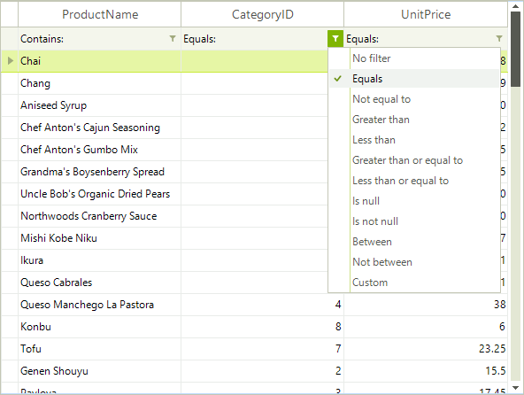
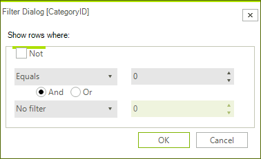

# Filtering

## Single Column Sorting

When filtering is enabled, each __GridViewDataColumn__ column displays a filter box beneath the corresponding header. The user can click the filter icon to display a drop-down list of comparison criteria (e.g. "Starts
with", "Equals"...). The user can click in the textbox next to the filter button to enter a comparison value. When the user presses __Enter__ (or moves the focus off the comparison value textbox), only records that match the criteria are listed in the column. Some criteria comparisons from the drop down list do not require a comparison value, i.e. __Is empty, Is not empty, Is null, Is not null__. 

## Complex Filters

The user can select Custom from the drop down list to display a dialog that allows a more complex filter to be built. In this dialog the user can select comparison criteria from the drop down list on the left and enter a value in the textbox on the right.  Then a second criteria and value pair can be entered. Between the two criteria is a radio button with choices for "And" and "Or". If the user leaves the value at the default "And", both criteria must be true for a given record to display. The condition can be inverted using the
“Not” option. 
