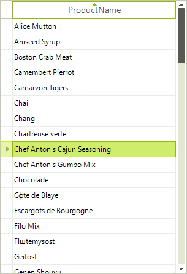
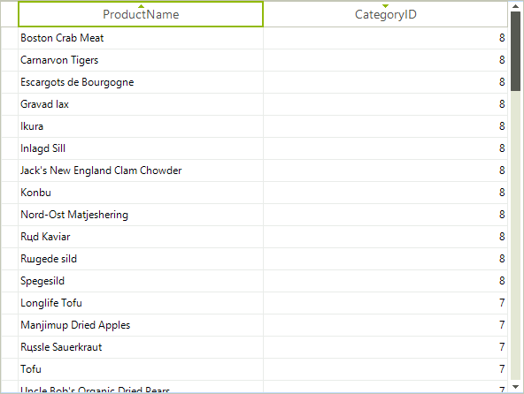
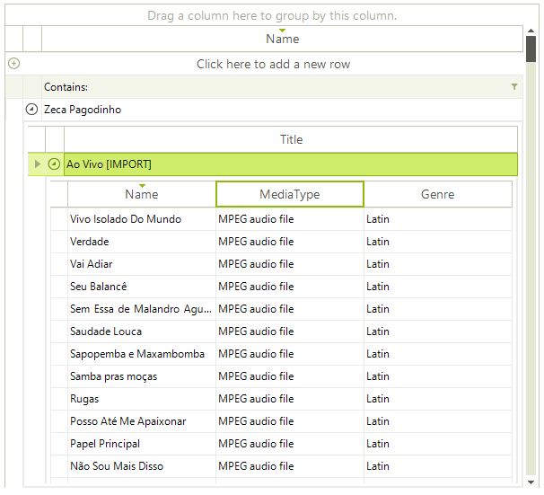
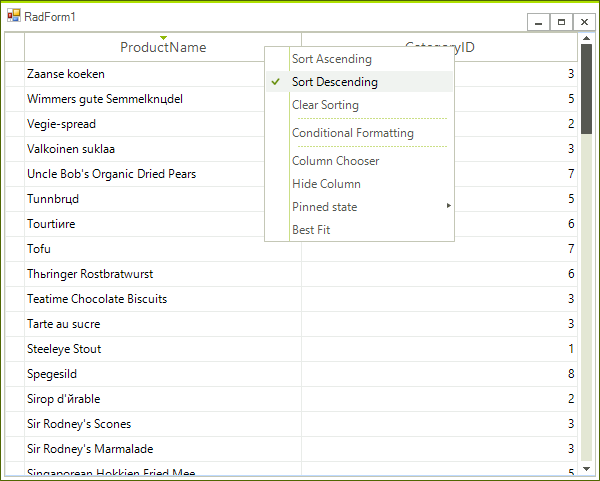

# Sorting

## Single Column Sorting

By default RadGridView allows you to sort by any column. The end-user should click on the header of the desired column to toggle between the sorting modes:

* Clicking the column header sorts by that column. The column header displays an upward pointing arrow.

* Clicking the header for a second time sorts by that column in descending order. The column header displays a downward pointing arrow.

* “Clear Sorting” from the context menu returns to a natural sort (i.e. no sorting). No arrow is displayed on the column header.

The screenshot below shows sorting by the "ProductName" column:
          
<table><th><tr><td>

Ascending</td><td>

Descending</td><td>

Natural Sort (Unsorted)</td></tr></th><tr><td>

</td><td>

</td><td>

</td></tr></table>

__Modifying sorting behavior__
          As you can see above, by default you can turn off the sorting of a column only via the 
          context menu of the sorted column. However, what if you want to turn of the sorting
          on the third click on the column header? In order to achieve this, you should handle the 
          SortChanging event, cancel the current sorting operation and set the sorting to None. Here is 
          how you can do this, assuming that the column in question is ProductName:

#### __[C#]__

{{source=..\SamplesCS\GridView\EndUserCapabilities\EUCapabilitiesSorting.cs region=sortChanging}}
	        void radGridView1_SortChanging(object sender, Telerik.WinControls.UI.GridViewCollectionChangingEventArgs e)
	        {
	            if (e.NewItems.Count > 0)
	            {
	                Telerik.WinControls.Data.SortDescriptor sort = (Telerik.WinControls.Data.SortDescriptor)e.NewItems[0];
	                if (sort.PropertyName == "ProductName" && this.radGridView1.Columns["ProductName"].SortOrder == Telerik.WinControls.UI.RadSortOrder.Descending)
	                {
	                    e.Cancel = true;
	
	                    this.radGridView1.Columns["ProductName"].SortOrder = Telerik.WinControls.UI.RadSortOrder.None;
	                }
	            }
	        }
	{{endregion}}

#### __[VB.NET]__

{{source=..\SamplesVB\GridView\EndUserCapabilities\EUCapabilitiesSorting.vb region=sortChanging}}
	    Private Sub radGridView1_SortChanging(ByVal sender As Object, ByVal e As Telerik.WinControls.UI.GridViewCollectionChangingEventArgs) Handles RadGridView1.SortChanging
	        If e.NewItems.Count > 0 Then
	            Dim sort As Telerik.WinControls.Data.SortDescriptor = CType(e.NewItems(0), Telerik.WinControls.Data.SortDescriptor)
	            If sort.PropertyName = "ProductName" AndAlso Me.RadGridView1.Columns("ProductName").SortOrder = Telerik.WinControls.UI.RadSortOrder.Descending Then
	                e.Cancel = True
	
	                Me.RadGridView1.Columns("ProductName").SortOrder = Telerik.WinControls.UI.RadSortOrder.None
	            End If
	        End If
	    End Sub
	{{endregion}}

## Multiple Column Sorting

By default, clicking on a column triggers the sorting operation for that column prevents the other columns from being sorted. By holding down the __Shift__ key the user can retain the sort for an existing column and the headers of other columns to add additional sorting.
            The screenshot below shows categories in the right-most column sorted in descending order. The products in the left most column are sorted in ascending order. Notice that the products are sorted within the categories, i.e. with "Boston Crab Meat" the first item within category id "8" and "Spegesild" that last item within category "8".
          

## Sorting in Hierarchical Tables

The default behavior of the grid is to allow all views of the data to be sorted, including the master grid and all child grid views. Sorting properties for the grid and each of the templates allows sorting for each view to be enabled independently.
            The example below shows the master grid view of categories "Category Name" column sorted in descending order and the child view of products "Product Name" column sorted in ascending order.
          

## Sorting Context Menus

Sorting can be invoked through right clicking the column heading to display the context menu. The menu will allow you to choose from Sort Ascending, Sort Descending and to Clear Sorting.
