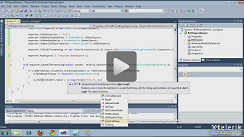

# Export to CSV

<table><th><tr><td>

RELATED VIDEOS</td><td></td></tr></th><tr><td>

[Exporting to CSV with RadGridView for WinForms](http://tv.telerik.com/watch/winforms/exporting-to-csv-with-radgridview-for-winforms)

In this video, you will learn how to export RadGridView for WinForms to the CSV file format.
            </td><td></td></tr></table>

## Overview

This method offers excellent export performance. It creates a csv file and supports formatting events to allow customizing exported data.

>The CSV export functionality is located in the __TelerikData.dll__ assembly.
     You need to include the following namespaces in order to access the types contained in TelerikData:

* Telerik.WinControls.Data

* Telerik.WinControls.UI.Export

## Exporting Data

__Initialize ExportToCSV object__

Before running export to CSV, you have to initialize the ExportToCSV class. The constructor takes one parameter: the RadGridView that will be exported:

#### __[C#]  ExportToCSV initialization__

{{region exportToCsvInitialization}}
	            ExportToCSV exporter = new ExportToCSV(this.radGridView1);
	{{endregion}}

#### __[VB.NET]  ExportToCSV initialization__

{{region exportToCsvInitialization}}
	        Dim exporter As ExportToCSV = New ExportToCSV(Me.RadGridView1)
	{{endregion}}

__File extension__

This property allows for changing the default (*.csv) file extension of the exported result file:

#### __[C#]  Setting the file extension__

{{region settingTheFileExtention}}
	            exporter.FileExtension = "";
	{{endregion}}

#### __[VB.NET]  Setting the file extension__

{{region settingTheFileExtention}}
	        exporter.FileExtension = ""
	{{endregion}}

__Hidden columns and rows option__

You can choose if the hidden columns and rows should be exported through __HiddenColumnOption__ and __HiddenRowOption__ properties. Please, note that these properties use the standard enums and include the *ExportAsHidden *option, which is not supported by CSV format. Setting that option will not affect the export at all.

* ExportAlways

* DoNotExport  (default)

* ExportAsHidden (not supported in csv)

__Summaries export option__

You can use __SummariesExportOption__ property to specify how to export summary items. There are four options to choose from:

* ExportAll (default)

* ExportOnlyTop

* ExportOnlyBottom

* DoNotExport

#### __[C#]  Setting summaries to export__

{{region settingSummariesToExport}}
	            exporter.SummariesExportOption = SummariesOption.DoNotExport;
	{{endregion}}

#### __[VB.NET]  Setting summaries to export__

{{region settingSummariesToExport}}
	        exporter.SummariesExportOption = SummariesOption.DoNotExport
	{{endregion}}

## RunExport method

Exporting data to CSV file is done through the RunExport method of ExportToCSV object. The RunExport method accepts the following parameter:

* fileName: the name of the exported file

#### __[C#]  Export to CVS format__

{{region exportToCsvFormat}}
	            string fileName = "C:\\ExportedData.csv";
	            exporter.RunExport(fileName);
	{{endregion}}

#### __[VB.NET]  Export to CVS format__

{{region exportToCsvFormat}}
	        Dim fileName As String = "C:\\ExportedData.csv"
	        exporter.RunExport(fileName)
	{{endregion}}

## Events

__CSVCellFormating event__

It gives access to a single cell’s element that allows you to replace the actual value for every cell related to the exported RadGridView:
 

#### __[C#]  Handling the CSVCellFormatting event__

{{region handlingTheCsvCellFormattingEvent}}
	        void exporter_CSVCellFormatting(object sender, Telerik.WinControls.UI.Export.CSV.CSVCellFormattingEventArgs e)
	        {
	            if (e.GridColumnIndex == 1 && e.GridRowInfoType == typeof(GridViewDataRowInfo))
	            {
	                e.CSVCellElement.Value =  "test value";
	            }
	        }
	{{endregion}}

#### __[VB.NET]  Handling the CSVCellFormatting event__

{{region handlingTheCsvCellFormattingEvent}}
	    Private Sub exporter_CSVCellFormatting(ByVal sender As Object, ByVal e As Telerik.WinControls.UI.Export.CSV.CSVCellFormattingEventArgs)
	        If (e.GridColumnIndex = 1 AndAlso e.GridRowInfoType.Equals(GetType(GridViewDataRowInfo))) Then
	            e.CSVCellElement.Value = "test value"
	        End If
	    End Sub
	{{endregion}}

__CSVTableCreated event__:

It can be used together with the public method AddCustomCSVRow. It allows for adding and formatting new custom rows on the top of the csv file :

#### __[C#] Handling the CSVTableCreated event__

{{region handlingTheCsvTableCreatedevent}}
	        void exporter_CSVTableCreated(object sender, Telerik.WinControls.UI.Export.CSV.CSVTableCreatedEventArgs e)
	        {
	            ((ExportToCSV)sender).AddCustomCSVRow(e.CSVTableElement, "MY TABLE CAPTION");
	        }
	{{endregion}}

#### __[VB.NET]  Handling the CSVTableCreated event__

{{region handlingTheCsvTableCreatedevent}}
	    Private Sub exporter_CSVTableCreated(ByVal sender As Object, ByVal e As Telerik.WinControls.UI.Export.CSV.CSVTableCreatedEventArgs)
	        DirectCast(sender, ExportToCSV).AddCustomCSVRow(e.CSVTableElement, "MY TABLE CAPTION")
	    End Sub
	{{endregion}}

