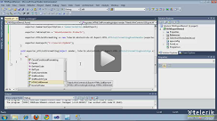

# Export to HTML

<table><th><tr><td>

RELATED VIDEOS</td><td></td></tr></th><tr><td>

[Exporting to HTML with RadGridView for WinForms](http://tv.telerik.com/watch/winforms/exporting-to-html-with-radgridview-for-winforms)

In this video, you will learn how to export RadGridView to the HTML file format.
            </td><td></td></tr></table>

## Overview

This method offers excellent export performance and creates an html formatted file, which can be opened in a browser or MS Word.

>The HTML export functionality is located in the __TelerikData.dll__ assembly.
            You need to include the following namespaces in order to access the types contained in TelerikData:

* Telerik.WinControls.Data

* Telerik.WinControls.UI.Export

## Exporting Data

__Initialize ExportToHTML object__

Before running export to HTML, you have to initialize the ExportToHTML class. The constructor takes one parameter: the RadGridView that will be exported:

#### __[C#]  ExportToHTML initialization__

{{region exportToHtmlInitialization}}
	            ExportToHTML exporter = new ExportToHTML(this.radGridView1);
	{{endregion}}

#### __[VB.NET]  ExportToHTML initialization__

{{region exportToHtmlInitialization}}
	        Dim exporter As ExportToHTML = New ExportToHTML(Me.RadGridView1)
	{{endregion}}

__File extension__
        This property allows for changing the default (*.htm) file extension of the exported result file

#### __[C#]  Setting the file extension__

{{region settingTheFileExtention}}
	            exporter.FileExtension = "";
	{{endregion}}

#### __[VB.NET]  Setting the file extension__

{{region settingTheFileExtention}}
	        exporter.FileExtension = ""
	{{endregion}}

__Hidden columns and rows option__

You can choose one of the three options below which will allow you to have a different behavior for the hidden column/rows
      	. You can choose these options by __HiddenColumnOption__ and __HiddenRowOption__ properties:

* ExportAlways

* DoNotExport (default)

* ExportAsHidden

Please note that some browsers do not support hidden columns and if you open exported file you could see the hidden columns. 
      	To make sure that the hidden columns or rows in the exported html file will not be included, you should set
      	__HiddenColumnOption__ or __HiddenRowOption__  property to *DoNotExport*:

#### __[C#]  Setting the HiddenColumnOption__

{{region settingTheHiddenColumnOption}}
	            exporter.HiddenColumnOption = Telerik.WinControls.UI.Export.HiddenOption.DoNotExport;    
	{{endregion}}

#### __[VB.NET]  Setting the HiddenColumnOption__

{{region settingTheHiddenColumnOption}}
	        exporter.HiddenColumnOption = Telerik.WinControls.UI.Export.HiddenOption.DoNotExport
	{{endregion}}

__Columns Width options__
          
            There are three options for the column widths. First option is to have the columns with fixed width, dependant on the size of
            the columns in the actual RadGridView that is being exported. This is the default way the exporter works. Second option is to set
            a fixed width for all the columns. The columns will then take this width while keeping their aspect ratio. To set a fixed size for all columns use the
            __FitWidthSize__ option of the exporter.
          
        

#### __[C#] Setting FitWidthSize__

{{region settingFixedColumnsWidth}}
	            exporter.FitWidthSize = 1000;
	{{endregion}}

#### __[VB.NET] Setting FitWidthSize__

{{region settingFixedColumnsWidth}}
	        exporter.FitWidthSize = 1000
	{{endregion}}

The third option is to set the column widths to be auto calculated depending on the content of the cells in the column. For this option you can use the 
          __AutoSizeColumns__ property.
        

#### __[C#] Setting AutoSizeColumns__

{{region settingAutoSizeColumns}}
	            exporter.AutoSizeColumns = true;
	{{endregion}}

#### __[VB.NET] Setting AutoSizeColumns__

{{region settingAutoSizeColumns}}
	        exporter.AutoSizeColumns = True
	{{endregion}}

If you use this option you need to control how the cells are sized. To do that you can use the __CellWhiteSpace__ option of
        the HTMLCellElement which controls how white spaces are handled. The possible values are. 

* Normal (Defalut)

* NoWrap

* Pre

* PreLine

* PreWrap

__Exporting Visual Settings__
Using the ExportToHTML class allows you to export the visual settings (themes) to the HTML file. ExportToHTML also provides a visual
      representation of the alternating row color. This feature works only if __EnableAlternatingRow__ property is
      set to *true*. Note that it does not transfer the alternating row settings that come from control theme.
      RadGridView will also export the conditional formatting to the HTML file. The row height is exported with the default DPI transformation (60pixels = 72points).	 
		  You can enable exporting visual settings through the __ExportVisualSettings__ property.
      By default the value of this property is *false*.

#### __[C#]  Setting ExportVisualSettings__

{{region settingExportVisualSettings}}
	            exporter.ExportVisualSettings = true;
	{{endregion}}

#### __[VB.NET]  Setting ExportVisualSettings__

{{region settingExportVisualSettings}}
	        exporter.ExportVisualSettings = True
	{{endregion}}

__HTML Table Caption__         
		You can specify the table caption through __TableCaption__ property.
		

#### __[C#]  Setting the SheetName__

{{region settingTheSheetName}}
	            exporter.TableCaption = "Table";
	{{endregion}}

#### __[VB.NET]  Setting the SheetName__

{{region settingTheSheetName}}
	        exporter.TableCaption = "Table"
	{{endregion}}

__Summaries export option__
       You can use __SummariesExportOption__ property to specify how to export summary items. There are four options to choose from:

* ExportAll (default)

* ExportOnlyTop

* ExportOnlyBottom

* DoNotExport

#### __[C#]  Setting the SummariesExportOption__

{{region settingSummariesExportOptions}}
	            exporter.SummariesExportOption = SummariesOption.DoNotExport;
	{{endregion}}

#### __[VB.NET]  Setting the SummariesExportOption__

{{region settingSummariesExportOptions}}
	        exporter.SummariesExportOption = SummariesOption.DoNotExport
	{{endregion}}

## RunExport method

Exporting data to HTML is done through the RunExport method of ExportToHTML object. The RunExport method accepts the following parameter:

* fileName - the name of the exported file

Consider the code sample below:

#### __[C#]  Export to HTML format__

{{region exportToHtmlFormat}}
	            string fileName = "c:\\ExportedData.htm";
	            exporter.RunExport(fileName);
	{{endregion}}

#### __[VB.NET]  Export to HTML format__

{{region exportToHtmlFormat}}
	        Dim fileName As String = "c:\\ExportedData.htm"
	        exporter.RunExport(fileName)
	{{endregion}}

## Events

__HTMLCellFormating event__
        It gives access to a single cell’s html element that allows you to make additional formatting for every html cell related to the exported RadGridView: 

#### __[C#]  Handling the HTMLCellFormatting event__

{{region handlingHtmlCellFormattingEvent}}
	        void exporter_HTMLCellFormatting(object sender, Telerik.WinControls.UI.Export.HTML.HTMLCellFormattingEventArgs e)
	        {
	            if (e.GridColumnIndex == 1 && e.GridRowInfoType == typeof(GridViewDataRowInfo))
	            {
	                e.HTMLCellElement.Value = "Test value";
	                e.HTMLCellElement.Styles.Add("background-color", ColorTranslator.ToHtml(Color.Orange));
	            }
	        }
	{{endregion}}

#### __[VB.NET]  Handling the HTMLCellFormatting event__

{{region handlingHtmlCellFormattingEvent}}
	    Private Sub exporter_HTMLCellFormatting(ByVal sender As Object, ByVal e As Telerik.WinControls.UI.Export.HTML.HTMLCellFormattingEventArgs)
	        If e.GridColumnIndex = 1 AndAlso e.GridRowInfoType.Equals(GetType(GridViewDataRowInfo)) Then
	            e.HTMLCellElement.Value = "Test value"
	            e.HTMLCellElement.Styles.Add("background-color", ColorTranslator.ToHtml(Color.Orange))
	        End If
	    End Sub
	{{endregion}}

__HTMLTableCaptionFormatting event__
        HTMLTableCaptionFormatting event can be used to make an additional formatting on the html caption table element . You can access TableCaptionElement through event’s arguments and apply a valid html format.

#### __[C#]  Handling the HTMLTableCaptionFormatting event__

{{region handlingHtmlTableCaptionFormattingEvent}}
	        void exporter_HTMLTableCaptionFormatting(object sender, Telerik.WinControls.UI.Export.HTML.HTMLTableCaptionFormattingEventArgs e)
	        {
	            e.TableCaptionElement.Styles.Add("background-color", ColorTranslator.ToHtml(Color.Red));
	            e.TableCaptionElement.Styles.Add("font-size", "200%");
	            e.TableCaptionElement.Styles.Add("color", ColorTranslator.ToHtml(Color.White));
	            e.TableCaptionElement.Styles.Add("font-weight", "bold");
	            e.CaptionText = "My Table Caption";
	        }
	{{endregion}}

#### __[VB.NET]  Handling the HTMLTableCaptionFormatting event__

{{region handlingHtmlTableCaptionFormattingEvent}}
	    Private Sub exporter_HTMLTableCaptionFormatting(ByVal sender As Object, ByVal e As Telerik.WinControls.UI.Export.HTML.HTMLTableCaptionFormattingEventArgs)
	        e.TableCaptionElement.Styles.Add("background-color", ColorTranslator.ToHtml(Color.Red))
	        e.TableCaptionElement.Styles.Add("font-size", "200%")
	        e.TableCaptionElement.Styles.Add("color", ColorTranslator.ToHtml(Color.White))
	        e.TableCaptionElement.Styles.Add("font-weight", "bold")
	        e.CaptionText = "My Table Caption"
	    End Sub
	{{endregion}}

