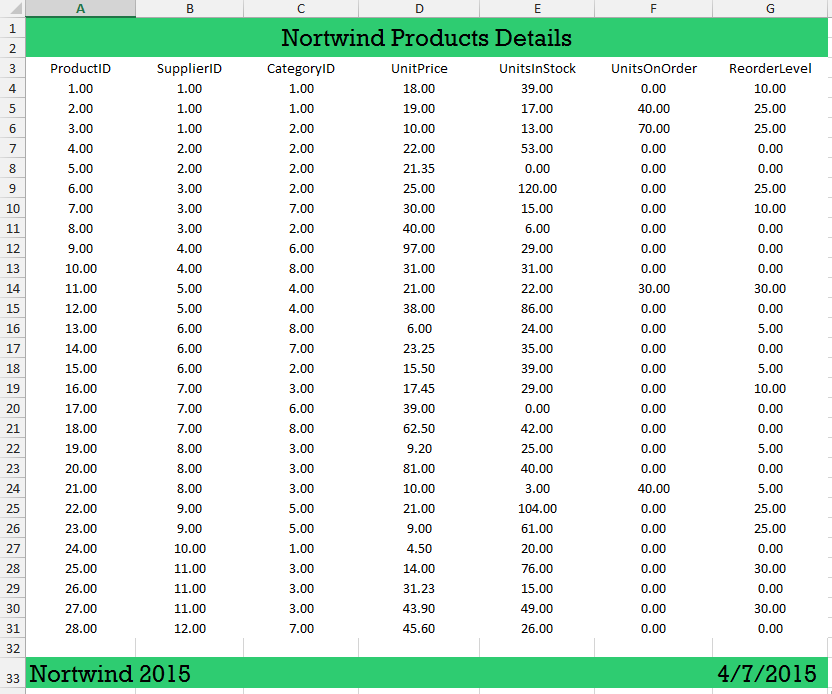

# Add Header and Footer to the Exported Document

This article will show how you can add header and footer to your exported document. After the document is exported it will look like in figure 1.

>caption Fig.1 The final exported document.


## 

The [spread export]() functionality gives you access to the exported document. It can be accessed in the __WorkbookCreated__ event. The following steps are showing how you can use this event to add header and footer.

1\. You can use the following code to initialize the exporter and subscribe to the event.

#### Initialize the exporter

{{source=..\SamplesCS\GridView\ExportingData\HowTo\HeaderAndFooter.cs region=SetExporter}} 
{{source=..\SamplesVB\GridView\ExportingData\HowTo\HeaderAndFooter.vb region=SetExporter}} 

````C#
GridViewSpreadExport spreadExporter = new GridViewSpreadExport(radGridView1);
SpreadExportRenderer exportRenderer = new SpreadExportRenderer();
exportRenderer.WorkbookCreated += exportRenderer_WorkbookCreated;
spreadExporter.RunExport(@"C:\exportedFile.xlsx", exportRenderer);

````
````VB.NET
Dim spreadExporter As New GridViewSpreadExport(radGridView1)
Dim exportRenderer As New SpreadExportRenderer()
        AddHandler exportRenderer.WorkbookCreated, AddressOf exportRenderer_WorkbookCreated
spreadExporter.RunExport("C:\exportedFile.xlsx", exportRenderer)

````

{{endregion}} 

2\. Before adding the header you should declare the two elements which will be used later for the cell value format and the background color.

#### Define styles and formats

{{source=..\SamplesCS\GridView\ExportingData\HowTo\HeaderAndFooter.cs region=StlylesAndFormats}} 
{{source=..\SamplesVB\GridView\ExportingData\HowTo\HeaderAndFooter.vb region=StlylesAndFormats}} 

````C#
PatternFill solidPatternFill = new PatternFill(PatternType.Solid, System.Windows.Media.Color.FromRgb(46, 204, 113), Colors.Transparent);
CellValueFormat textFormat = new CellValueFormat("@");

````
````VB.NET
Dim solidPatternFill As New PatternFill(PatternType.Solid, System.Windows.Media.Color.FromRgb(46, 204, 113), Colors.Transparent)
Dim textFormat As New CellValueFormat("@")

````

{{endregion}} 

>important You need to add a reference to the `PresentationCore` assembly and the `System.Windows.Media` namespace.

3\. Now you can add the header, first you need to insert a new row on top of the document. Then you can merge the all the cells above the grid and set the new cell value and styles.

#### Add header

{{source=..\SamplesCS\GridView\ExportingData\HowTo\HeaderAndFooter.cs region=Header}} 
{{source=..\SamplesVB\GridView\ExportingData\HowTo\HeaderAndFooter.vb region=Header}} 

````C#
Worksheet worksheet = e.Workbook.Sheets[0] as Worksheet;
CellRange range = new CellRange(0, 0, 1, radGridView1.Columns.Count - 4);
CellSelection header = worksheet.Cells[range];
if (header.CanInsertOrRemove(range, ShiftType.Down))
{
    header.Insert(InsertShiftType.Down);
}
header.Merge();
header.SetFormat(textFormat);
header.SetHorizontalAlignment(RadHorizontalAlignment.Center);
header.SetVerticalAlignment(RadVerticalAlignment.Center);
header.SetFontFamily(new ThemableFontFamily("Rockwell"));
header.SetFontSize(24);
header.SetFill(solidPatternFill);
header.SetValue("Nortwind Products Details");

````
````VB.NET
Dim worksheet As Worksheet = TryCast(e.Workbook.Sheets(0), Worksheet)
Dim range As New CellRange(0, 0, 1, radGridView1.Columns.Count - 4)
Dim header As CellSelection = worksheet.Cells(range)
If header.CanInsertOrRemove(range, ShiftType.Down) Then
    header.Insert(InsertShiftType.Down)
End If
header.Merge()
header.SetFormat(textFormat)
header.SetHorizontalAlignment(RadHorizontalAlignment.Center)
header.SetVerticalAlignment(RadVerticalAlignment.Center)
header.SetFontFamily(New ThemableFontFamily("Rockwell"))
header.SetFontSize(24)
header.SetFill(solidPatternFill)
header.SetValue("Nortwind Products Details")

````

{{endregion}} 

4\. The final part is adding the footer. For example you can select the left most and right most cells below the actual grid data and set their styles and value. At the end you can set the fill for the entire row.

#### Add footer

{{source=..\SamplesCS\GridView\ExportingData\HowTo\HeaderAndFooter.cs region=Footer}} 
{{source=..\SamplesVB\GridView\ExportingData\HowTo\HeaderAndFooter.vb region=Footer}} 

````C#
CellSelection footerLeft = worksheet.Cells[radGridView1.RowCount + 4, 0];
footerLeft.SetFormat(textFormat);
footerLeft.SetValue("Nortwind 2015");
footerLeft.SetVerticalAlignment(RadVerticalAlignment.Center);
footerLeft.SetFontFamily(new ThemableFontFamily("Rockwell"));
footerLeft.SetFontSize(24);
CellSelection footerRight = worksheet.Cells[radGridView1.RowCount + 4, radGridView1.Columns.Count - 1];
footerRight.SetFormat(textFormat);
footerRight.SetValue(DateTime.Now.ToShortDateString());
footerRight.SetVerticalAlignment(RadVerticalAlignment.Center);
footerRight.SetFontFamily(new ThemableFontFamily("Rockwell"));
footerRight.SetFontSize(24);
range = new CellRange(radGridView1.RowCount + 4, 0, radGridView1.RowCount + 4, radGridView1.Columns.Count - 1);
CellSelection footer = worksheet.Cells[range];
footer.SetFill(solidPatternFill);
worksheet.Columns[worksheet.UsedCellRange].SetWidth(new ColumnWidth(130, false));

````
````VB.NET
Dim footerLeft As CellSelection = worksheet.Cells(radGridView1.RowCount + 4, 0)
footerLeft.SetFormat(textFormat)
footerLeft.SetValue("Nortwind 2015")
footerLeft.SetVerticalAlignment(RadVerticalAlignment.Center)
footerLeft.SetFontFamily(New ThemableFontFamily("Rockwell"))
footerLeft.SetFontSize(24)
Dim footerRight As CellSelection = worksheet.Cells(radGridView1.RowCount + 4, radGridView1.Columns.Count - 1)
footerRight.SetFormat(textFormat)
footerRight.SetValue(Date.Now.ToShortDateString())
footerRight.SetVerticalAlignment(RadVerticalAlignment.Center)
footerRight.SetFontFamily(New ThemableFontFamily("Rockwell"))
footerRight.SetFontSize(24)
range = New CellRange(radGridView1.RowCount + 4, 0, radGridView1.RowCount + 4, radGridView1.Columns.Count - 1)
Dim footer As CellSelection = worksheet.Cells(range)
footer.SetFill(solidPatternFill)
worksheet.Columns(worksheet.UsedCellRange).SetWidth(New ColumnWidth(130, False))

````

{{endregion}} 


