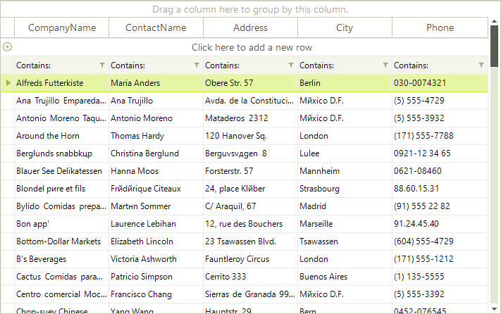
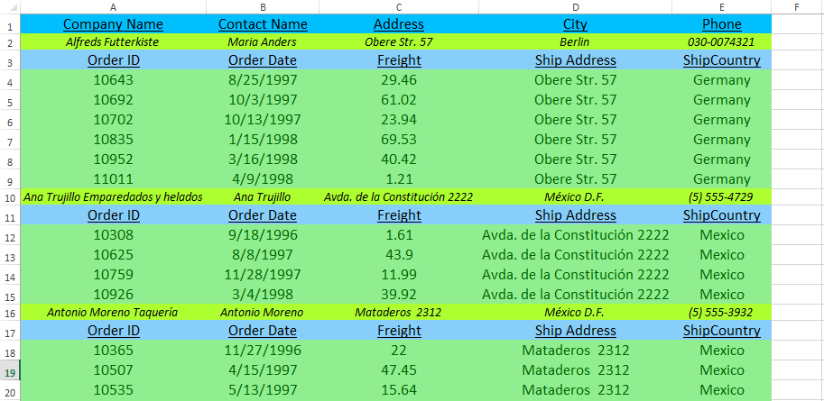

# Spread export 

SpreadExport for RadGridView, utilizes our [RadSpreadProcessing]()
        libraries to export the contents of RadGridView to *xlsx, csv, pdf* and
        *txt* formats.

        This article will explain in detail the SpreadExport abilities and will demonstrate how to use it. 
        Here is how the following grid, looks when exported.
      

>The SpreadExport export functionality is located in the __TelerikExport.dll__ assembly.
          You need to include the following namespaces in order to access the types contained in TelerikExport:
        

* Telerik.WinControls.Data

* Telerik.WinControls.UI.Export.SpreadExport

## Exporting

To use the spread export functionality, an instance of the __SpreadExport__ object should be
          created, passing as parameter the RadGridView instance to export. Afterwards, the *RunExport*
          method will trigger the export process. The latter method accepts as parameter a filename of the file to be exported.
        

#### __[C#]  __

{{region Export}}
	
	            SpreadExport spreadExporter = new SpreadExport(radGridView1);
	            spreadExporter.RunExport("D:\\exportedFile.xlsx");
	
	{{endregion}}

#### __[VB.NET]  __

{{region Export}}
	
				Dim spreadExporter As SpreadExport = New SpreadExport(radGridView1)
				spreadExporter.RunExport("D:\exportedFile.xlsx")
	
	            '#End Region
			End Sub
	
			Private Sub radButton1_Click(ByVal sender As Object, ByVal e As EventArgs) Handles radButton1.Click
				System.IO.File.Delete("D:\exportedFile.xlsx")
				Dim spreadExporter As SpreadExport = New SpreadExport(radGridView1)
				spreadExporter.HiddenColumnOption = Telerik.WinControls.UI.Export.HiddenOption.DoNotExport
	
			   ' spreadExporter.CellFormatting += spreadExporter_CellFormatting;
				AddHandler spreadExporter.WorkbookCreated, AddressOf spreadExporter_WorkbookCreated
				spreadExporter.ExportVisualSettings = True
	
				'spreadExporter.ExportHierarchy = true;
				'spreadExporter.ChildViewExportMode = Telerik.WinControls.UI.Export.ChildViewExportMode.ExportCurrentlyActiveView
				'spreadExporter.HiddenRowOption
				'spreadExporter.PagingExportOption = Telerik.WinControls.UI.Export.PagingExportOption.
				'spreadExporter.SummariesExportOption
				'spreadExporter.RadGridViewToExport
				'spreadExporter.SheetMaxRows
				'spreadExporter.SheetName
	
				'spreadExporter.ChildViewExporting
				'spreadExporter.ExportCompleted
	
				spreadExporter.ExportHierarchy = False
				spreadExporter.RunExport("D:\exportedFile.xlsx")
				System.Diagnostics.Process.Start("D:\exportedFile.xlsx")
			End Sub
	
			#Region "WorbookCreated"
	
			Private Sub spreadExporter_WorkbookCreated(ByVal sender As Object, ByVal e As WorkbookCreatedEventArgs)
				Dim worksheet As Worksheet = CType(e.Workbook.Sheets(0), Worksheet)
				worksheet.Columns(worksheet.UsedCellRange).AutoFitWidth()
			End Sub
	
			#End Region
	
			#Region "CellFormatting"
	
			Private Sub spreadExporter_CellFormatting(ByVal sender As Object, ByVal e As Telerik.WinControls.UI.Export.SpreadExport.CellFormattingEventArgs)
				If e.GridRowInfoType Is GetType(GridViewTableHeaderRowInfo) Then
					e.CellStyleInfo.Underline = True
	
					If e.GridCellInfo.RowInfo.HierarchyLevel = 0 Then
						e.CellStyleInfo.BackColor = Color.DeepSkyBlue
					ElseIf e.GridCellInfo.RowInfo.HierarchyLevel = 1 Then
						e.CellStyleInfo.BackColor = Color.LightSkyBlue
					End If
				End If
	
				If e.GridRowInfoType Is GetType(GridViewHierarchyRowInfo) Then
					If e.GridCellInfo.RowInfo.HierarchyLevel = 0 Then
						e.CellStyleInfo.IsItalic = True
						e.CellStyleInfo.FontSize = 12
						e.CellStyleInfo.BackColor = Color.GreenYellow
					ElseIf e.GridCellInfo.RowInfo.HierarchyLevel = 1 Then
						e.CellStyleInfo.ForeColor = Color.DarkGreen
						e.CellStyleInfo.BackColor = Color.LightGreen
					End If
				End If
			End Sub
	
			#End Region
	
		End Class
	End Namespace

## Properties

__ExportFormat__ - defines the format the grid will be exported to. The available values are
          __Xslx, Pdf, Csv, Txt__. The default value of the property is __Xslx__,
          hence if not other specified, the exporter will export to __Xslx__.
        

__ExportVisualSettings__ - allows you to export the visual settings (themes) to the exported file.
          RadGridView will also export all formatting to the Excel file. The column width and row height will also be matched in the exported file.
        

__ExportHierarchy__ - defines whether the exporter will export hierarchical data or not.
        

__ChildViewExportMode__ - defines which child view of a hierarchy row to be exported. Available modes are:
        

* *ExportFirstView* - the exporter exports the first view.
            

* *ExportCurrentlyActiveView* - the exporter exports the view that is active in the grid.
            

* *SelectViewToExport* - in this mode the ChildViewExporing event is fired. The event allows to choose the view to export in row by row basis.
            

__HiddenColumnOption__ - defines whether hidden columns will be exported. Available options are:
        

* *ExportAlways* - the exporter will export hidden columns as well
            

* *DoNotExport* - the exporter will not export hidden columns
            

* *ExportAsHidden* - the exporter will export hidden columns as hidden in excel*
            

__HiddenRowOption__ - defines whether hidden rows will be exported. Available options are:
        

* *ExportAlways* - the exporter will export hidden rows as well
            

* *DoNotExport* - the exporter will not export hidden rows
            

* *ExportAsHidden* - the exporter will export hidden rows as hidden in excel*
            

>MS Excel does not support other ways of hiding a column/row different from setting its width to zero. To avoid including hidden
            columns or rows in the exported excel file you could set __HiddenColumnOption__ or
            __HiddenRowOption__ property to *DoNotExport*:
          

__PagingExportOption__ - defines which pages to be exported, when paging is used in RadGridView
        

* *CurrentPageOnly* - the exporter will export only the data on the current page.
            

* *AllPAges* - the exporter will export the data from all pages.
            

__SummariesExportOption__ - allows to specify how to export summary items. There are fourth option to chose:
        

* *ExportAll (default)* - the exporter will export all summary rows. This is the default setting.
            

* *ExportOnlyTop* - the exporter will export only the top summary rows
            

* *ExportOnlyBottom* -  the exporter will export only the bottom summary rows
            

* *DoNotExport* - the exporter will not export any summary rows
            

__RadGridViewToExport__ - this property is used to set the instance of RadGridView to export.
        

__SheetMaxRows__ - the exporter splits the data on separate sheets if the number of rows is greater than 
          the Excel maximum. You can control the maximum number of rows through this SheetMaxRows property. Available options are:
        

* *1048576* -  Max rows for Excel 2007 and above
            

* *65536 (default)* - Max rows for previous versions of Excel. This is the default setting.
            

__SheetName__ - defines the sheet name of the sheet to export to. If your data is large enough to be 
          split on more than one sheets, then the export method adds index to the names of the next sheets.
        

## Events

__CellFormatting__ - this event is used to format the cells to be exported. The event arguments provide:
        

* *CellSelection* - provides access to the excel cells selection. More information about the abilities this
              object introduces, can be found here: [Get, Set and Clear Cell Properties]()

* *CellStyleInfo* - this object is a wrapper of the CellSelection object, and allows to easier modification
              of the most common appearance settings.
            

* *GridCellInfo* - provides access to the grid cell to be exported
            

* *GridColumnIndex* - returns the index of the column to be exported
            

* *GridColumnIndex* - returns the index of the row to be exported
            

* *GridRowInfoType* - returns the type of the row to be exported
            

Here is an example of formatting the exported grid: 

#### __[C#]  __

{{region CellFormatting}}
	
	        void spreadExporter_CellFormatting(object sender, Telerik.WinControls.UI.Export.SpreadExport.CellFormattingEventArgs e)
	        {
	            if (e.GridRowInfoType == typeof(GridViewTableHeaderRowInfo))
	            {
	                e.CellStyleInfo.Underline = true;
	
	                if (e.GridCellInfo.RowInfo.HierarchyLevel == 0)
	                {
	                    e.CellStyleInfo.BackColor = Color.DeepSkyBlue;
	                }
	                else if (e.GridCellInfo.RowInfo.HierarchyLevel == 1)
	                {
	                    e.CellStyleInfo.BackColor = Color.LightSkyBlue;
	                }
	            }
	
	            if (e.GridRowInfoType == typeof(GridViewHierarchyRowInfo))
	            {
	                if (e.GridCellInfo.RowInfo.HierarchyLevel == 0)
	                {
	                    e.CellStyleInfo.IsItalic = true;
	                    e.CellStyleInfo.FontSize = 12;
	                    e.CellStyleInfo.BackColor = Color.GreenYellow;
	                }
	                else if (e.GridCellInfo.RowInfo.HierarchyLevel == 1)
	                {
	                    e.CellStyleInfo.ForeColor = Color.DarkGreen;
	                    e.CellStyleInfo.BackColor = Color.LightGreen;
	                }
	            }
	        }
	
	{{endregion}}

#### __[VB.NET]  __

{{region CellFormatting}}
	
			Private Sub spreadExporter_CellFormatting(ByVal sender As Object, ByVal e As Telerik.WinControls.UI.Export.SpreadExport.CellFormattingEventArgs)
				If e.GridRowInfoType Is GetType(GridViewTableHeaderRowInfo) Then
					e.CellStyleInfo.Underline = True
	
					If e.GridCellInfo.RowInfo.HierarchyLevel = 0 Then
						e.CellStyleInfo.BackColor = Color.DeepSkyBlue
					ElseIf e.GridCellInfo.RowInfo.HierarchyLevel = 1 Then
						e.CellStyleInfo.BackColor = Color.LightSkyBlue
					End If
				End If
	
				If e.GridRowInfoType Is GetType(GridViewHierarchyRowInfo) Then
					If e.GridCellInfo.RowInfo.HierarchyLevel = 0 Then
						e.CellStyleInfo.IsItalic = True
						e.CellStyleInfo.FontSize = 12
						e.CellStyleInfo.BackColor = Color.GreenYellow
					ElseIf e.GridCellInfo.RowInfo.HierarchyLevel = 1 Then
						e.CellStyleInfo.ForeColor = Color.DarkGreen
						e.CellStyleInfo.BackColor = Color.LightGreen
					End If
				End If
			End Sub
	
			#End Region
	
		End Class
	End Namespace

__WorkbookCreated__ - this event is triggered when the workbook is ready to be exported. Allows to introduce
          final customizations. More information on how to work with Workbook is available here: [Working with Workbooks](76c31a52-0999-4bfb-bc1d-ee0e6f56b6c0).
          
          Here is for example how to best fit all columns:
        

#### __[C#]  __

{{region WorbookCreated}}
	
	        void spreadExporter_WorkbookCreated(object sender, WorkbookCreatedEventArgs e)
	        {
	            Worksheet worksheet = (Worksheet)e.Workbook.Sheets[0];
	            worksheet.Columns[worksheet.UsedCellRange].AutoFitWidth();
	        }
	
	{{endregion}}

#### __[VB.NET]  __

{{region WorbookCreated}}
	
			Private Sub spreadExporter_WorkbookCreated(ByVal sender As Object, ByVal e As WorkbookCreatedEventArgs)
				Dim worksheet As Worksheet = CType(e.Workbook.Sheets(0), Worksheet)
				worksheet.Columns(worksheet.UsedCellRange).AutoFitWidth()
			End Sub
	
			#End Region
	
			#Region "CellFormatting"
	
			Private Sub spreadExporter_CellFormatting(ByVal sender As Object, ByVal e As Telerik.WinControls.UI.Export.SpreadExport.CellFormattingEventArgs)
				If e.GridRowInfoType Is GetType(GridViewTableHeaderRowInfo) Then
					e.CellStyleInfo.Underline = True
	
					If e.GridCellInfo.RowInfo.HierarchyLevel = 0 Then
						e.CellStyleInfo.BackColor = Color.DeepSkyBlue
					ElseIf e.GridCellInfo.RowInfo.HierarchyLevel = 1 Then
						e.CellStyleInfo.BackColor = Color.LightSkyBlue
					End If
				End If
	
				If e.GridRowInfoType Is GetType(GridViewHierarchyRowInfo) Then
					If e.GridCellInfo.RowInfo.HierarchyLevel = 0 Then
						e.CellStyleInfo.IsItalic = True
						e.CellStyleInfo.FontSize = 12
						e.CellStyleInfo.BackColor = Color.GreenYellow
					ElseIf e.GridCellInfo.RowInfo.HierarchyLevel = 1 Then
						e.CellStyleInfo.ForeColor = Color.DarkGreen
						e.CellStyleInfo.BackColor = Color.LightGreen
					End If
				End If
			End Sub
	
			#End Region
	
		End Class
	End Namespace

__ChildViewExporting__ - this event is used to specify which child view to be exported, for each exported row,
          during the export. Will be triggered only when the __ChildViewExportMode__ is set to 
          *SelectViewToExport*.
          
          The event arguments provide the __ParentRow__ which active view should be set via the
          __ActiveViewIndex__ property.
        

__ExportCompleted__ - this event is triggered when the export operation completes.
        
