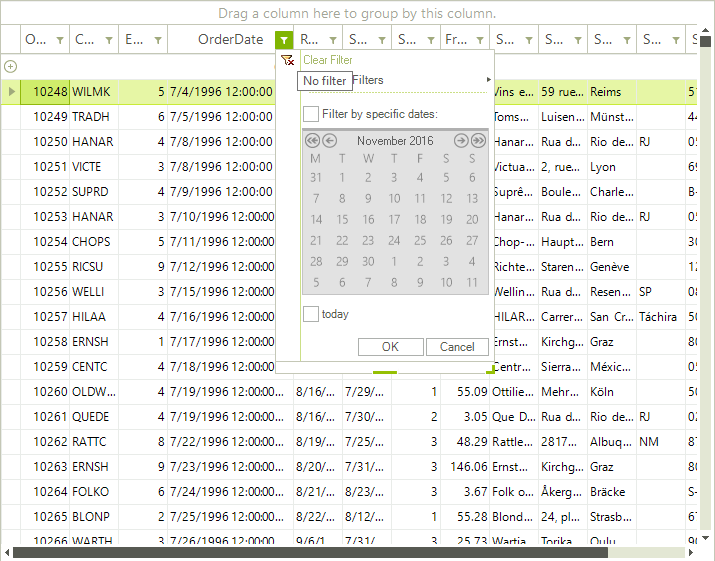
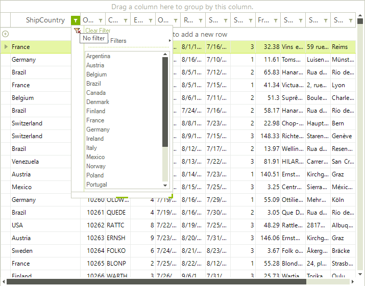
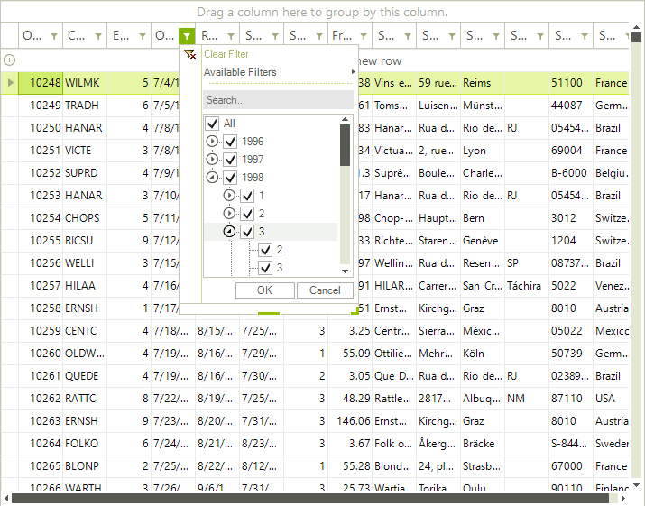

# Excel-like filtering


## 

Excel-Like filtering offers another way for filtering data in RadGridView by the end user. It is built in a way to mimic the standard excel filtering functionality and offers a dialog, which contains a list with distinct column values, from which the end user can chose.<br>

In addition Excel-Like filtering supports the default filters available thorough “Available Filter” menu item and custom filter form.

Enabling the excel-like filtering is quite easy. You have to set the grid’s properties EnableFiltering and ShowHeaderCellButtons:

#### Enabling Excel-like filtering

{{source=..\SamplesCS\GridView\Filtering\Excel-like Filtering.cs region=excel-like filtering}} 
{{source=..\SamplesVB\GridView\Filtering\Excel-like Filtering.vb region=excel-like filtering}} 

````C#
this.radGridView1.EnableFiltering = true;
this.radGridView1.MasterTemplate.ShowHeaderCellButtons = true;
this.radGridView1.MasterTemplate.ShowFilteringRow = false;

````
````VB.NET
Me.RadGridView1.EnableFiltering = True
Me.RadGridView1.MasterTemplate.ShowHeaderCellButtons = True
Me.RadGridView1.MasterTemplate.ShowFilteringRow = False

````

{{endregion}} 

Note that ShowHeaderCellButtons property can be specified on grid templates level, and scenarios with mixed filter functionality on the different hierarchy levels are possible. Also excel-like filtering will be synchronized with the previous filter row functionality if ShowFilteringRow remains true.
        

After enabling the Excel-like filtering feature, you may decide that you do not want it for a specific column. In this case you should set the __AllowFiltering__ property of that column to *false*:

{{source=..\SamplesCS\GridView\Filtering\Excel-like Filtering.cs region=allowFiltering}} 
{{source=..\SamplesVB\GridView\Filtering\Excel-like Filtering.vb region=allowFiltering}} 

````C#
this.radGridView1.Columns["ContactName"].AllowFiltering = false;

````
````VB.NET
Me.RadGridView1.Columns("ContactName").AllowFiltering = False

````

{{endregion}} 


## Customizing Excel-like filtering popup

The __FilterPopupRequired__ event is thrown just before filter popup showing. It gives access to current filter popup through __FilterPopup__ argument and also allows setting up any custom made popup, which implements __IGridFilterPopup__ interface.

__Calendar filter popup__

This popup allows convenient selection of specific date, or period. It will be shown for DateTime columns automatically  and by default it contains three custom menu items – “*Today*”, “*Yestarday*” and “*During last 7 days*”. A customization of the custom items is possible through following methods: __ClearCustomMenuItems__, __AddCustomMenuItem__ and __RemoveCustomMenuItem__. Here is how the default popup for DateTime column looks like:<br>

The following code demonstrates how to clear the default custom items, and how to add your own item to this popup:

{{source=..\SamplesCS\GridView\Filtering\Excel-like Filtering2.cs region=CalendarFilterPopup}} 
{{source=..\SamplesVB\GridView\Filtering\Excel-like Filtering2.vb region=CalendarFilterPopup}} 

````C#
void radGridView1_FilterPopupRequired(object sender, Telerik.WinControls.UI.FilterPopupRequiredEventArgs e)
{
    if (e.FilterPopup is RadDateFilterPopup)
    {
        RadDateFilterPopup popup = (RadDateFilterPopup)e.FilterPopup;
        popup.ClearCustomMenuItems();
        popup.AddCustomMenuItem("today", new DateFilterDescriptor(e.Column.Name, FilterOperator.IsEqualTo, DateTime.Today));
    }
}

````
````VB.NET
Private Sub radGridView1_FilterPopupRequired(sender As Object, e As Telerik.WinControls.UI.FilterPopupRequiredEventArgs) Handles RadGridView1.FilterPopupRequired
    If TypeOf e.FilterPopup Is RadDateFilterPopup Then
        Dim popup As RadDateFilterPopup = DirectCast(e.FilterPopup, RadDateFilterPopup)
        popup.ClearCustomMenuItems()
        popup.AddCustomMenuItem("today", New DateFilterDescriptor(e.Column.Name, FilterOperator.IsEqualTo, DateTime.Today))
    End If
End Sub

````

{{endregion}} 

Here is how the customized popup looks like<br>

__Simple list filter popup__

This popup allows easy and fast filtering based on simple list and one-click filter apply. It can be set up through FilterPopupRequired event

{{source=..\SamplesCS\GridView\Filtering\Excel-like Filtering2.cs region=SimpleListPopup}} 
{{source=..\SamplesVB\GridView\Filtering\Excel-like Filtering2.vb region=SimpleListPopup}} 

````C#
void radGridView1_FilterPopupRequired1(object sender, Telerik.WinControls.UI.FilterPopupRequiredEventArgs e)
{
    if (e.Column.Name == "ShipCountry")
    {
        e.FilterPopup = new RadSimpleListFilterPopup(e.Column);
    }
}

````
````VB.NET
Private Sub radGridView1_FilterPopupRequired1(sender As Object, e As Telerik.WinControls.UI.FilterPopupRequiredEventArgs) Handles RadGridView1.FilterPopupRequired
    If e.Column.Name = "ShipCountry" Then
        e.FilterPopup = New RadSimpleListFilterPopup(e.Column)
    End If
End Sub

````

{{endregion}} 



__Grouped dates popup__

This pop allows representation of date values grouped by year and month in a list. This simplifies the process of selecting more than one filtering criteria based on month or year.

>note Note that if there are a lot of values, there will be performance impact of selecting items on higher level (as month and year) because a lot of FilterDescriptors will be applied simultaneously.
>

{{source=..\SamplesCS\GridView\Filtering\Excel-like Filtering2.cs region=GroupedDatesPopup}} 
{{source=..\SamplesVB\GridView\Filtering\Excel-like Filtering2.vb region=GroupedDatesPopup}} 

````C#
void radGridView1_FilterPopupRequired2(object sender, Telerik.WinControls.UI.FilterPopupRequiredEventArgs e)
{
    if (e.Column.Name == "OrderDate")
    {
        e.FilterPopup = new RadListFilterPopup(e.Column, true);
    }
}

````
````VB.NET
Private Sub radGridView1_FilterPopupRequired2(sender As Object, e As Telerik.WinControls.UI.FilterPopupRequiredEventArgs) Handles RadGridView1.FilterPopupRequired
    If e.Column.Name = "OrderDate" Then
        e.FilterPopup = New RadListFilterPopup(e.Column, True)
    End If
End Sub

````

{{endregion}} 



## Customizing composite filter dialog

When you select an item from the “Available Filter” menu, a __CompositeFilterForm__ is displayed. The __CreateCompositeFilterDialog__ event is fired ust before the __CompositeFilterForm__ is created. It allows you to create the default dialog and customize it or initialize your own implementation of the composite filter dialog.<br>
