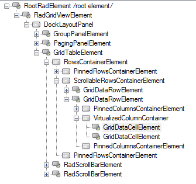

# Element Hierarchy

__RadGridView__ uses the [Telerik Presentation Framework]() which enables rich experiences like advanced styling and animations. Just like WPF it uses elements ordered in a visual tree called element hierarchy. This article describes the element hierarchy used in __RadGridView__:
      
>caption The RadGridView element hierarchy.

* __GridVisualElement__ is the base element which is inherited by all visual elements in __RadGridView__. It derives from the __LightVisualElement__ and provides functionality to display fill, border, text and image.

* __RadGridViewElement__ is the root element in grid hierarchy. Its dock layout allows for presenting different views of the same data simultaneously. All views in this panel should implement the __IGridView__ interface. This enables presenting detail views and split view. This element is accessible using the __GridViewElement__ property.

* __GridTableElement__ is an implementation of the __IGridView__ interface. It relates with a single __GridViewInfo__ and represents a child view when used in hierarchy. In a flat grid there is only one table element that contains all rows and cells that are currently visible. The table element which presents data for the first level in hierarchy or a flat grid is accessible through the __TableElement__ property. The __GetRowView__ method returns the table element related with the specified __GridViewInfo__.

* __GridRowElement__ is the base visual element for presenting rows. It contains three different layouts enabling presenting frozen columns. It references a __GridViewRowInfo__ object in its __RowInfo__ property.

>note Please note that all cell and row elements are virtualized. Visual elements are created only for rows and cells that are currently visible. [Read More]()
>

* __GridCellElement__ is the base visual element for presenting cells. It references __GridViewColumn__ and __GridRowElement__ objects to represent cell text using its __Value__ property.

* __Scrollbar elements__ – instead of using the build-in WinForms mechanism for scrolling, __RadGridView__ uses elements and implements custom logic. Scrollbar elements are accessible using the __HScrollBar__ and RadGridView supports two different scrolling modes – normal and deferred, which is controlled using the __EnableFastScrolling__ property. When using hierarchy, you can choose between a single scrollbar and dedicated scrollbar elements in every child view. To do this, set the __UseScrollingInHierarchy__ property to *true*.

* __GroupPanelElement__ – this panel is placed by default on top of __RadGridView__ and uses to indicate whether grouping applies. Its visibility is controlled by using the __ShowGroupPanel__ and __EnableGrouping__ properties.

* __GroupFieldElement__ – represents a single group descriptor in __GroupPanelElement__.

# See Also

 * [UI Virtualization]()
