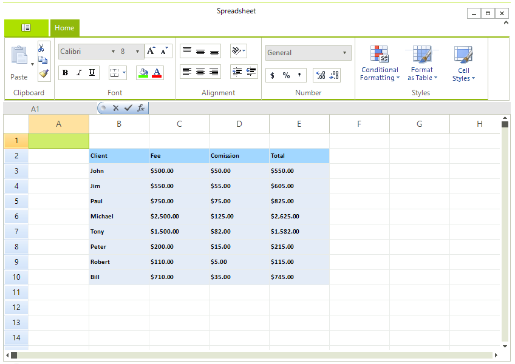
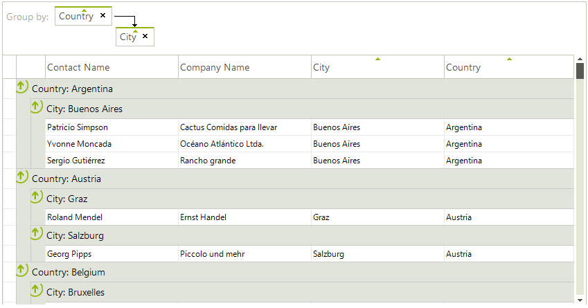
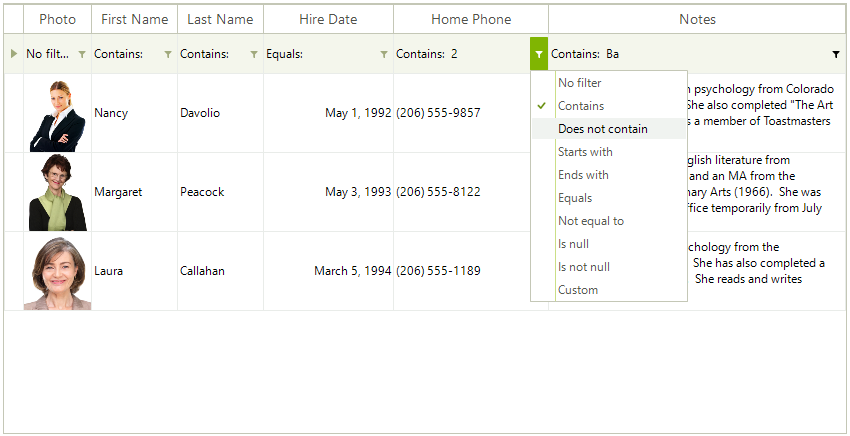
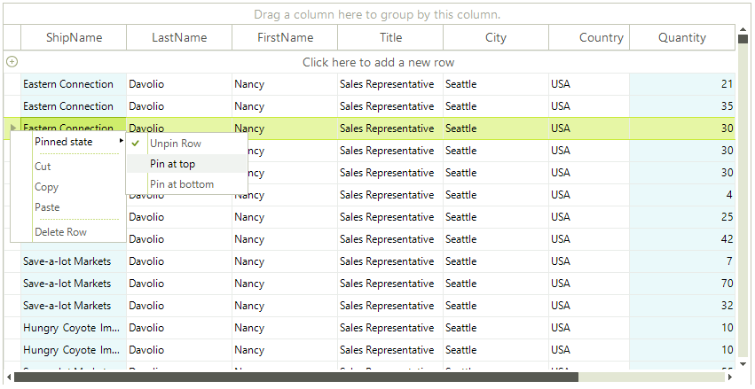
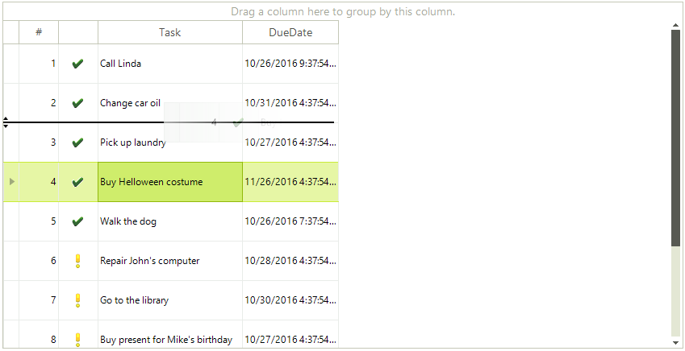
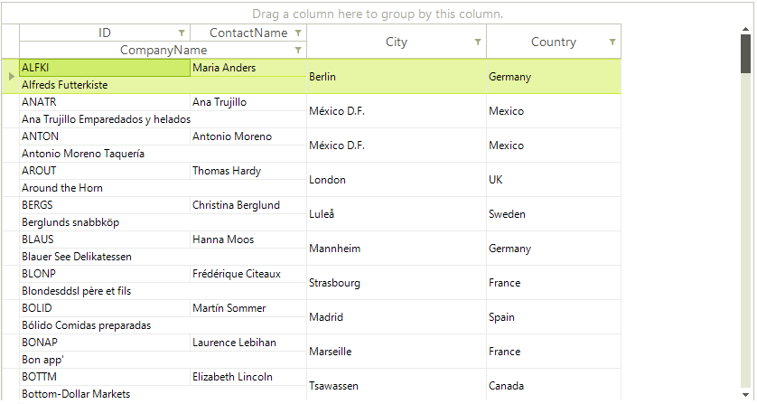

# Key Features

RadGridView has a bunch of useful features for you to give to your end-users. Here are these features at a glance: 

## Outstanding performance

The highly optimized data layer of RadGridView uses a AVL tree which enables fast grouping,
          sorting and filtering operations when using complex hierarchy scenarios. In addition,
          the user interface uses virtualization for its row and cell elements. This way it can support spreadsheet scenarios,
          and a large number of columns without any performance loss.
        

## Binding to a wide set of binding sources

RadGridView can bind to different types of data sources including custom business objects, data sets and collections.
          The only requirement is that these objects must implement one of the following interfaces: IList, IEnumarable, or ICollection.
          Furthermore, RadGridView supports out-of-the-box binding to sub-objects, nullable properties and properties of sub-objects.
          [Read more]()

## Hierarchical data representation

RadGridView has the ability to represent hierarchical master-detail data.
          Its hierarchical schema could be set up either at design-time, in runtime using the control’s API,
          or handled automatically for you based on the structure of the data. RadGridView can present also multiple child views
          or a tree like (self-referencing) hierarchy.
          The provider based hierarchy model enables using load-on-demand and object-relational hierarchies.
          [Read more]()

## Grouping

RadGridView allows for easy implementation of multilevel grouping of data from a single table.
          Data can be grouped according to several criteria effectively creating a tree of groups with the leaf nodes
          holding the actual data records. Users can apply grouping with the help of a single drag and drop action.
          In addition, RadGridView supports fully customizable custom grouping,
          aggregate operations (e.g. sum, min, max, count, first and last) and custom formatted group headers.
          [Read more]()

## Sorting

In addition to the simple one-column sorting which is enabled by default in RadGridView, you can sort data by several columns.
          RadGridView also enables applying sorting and custom soring programmatically.
          [Read more]()

## Filtering

RadGridView has a built-in filtering support it and can perform filtering operations for all columns
          that support this feature. Clicking in the filter cell will open the in-place editor specified for the column
          and will allow for entering a filter condition. Clicking the filtering icon in the filter cell opens a menu
          with the available filter conditions (e.g. Contains, Starts with, Less than).
          Furthermore, filtering can be defined programmatically by using filter descriptors or custom filtering.
          [Read more]()

## Summary rows and totals row with Aggregate Functions

RadGridView can show summary rows when grouping is applied or a totals row which contains
          values calculated from a variety of aggregate functions, such as Sum, Count, Min, Max, Average, etc.
          Of course, the representation of the aggregate result is fully customizable.
          [Read more]()

## Pinned (Frozen) columns and rows

RadGridView allows you to keep a part of your data always visible while putting the rest
          of the data in context. To freeze columns, simply choose the Pin to left or Pin to right option from the context menu.
          RadGridView API allows for programmatically freezing columns or rows. Read more
          [here]()
          and
          [here]()

## Row and column reordering

RadGridView allows the user to reorder rows and columns with a single drag and drop operation,
          based on their personal preference. Row reordering is available only when using unbound grid, because
          it cannot be preserved in the data source.
          Furthermore, RadGridView enables changing the order of all system rows with its flexible API.
          Read more
          [here]()
          and
          [here]()

## Column grouping and HTML table like layouts

Most grids present table data. In addition to this, RadGridView enables creating custom views.
          It comes with two predefined views – column grouping, which enables unlimited nesting of columns and
          column groups and html view which enables cell and row merge within the record, just like an html table.
        

## In-place data editing with validation and error indication

Except displaying sets of data, RadGridView allows for managing it. You are able to execute the
          standard operations – Insert, Update and Delete. Besides, you can edit grid cells by using various in-place
          editors and validate the changes.
          RadGridView also supports the IDataError interface which enables automatic error indication.
        

## Selection and navigation

RadGridView provides selection functionality, which allows single and multiple records
          selection that can be manipulated both with the mouse and with the keyboard.
          The navigation API gives you full control over this process when using code.
        

## Exporting data in different file formats

RadGridView allows for exporting its data in different file formats.
          The supported formats include: PDF, HTML, CSV and Excel.
          [Read more]()

## Localization and support for right-to-left languages

RadGridView provides advanced Localization support. All displayed strings can be customized by using localization providers.
          RadGridView has also a full support for right-to-left languages.
          Read more
          [here]()
          and
          [here]()

## Easily customizable appearance and theming mechanism

RadGridView is built on top of the Telerik Presentation Framework and enables easy styling without writing any
          code by using
          [Visual Style Builder]().
          [Read more]()
          In addition, it is fully customizable with its flexible API.
          The conditional formatting feature enables formatting of grid elements for enhanced readability and usability of the displayed data.
          It can be applied programmatically or by the user at run time.
          [Read more]()
          Read more
        

# See Also

 * [Getting Started]()

 * [Databinding RadGridView]()[Visual Structure](c3744f84-3e80-4b59-8ea0-ce38723d4eca)
