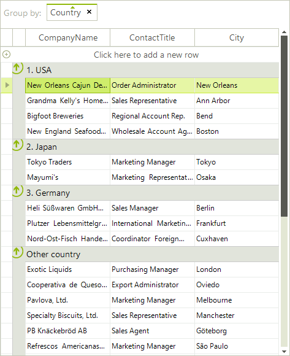
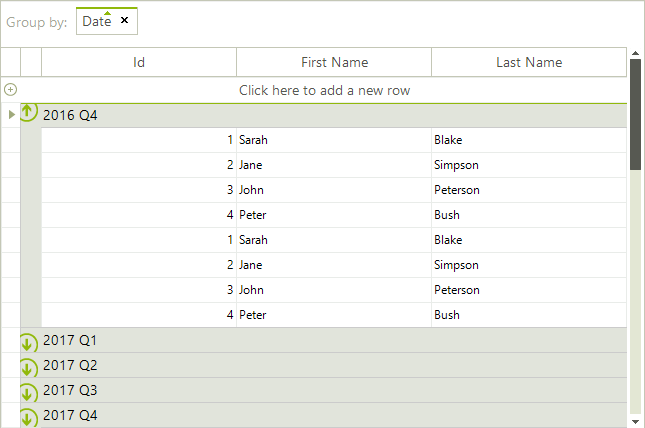

# Custom Grouping

Custom grouping is a flexible mechanism for creating groups by using  custom logic. It has a higher priority than the applied __GroupDescriptors__ (added either by code or by dragging columns to the group panel).

Custom grouping is applied if user grouping is enabled through the __EnableGrouping__ or __GridViewTemplate.EnableGrouping__ properties. By default, grouping is enabled at all levels.

RadGridView provides two mechanisms for custom grouping:

* Handling the __CustomGrouping__ event

* Replacing the RadGridView grouping mechanism by providing a custom __GroupPredicate__

You can use the __GroupSummaryEvaluate__ event to format the group header row text of the created custom groups.

## Using the CustomGrouping event

The __CustomGrouping__ event is fired if custom grouping is enabled through the __EnableCustomGrouping__ or __GridViewTemplate.EnableCustomGrouping__ properties. By default, custom grouping is disabled at all levels.

* __Template:__ The template that holds the rows that will be grouped.

* __Row:__ The row which group is defined.

* __Level:__ The level of the current group, represents zero-based depth of the group.

* __GroupKey:__ Identifier of the group.

* __Handled:__ Defines whether the row is processed by the custom algorithm or by the applied group descriptors.

The following example demonstrates how to handle the __CustomGrouping__ event to group  by the values of the `Country` column creating groups only for predefined countries:

>caption Figure 1 Custom Grouping



{{source=..\SamplesCS\GridView\Grouping\CustomGrouping.cs region=usingCustomGrouping}} 
{{source=..\SamplesVB\GridView\Grouping\CustomGrouping.vb region=usingCustomGrouping}} 

````C#
this.radGridView1.EnableCustomGrouping = true;
this.radGridView1.CustomGrouping += new GridViewCustomGroupingEventHandler(radGridView1_CustomGrouping);
GroupDescriptor descriptor = new GroupDescriptor("Country");
this.radGridView1.GroupDescriptors.Add(descriptor);
this.radGridView1.GroupSummaryEvaluate += new GroupSummaryEvaluateEventHandler(radGridView1_GroupSummaryEvaluate);

````
````VB.NET
Me.RadGridView1.EnableCustomGrouping = True
Dim descriptor As New GroupDescriptor("Country")
Me.RadGridView1.GroupDescriptors.Add(descriptor)

````

{{endregion}} 


{{source=..\SamplesCS\GridView\Grouping\CustomGrouping.cs region=usingCustomGrouping1}} 
{{source=..\SamplesVB\GridView\Grouping\CustomGrouping.vb region=usingCustomGrouping1}} 

````C#
private void radGridView1_CustomGrouping(object sender, GridViewCustomGroupingEventArgs e)
{
    string country = e.Row.Cells["Country"].Value.ToString();
    switch (country)
    {
        case "USA":
            e.GroupKey = "1. USA";
            break;
        case "Japan":
            e.GroupKey = "2. Japan";
            break;
        case "Germany":
            e.GroupKey = "3. Germany";
            break;
        default:
            e.GroupKey = "Other country";
            break;
    }
}
private void radGridView1_GroupSummaryEvaluate(object sender, GroupSummaryEvaluationEventArgs e)
{
    if (e.Value == null)
    {
        e.FormatString = e.Group.Key.ToString();
    }
}

````
````VB.NET
Private Sub RadGridView1_CustomGrouping(ByVal sender As Object, ByVal e As Telerik.WinControls.UI.GridViewCustomGroupingEventArgs) Handles RadGridView1.CustomGrouping
    Dim country As String = e.Row.Cells("Country").Value.ToString()
    Select Case country
        Case "USA"
            e.GroupKey = "1. USA"
            Exit Select
        Case "Japan"
            e.GroupKey = "2. Japan"
            Exit Select
        Case "Germany"
            e.GroupKey = "3. Germany"
            Exit Select
        Case Else
            e.GroupKey = "Other country"
            Exit Select
    End Select
End Sub
Private Sub RadGridView1_GroupSummaryEvaluate(ByVal sender As Object, ByVal e As Telerik.WinControls.UI.GroupSummaryEvaluationEventArgs) Handles RadGridView1.GroupSummaryEvaluate
    If e.Value Is Nothing Then
        e.FormatString = e.Group.Key.ToString()
    End If
End Sub

````

{{endregion}} 

When __RadGridView__ is displaying date columns, it is a common requirement to perform grouping by certain part of the DateTime value. The example below will handle a scenario in which the date fields are grouped in year quarters.

>caption Figure: 2 DateTime Grouping Default Behavior


>caption Figure: 3 DateTime Grouping Custom Behavior



{{source=..\SamplesCS\GridView\Grouping\CustomGroupingDateFields.cs region=CustomGrouping}} 
{{source=..\SamplesVB\GridView\Grouping\CustomGroupingDateFields.vb region=CustomGrouping}} 

````C#
private void radGridView1_CustomGrouping(object sender, GridViewCustomGroupingEventArgs e)
{
    DateTime date = (DateTime)e.Row.Cells["Date"].Value;
    e.GroupKey = date.Year + " " + this.GetQuarter(date);
}
private string GetQuarter(DateTime date)
{
    if (date.Month >= 0 && date.Month <= 3)
    {
        return "Q1";
    }
    else if (date.Month >= 4 && date.Month <= 6)
    {
        return "Q2";
    }
    else if (date.Month >= 7 && date.Month <= 9)
    {
        return "Q3";
    }
    else
    {
        return "Q4";
    }
}
private void radGridView1_GroupSummaryEvaluate(object sender, GroupSummaryEvaluationEventArgs e)
{
    if (e.Value == null)
    {
        e.FormatString = e.Group.Key.ToString();
    }
}

````
````VB.NET
Private Sub radGridView1_CustomGrouping(sender As Object, e As GridViewCustomGroupingEventArgs)
    Dim [date] As DateTime = DirectCast(e.Row.Cells("Date").Value, DateTime)
    e.GroupKey = Convert.ToString([date].Year) & " " & Me.GetQuarter([date])
End Sub
Private Function GetQuarter([date] As DateTime) As String
    If [date].Month >= 0 AndAlso [date].Month <= 3 Then
        Return "Q1"
    ElseIf [date].Month >= 4 AndAlso [date].Month <= 6 Then
        Return "Q2"
    ElseIf [date].Month >= 7 AndAlso [date].Month <= 9 Then
        Return "Q3"
    Else
        Return "Q4"
    End If
End Function
Private Sub radGridView1_GroupSummaryEvaluate(sender As Object, e As GroupSummaryEvaluationEventArgs)
    If e.Value Is Nothing Then
        e.FormatString = e.Group.Key.ToString()
    End If
End Sub

````

{{endregion}} 

## Implementing grouping mechanism by using GroupPredicate

You can replace the grouping mechanism in RadGridView with a custom one by setting the __GroupPredicate__ of the __GridViewTemplate__.
        

The following example demonstrates how to use a custom grouping mechanism to group the rows by the values of the `ContactTitle` column, creating groups only for the desired contact title categories:

>caption Figure: 4 Implementing GroupPredicate


{{source=..\SamplesCS\GridView\Grouping\CustomGrouping1.cs region=usingGroupPredicate}} 
{{source=..\SamplesVB\GridView\Grouping\CustomGrouping1.vb region=usingGroupPredicate}} 

````C#
private object PerformGrouping(GridViewRowInfo row, int level)
{
    string title = row.Cells["ContactTitle"].Value.ToString();
    string groupKey;
    if (title.StartsWith("Sales"))
    {
        groupKey = "1. Sales contacts";
    }
    else if (title.StartsWith("Marketing"))
    {
        groupKey = "2. Marketing contacts";
    }
    else if (title.StartsWith("Accounting"))
    {
        groupKey = "3. Accounting contacts";
    }
    else
    {
        groupKey = "Other contacts";
    }
    return groupKey;
}
private void radGridView1_GroupSummaryEvaluate(object sender, GroupSummaryEvaluationEventArgs e)
{
    if (e.Value == null)
    {
        e.FormatString = e.Group.Key.ToString();
    }
}

````
````VB.NET
Private Function PerformGrouping(ByVal row As GridViewRowInfo, ByVal level As Integer) As Object
    Dim title As String = row.Cells("ContactTitle").Value.ToString()
    Dim groupKey As String
    If title.StartsWith("Sales") Then
        groupKey = "1. Sales contacts"
    ElseIf title.StartsWith("Marketing") Then
        groupKey = "2. Marketing contacts"
    ElseIf title.StartsWith("Accounting") Then
        groupKey = "3. Accounting contacts"
    Else
        groupKey = "Other contacts"
    End If
    Return groupKey
End Function
Private Sub RadGridView1_GroupSummaryEvaluate(ByVal sender As Object, ByVal e As Telerik.WinControls.UI.GroupSummaryEvaluationEventArgs) Handles RadGridView1.GroupSummaryEvaluate
    If e.Value Is Nothing Then
        e.FormatString = e.Group.Key.ToString()
    End If
End Sub

````

{{endregion}} 


{{source=..\SamplesCS\GridView\Grouping\CustomGrouping1.cs region=usingGroupPredicate1}} 
{{source=..\SamplesVB\GridView\Grouping\CustomGrouping1.vb region=usingGroupPredicate1}} 

````C#
private object PerformGrouping(GridViewRowInfo row, int level)
{
    string title = row.Cells["ContactTitle"].Value.ToString();
    string groupKey;
    if (title.StartsWith("Sales"))
    {
        groupKey = "1. Sales contacts";
    }
    else if (title.StartsWith("Marketing"))
    {
        groupKey = "2. Marketing contacts";
    }
    else if (title.StartsWith("Accounting"))
    {
        groupKey = "3. Accounting contacts";
    }
    else
    {
        groupKey = "Other contacts";
    }
    return groupKey;
}
private void radGridView1_GroupSummaryEvaluate(object sender, GroupSummaryEvaluationEventArgs e)
{
    if (e.Value == null)
    {
        e.FormatString = e.Group.Key.ToString();
    }
}

````
````VB.NET
Private Function PerformGrouping(ByVal row As GridViewRowInfo, ByVal level As Integer) As Object
    Dim title As String = row.Cells("ContactTitle").Value.ToString()
    Dim groupKey As String
    If title.StartsWith("Sales") Then
        groupKey = "1. Sales contacts"
    ElseIf title.StartsWith("Marketing") Then
        groupKey = "2. Marketing contacts"
    ElseIf title.StartsWith("Accounting") Then
        groupKey = "3. Accounting contacts"
    Else
        groupKey = "Other contacts"
    End If
    Return groupKey
End Function
Private Sub RadGridView1_GroupSummaryEvaluate(ByVal sender As Object, ByVal e As Telerik.WinControls.UI.GroupSummaryEvaluationEventArgs) Handles RadGridView1.GroupSummaryEvaluate
    If e.Value Is Nothing Then
        e.FormatString = e.Group.Key.ToString()
    End If
End Sub

````

{{endregion}}
# See Also
* [Basic Grouping]({[%slug winforms/gridview/grouping/basic-grouping%]}

* [Events]({[%slug winforms/gridview/grouping/events%]}

* [Formatting Group Header Row]({[%slug winforms/gridview/grouping/formatting-group-header-row%]}

* [Group Aggregates]({[%slug winforms/gridview/grouping/group-aggregates%]}

* [Groups Collection]({[%slug winforms/gridview/grouping/groups-collection%]}

* [Setting Groups Programmatically]({[%slug winforms/gridview/grouping/setting-groups-programmatically%]}

* [Sorting group rows]({[%slug winforms/gridview/grouping/sorting-group-rows%]}

* [Using Grouping Expressions]({[%slug winforms/gridview/grouping/using-grouping-expressions%]}

